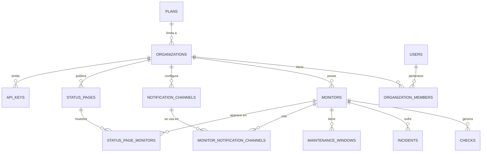

# Diario de construcción de UptimePulse

> Registro paso a paso de todo lo que se implementa, cómo se hace y cómo reproducirlo tú mismo desde una terminal, sin depender de este asistente. Cada entrada corresponde a una tarea de [TASK.md](TASK.md).

---

## 2026-09-20 — Fase 0.1: Estructura del monorepo

### Objetivo
Tener el esqueleto de carpetas del proyecto (`apps/api`, `apps/worker`, `apps/web`, `packages/shared`) con cada parte arrancando un "Hello world", más las herramientas base de calidad de código (TypeScript, ESLint, Prettier) y el repositorio git inicializado.

### Decisión de diseño: npm workspaces en vez de pnpm
El README sugería `pnpm` como gestor de monorepo. Al intentar activarlo con `corepack enable pnpm`, Windows dio un error de permisos (`EPERM`) porque corepack necesita escribir en `C:\Program Files\nodejs`, que requiere permisos de administrador.

**Decisión:** usar **npm workspaces** en su lugar. Viene integrado con Node (desde npm 7+), no requiere instalar nada adicional ni permisos de admin, y para el tamaño de este proyecto cubre exactamente lo mismo que pnpm (resolución de dependencias compartidas entre `apps/*` y `packages/*`, scripts por workspace). Si en el futuro el repo crece mucho y se necesita cacheo de builds más agresivo, se puede migrar a Turborepo por encima de npm workspaces sin rehacer la estructura.

> Si más adelante consigues permisos de admin y prefieres pnpm, el cambio es mecánico: borrar `node_modules` y `package-lock.json` de raíz, sustituir `"workspaces"` de `package.json` por un `pnpm-workspace.yaml`, y ejecutar `pnpm install`.

### Qué se hizo

1. **Estructura de carpetas** (README §6):
   ```
   uptimepulse/
   ├── apps/
   │   ├── api/src
   │   ├── worker/src
   │   └── web/src
   └── packages/
       └── shared/src
   ```

2. **`package.json` raíz** con `"workspaces": ["apps/*", "packages/*"]` y scripts atajo:
   - `npm run dev:api` → arranca solo la API.
   - `npm run dev:worker` → arranca solo el worker.
   - `npm run dev:web` → arranca solo el frontend.
   - `npm run build` / `npm run lint` / `npm run test` → se ejecutan en todos los workspaces que tengan ese script (`--workspaces --if-present`).

3. **`tsconfig.base.json`** en la raíz: configuración TypeScript estricta (`strict: true`) compartida, que cada app extiende con `"extends": "../../tsconfig.base.json"`.

4. **`packages/shared`**: paquete `@uptimepulse/shared` sin paso de compilación (se importa el `.ts` directamente vía `tsx`/Vite) que exporta los primeros tipos de dominio (`Monitor`, `MonitorType`, `MonitorStatus`). Este paquete crecerá según se avance en el modelo de datos (Fase 0.3).

5. **`apps/api`** y **`apps/worker`**: cada uno un paquete npm mínimo que usa [`tsx`](https://github.com/privatenumber/tsx) para ejecutar TypeScript directamente en desarrollo (sin compilar a JS cada vez), con `tsx watch` para recarga automática al guardar. De momento solo imprimen un mensaje por consola a modo de placeholder.

6. **`apps/web`**: app React + Vite + TypeScript montada a mano (en vez del scaffold interactivo `npm create vite@latest`, para que cada archivo generado quede documentado aquí). Arranca en `http://localhost:5173`.

7. **Calidad de código**: `eslint.config.js` (formato "flat config" de ESLint 9) con las reglas recomendadas de JS + TypeScript, y `.prettierrc.json` con el estilo de formateo. Scripts `npm run lint` y `npm run format` en la raíz.

8. **`.gitignore`** para no versionar `node_modules`, `dist`, `.env`, logs, etc.

9. **`git init`** — se inicializó el repositorio local. **Aún no se ha hecho ningún commit** (lo dejo para cuando tú lo confirmes explícitamente, ya que crear commits es una decisión tuya).

### Comandos ejecutados (y qué hace cada uno)

```bash
# Comprobar herramientas disponibles
node --version      # v24.19.0
npm --version        # 11.17.0
git --version        # 2.55.0

# Instalar todas las dependencias de todos los workspaces de golpe
npm install

# Arrancar cada app por separado (cada una en su propia terminal, quedan corriendo)
npm run dev:api      # imprime el mensaje placeholder y se queda escuchando cambios
npm run dev:worker   # ídem
npm run dev:web      # levanta Vite en http://localhost:5173

# Comprobar que el código pasa las reglas de estilo/errores básicos
npm run lint

# Inicializar el repositorio git (sin hacer commit todavía)
git init
```

### Cómo reproducir este paso tú mismo, desde cero

Si quisieras montar exactamente esto sin mí, en una carpeta vacía:

1. Verifica que tienes Node 20+ instalado: `node --version`.
2. Crea las carpetas: `mkdir -p apps/api/src apps/worker/src apps/web/src packages/shared/src` (en PowerShell: `New-Item -ItemType Directory -Force -Path apps/api/src, apps/worker/src, apps/web/src, packages/shared/src`).
3. Copia el contenido de cada archivo tal como aparece en el repo actual (`package.json` raíz, `tsconfig.base.json`, `.gitignore`, `eslint.config.js`, `.prettierrc.json`, y los `package.json`/`tsconfig.json`/`src/*` de cada `apps/*` y `packages/shared`) — todos están ya en tu proyecto, este diario documenta el porqué de cada uno, no hace falta rehacerlos.
4. Ejecuta `npm install` en la raíz.
5. Comprueba que arranca cada pieza con `npm run dev:api`, `npm run dev:worker`, `npm run dev:web` (en terminales separadas) y que `npm run lint` no da errores.
6. `git init` si aún no existe `.git/`.

### Cómo verificar que este paso está bien hecho
- `npm run dev:api` imprime `[api] servidor placeholder arrancado...` sin errores.
- `npm run dev:worker` imprime `[worker] proceso placeholder arrancado...` sin errores.
- `npm run dev:web` levanta Vite y `http://localhost:5173` muestra la página "UptimePulse" en el navegador.
- `npm run lint` termina sin listar errores.
- `git status` ya no dice "not a git repository".

### Pendiente / notas para más adelante
- Hay 2 vulnerabilidades reportadas por `npm audit` (1 moderada, 1 alta) en dependencias transitivas del scaffold de Vite/ESLint. No son explotables en este momento (son herramientas de desarrollo, no código que se despliega), pero conviene revisarlas con `npm audit` antes de la Fase 5 (seguridad).
- `npm` avisó de scripts de instalación pendientes de aprobar para `esbuild` (usado por Vite): `npm warn allow-scripts ... esbuild@0.28.2/0.21.5`. Esto es una política de seguridad de npm que bloquea `postinstall` scripts no aprobados explícitamente. Vite funcionó igualmente en la prueba (usa un binario ya publicado), pero si en el futuro ves errores de "esbuild binary not found", ejecuta `npm approve-scripts esbuild` para aprobarlo conscientemente (revisando antes qué hace ese script).
- ~~Todavía no hay ningún commit en git~~ **Corrección (ver entrada del 2026-09-20 más abajo): esto ya no es así.** Fuera de esta conversación se conectó el proyecto a un repositorio remoto real (`github.com/gsan-dev/UptimePulse`), con commits ya hechos. Detalle completo en la siguiente entrada.

### Próximo paso (Fase 0.2)
Levantar `docker-compose.yml` con PostgreSQL (+ TimescaleDB) y Redis para tener la infraestructura de datos local lista antes de diseñar el esquema de la Fase 0.3.

---

## 2026-09-20 (continuación) — Incidente: ramas git y verificación de la Fase 0.1

### Qué pasó
Fuera de esta conversación (probablemente desde el panel de Source Control de VS Code) se conectó el proyecto a un repositorio remoto real: `https://github.com/gsan-dev/UptimePulse.git`. Ahí se crearon dos ramas con historiales muy distintos:

- **`main`** → un único commit `"Initial commit: README only"` cuyo árbol está **completamente vacío** (ni siquiera tiene el readme, pese al mensaje).
- **`dev`** → un commit `"dev-branch 0.1 task.md readme.md apps/ packages/"` que sí contiene todo el trabajo de la Fase 0.1 (readme, TASK.md, DIARIO.md, apps/, packages/, configuración).

En algún momento se hizo `checkout` a `main`, y como esa rama no tiene archivos, Git vació la carpeta de trabajo — esto es lo que pareció "Git ha borrado mis archivos". Al volver a `dev`, todo reapareció porque ahí sí está guardado.

**Decisión tomada con el usuario:** dejar `main` vacía tal cual está por ahora y trabajar exclusivamente en `dev`. `main` seguirá siendo una rama "trampa" (si algo la vuelve a hacer checkout, la carpeta se vacía otra vez), así que conviene fijarse en el selector de rama de VS Code y confirmar que siempre marca `dev` antes de trabajar.

El usuario subió manualmente el `readme.md` a `main` con:
```bash
git checkout main
git checkout dev -- readme.md
git add readme.md
git commit -m "Añadir readme.md a main"
git push origin main
git checkout dev   # importante: volver a dev para seguir trabajando
```

### Verificación completa de la Fase 0.1 (repetida tras el incidente)

Como `node_modules/` no está versionado (está en `.gitignore`), desapareció durante el vaivén de ramas — **esto es normal y no indica ningún problema**, simplemente hay que reinstalar:

```bash
npm install
```

Con eso reinstalado, se repitió la checklist de verificación original y **todo sigue cumpliéndose**:

| Comprobación | Resultado |
|---|---|
| `npm run lint` sin errores | ✅ Correcto |
| `npm run dev:api` imprime el mensaje placeholder | ✅ Correcto |
| `npm run dev:worker` imprime el mensaje placeholder | ✅ Correcto |
| `npm run dev:web` levanta Vite en `http://localhost:5173` | ✅ Correcto |
| `git status` reconoce el repositorio (ya no dice "not a git repository") | ✅ Correcto — además ahora hay un remoto (`origin`) configurado |

**Conclusión: la Fase 0.1 sigue completa y funcional.** Nada se perdió; el susto fue por el checkout a una rama vacía, no por una eliminación real de archivos.

### Lección para el futuro
Cada vez que reabras el proyecto tras un tiempo sin tocarlo (o tras cualquier operación de git rara), el primer chequeo es:
```bash
git branch --show-current   # ¿estás en dev?
git status                  # ¿working tree clean?
npm install                 # por si falta node_modules
```

---

## 2026-09-20 (continuación 2) — Fase 0.2: Docker Compose para desarrollo

### Objetivo
Tener PostgreSQL (con la extensión TimescaleDB) y Redis corriendo en local vía Docker, con datos persistentes entre reinicios y configuración por variables de entorno, listos para que la Fase 0.3 (esquema de base de datos) tenga dónde aplicar sus migraciones.

### Paso previo: instalar y arrancar Docker Desktop
Docker no estaba instalado en la máquina. Se instaló con `winget` (requiere que el propio instalador se autoeleve a administrador — lo pidió Windows vía UAC, no hizo falta hacer nada especial más que aceptar):

```powershell
winget install --id Docker.DockerDesktop -e --accept-package-agreements --accept-source-agreements --silent
```

Tras la instalación hizo falta:
1. **Reiniciar el equipo** (para que Windows terminase de activar WSL2/Virtualización, que Docker Desktop necesita como backend). Esto lo hizo el usuario manualmente — reiniciar la máquina es una acción que afecta a todo lo abierto, así que no se automatiza.
2. **Abrir Docker Desktop** — la app no arranca sola tras el reinicio. Se lanzó con:
   ```powershell
   Start-Process "C:\Program Files\Docker\Docker\Docker Desktop.exe"
   ```
3. Esperar (30-90s la primera vez) a que el daemon responda:
   ```bash
   docker info
   ```

> **Nota:** el CLI de `docker` no queda en el `PATH` de Git Bash tras la instalación. La ruta completa que funciona es `/c/Program Files/Docker/Docker/resources/bin/docker.exe`. En una consola normal de Windows (PowerShell/CMD) sí queda disponible como `docker` tras reiniciar la terminal, porque Docker Desktop añade esa ruta al `PATH` del sistema, no al de Git Bash específicamente.

### Qué se hizo

1. **`docker-compose.yml`** en la raíz, con dos servicios:
   - `postgres` — imagen `timescale/timescaledb:latest-pg16` (Postgres con la extensión TimescaleDB ya instalada, en vez de la imagen oficial `postgres` a secas + instalar la extensión a mano).
   - `redis` — imagen `redis:7-alpine` (ligera, para la cola de trabajo de la Fase 2.1).
   - Ambos con `healthcheck` (`pg_isready` / `redis-cli ping`) para que `docker compose ps` diga explícitamente si están sanos, no solo "arrancados".
   - Ambos con volumen nombrado (`postgres_data`, `redis_data`) para que los datos sobrevivan a un `docker compose down` (no a un `down -v`, que sí los borra a propósito).
   - Puertos y credenciales parametrizados vía variables de entorno con valores por defecto (`${POSTGRES_USER:-uptimepulse}`), para que funcione incluso sin `.env`.

2. **`.env.example`** (versionado en git) documentando todas las variables: usuario/contraseña/puerto de Postgres, `DATABASE_URL` ya montada, puerto y `REDIS_URL` de Redis.

3. **`.env`** real creado como copia de `.env.example` (ya estaba cubierto por `.gitignore` desde la Fase 0.1, así que nunca se sube).

### Comandos ejecutados (y qué hace cada uno)

```bash
# Copiar la plantilla de variables de entorno a la real (solo la primera vez)
cp .env.example .env

# Descargar las imágenes y levantar los contenedores en segundo plano
docker compose up -d

# Ver el estado de los contenedores (deben decir "healthy", no solo "Up")
docker compose ps

# Comprobar que la extensión TimescaleDB está disponible dentro de Postgres
docker exec uptimepulse-postgres psql -U uptimepulse -d uptimepulse \
  -c "CREATE EXTENSION IF NOT EXISTS timescaledb; SELECT extname, extversion FROM pg_extension WHERE extname='timescaledb';"

# Comprobar que Redis responde
docker exec uptimepulse-redis redis-cli ping

# Ver los volúmenes persistentes creados
docker volume ls
```

**Resultado de la verificación:**
- `uptimepulse-postgres` → `Up (healthy)`, puerto `5432` expuesto.
- `uptimepulse-redis` → `Up (healthy)`, puerto `6379` expuesto.
- Extensión `timescaledb` versión `2.30.1` instalada correctamente.
- Redis responde `PONG`.
- Volúmenes `uptimepulse_postgres_data` y `uptimepulse_redis_data` creados.

### Cómo reproducir este paso tú mismo, desde cero

1. Instala Docker Desktop (si no lo tienes): `winget install --id Docker.DockerDesktop -e`, reinicia el equipo, abre Docker Desktop y espera a que el icono de la ballena diga "running".
2. En la raíz del proyecto: `cp .env.example .env` (en PowerShell: `Copy-Item .env.example .env`). Cambia la contraseña si quieres, aunque en local no es crítico.
3. `docker compose up -d`.
4. `docker compose ps` — comprueba que ambos servicios dicen `healthy`.
5. (Opcional, solo para comprobar) `docker exec uptimepulse-postgres psql -U uptimepulse -d uptimepulse -c "\dx"` — debería listar `timescaledb` entre las extensiones.

### Comandos útiles para el día a día
```bash
docker compose up -d       # arrancar (si ya existen los contenedores, los reutiliza)
docker compose down        # parar y borrar los contenedores (los datos NO se pierden, están en los volúmenes)
docker compose down -v     # parar y borrar TAMBIÉN los volúmenes (esto sí borra los datos, úsalo con cuidado)
docker compose logs -f     # ver logs en vivo de ambos servicios
```

### Pendiente / notas para más adelante
- La imagen usa el tag flotante `latest-pg16` (la última versión de TimescaleDB compatible con Postgres 16). Para producción convendría fijar una versión exacta (ej. `timescale/timescaledb:2.17.2-pg16`) para que un `docker compose pull` futuro no cambie de versión sin avisar. Anotado como mejora, no urgente en desarrollo.
- La contraseña por defecto en `.env.example` es `changeme` — recuerda cambiarla si esto llega a desplegarse en algún sitio accesible, aunque en local no supone riesgo real.

### Próximo paso (Fase 0.3)
Diseñar el modelo de datos (ERD) y elegir herramienta de migraciones (Prisma/Drizzle/node-pg-migrate) para empezar a aplicar el esquema sobre este Postgres.

---

## 2026-09-20 (continuación 3) — Fase 0.3: Modelo de datos inicial

### Objetivo
Diseñar el esquema completo de base de datos (13 tablas), elegir una herramienta de migraciones, y aplicarlo de verdad sobre el Postgres de la Fase 0.2 — no solo dejarlo dibujado en un documento.

### Decisión de diseño: Drizzle ORM + drizzle-kit, no Prisma
El TASK.md dejaba la elección abierta entre Prisma, Drizzle o node-pg-migrate. Motivo de la elección:

- La tabla `checks` necesita ser una **hypertable de TimescaleDB** (`create_hypertable()`) y llevar una **política de retención** (`add_retention_policy()`) — ambas son llamadas a funciones SQL específicas de Timescale que Prisma no sabe representar en su lenguaje de esquema (`schema.prisma`), obligando a workarounds frágiles.
- **Drizzle-kit soporta migraciones "custom"**: además de generar SQL automáticamente a partir del esquema TypeScript (como Prisma), permite intercalar archivos SQL escritos a mano en el mismo flujo de migraciones versionadas. Así, las partes "normales" (tablas, FKs, enums) se generan solas, y las partes Timescale-específicas se escriben a mano sin salirse del sistema de migraciones.
- Sigue dando tipos TypeScript inferidos automáticamente del esquema (igual que Prisma), que es lo que de verdad importa para que `apps/api` y `apps/worker` trabajen con autocompletado y sin duplicar tipos a mano.

### Decisión de diseño: nuevo paquete `packages/db`
El README original solo contemplaba `packages/shared`. Se añade `packages/db` porque:
- El esquema de base de datos y el cliente de Postgres (`pg`) solo los necesitan `apps/api` y `apps/worker` — **no** `apps/web`. Meterlo en `packages/shared` arrastraría el driver de Postgres al bundle del frontend.
- `packages/shared` sigue existiendo para los tipos de dominio ligeros que sí usa el frontend (`Monitor`, `MonitorStatus`, etc., de la Fase 0.1). Son deliberadamente dos cosas distintas: `shared` = contratos ligeros multi-plataforma; `db` = esquema real + acceso a datos, solo backend.

### El ERD (13 tablas)



Tablas y su propósito (todas creadas y verificadas contra la BD real):

| Tabla | Para qué sirve |
|---|---|
| `plans` | Límites de cada plan de suscripción (nº monitores, intervalo mínimo, canales permitidos). |
| `organizations` | Cuenta/equipo dueño de los monitores; referencia a su plan. |
| `users` | Usuarios, con soporte para password o login OAuth. |
| `organization_members` | Tabla puente usuario↔organización con rol (admin/editor/readonly). |
| `monitors` | Configuración de cada monitor (tipo, target, intervalo, timeout, etc.). |
| `checks` | **Hypertable de TimescaleDB.** Un resultado de comprobación por fila; volumen alto, particionado por tiempo. |
| `incidents` | Agrupación de checks fallidos consecutivos en un incidente con inicio/fin. |
| `notification_channels` | Canales configurados por organización (email/SMS/webhook/Slack/Discord). |
| `monitor_notification_channels` | Tabla puente monitor↔canal — la "matriz de alertas" del README §3.5. |
| `maintenance_windows` | Ventanas de mantenimiento (mejora añadida sobre el README original, ver análisis inicial). |
| `status_pages` / `status_page_monitors` | Páginas de estado públicas y qué monitores muestran. |
| `api_keys` | Claves de API por organización, con scopes y hash (nunca la clave en claro). |

### Decisiones concretas sobre columnas (para que quede razonado, no solo hecho)

- **IDs**: `uuid` con `defaultRandom()` (usa `gen_random_uuid()`) para todas las tablas salvo `checks`. Evita exponer IDs secuenciales adivinables en la API pública (ej. status pages).
- **`checks.id`**: aquí sí es `bigint` autoincremental, no `uuid`. Motivo: es la tabla de mayor volumen con diferencia (una fila por check, cada 30s-15min por monitor); un `bigint` ocupa 8 bytes frente a los 16 de un `uuid`, y no necesita ser impredecible porque nunca se expone en una URL pública.
- **Clave primaria de `checks` = `(id, timestamp)`**, no solo `id`. Esto no es una preferencia sino un **requisito técnico de TimescaleDB**: la clave primaria de una hypertable debe incluir la columna de partición temporal.
- **Borrado en cascada** (`ON DELETE CASCADE`) desde `monitors`, `organizations`, etc. hacia sus tablas hijas: al borrar una organización o un monitor, se limpia todo lo asociado (checks, incidentes, ventanas de mantenimiento...) sin dejar huérfanos. Verificado en la prueba de humo (ver más abajo).
- **`headers`, `tags`, `config`, `scopes`, `allowed_channels`** son `jsonb` en vez de tablas normalizadas aparte — son datos de forma variable/opcional por fila donde no hace falta consultarlos con SQL relacional; `jsonb` es el compromiso estándar de Postgres para esto.

### Política de retención de datos (decisión pendiente del análisis inicial, ahora resuelta)
- Los checks en crudo se conservan **90 días** (`add_retention_policy('checks', INTERVAL '90 days')`), ya activa y verificada contra la BD real.
- A partir de esos 90 días, TimescaleDB borra automáticamente los chunks antiguos.
- **Importante para la Fase 2.2:** los *continuous aggregates* (rollups horarios/diarios para calcular uptime % histórico) deben crearse **antes** de que la política de retención empiece a borrar datos con los que aún no se ha calculado ningún rollup. En desarrollo esto no es un problema (no hay datos de producción de más de 90 días), pero es la razón por la que la Fase 2.2 del TASK.md debe implementarse sin demorarla demasiado una vez haya datos reales.

### Comandos ejecutados (y qué hace cada uno)

```bash
# 1. Instalar las dependencias nuevas (drizzle-orm, drizzle-kit, pg, dotenv, tsx)
npm install

# 2. Generar una migración "en blanco" para escribir SQL a mano (extensiones de Postgres)
cd packages/db
npx drizzle-kit generate --custom --name=enable_extensions
# -> crea migrations/0000_enable_extensions.sql vacío, que se rellenó a mano con:
#    CREATE EXTENSION IF NOT EXISTS pgcrypto;
#    CREATE EXTENSION IF NOT EXISTS timescaledb;

# 3. Generar la migración del esquema completo, comparando schema.ts contra "nada" (primera vez)
npx drizzle-kit generate
# -> crea migrations/0001_grey_deadpool.sql con las 13 tablas, enums y foreign keys

# 4. Otra migración en blanco para la conversión a hypertable + retención
npx drizzle-kit generate --custom --name=checks_hypertable
# -> se rellenó a mano con create_hypertable(), add_retention_policy() y un índice de apoyo

# 5. Aplicar las tres migraciones, en orden, contra el Postgres del docker-compose
npm run db:migrate
```

### Problema encontrado y resuelto: `drizzle-kit` no encontraba `drizzle-orm`

Al ejecutar el paso 2 por primera vez, `drizzle-kit` fallaba con:
```
Please install latest version of drizzle-orm
```
...incluso teniendo la versión correcta instalada. La causa (investigada leyendo el propio código de `drizzle-kit` en `node_modules`): `drizzle-orm` tiene muchos peer-dependencies opcionales (uno por cada driver de BD que soporta: `pg`, `postgres`, `mysql2`, `better-sqlite3`...), y el algoritmo de hoisting de `npm` en el monorepo decidió **no elevarlo** a la raíz `node_modules/`, dejándolo solo dentro de `packages/db/node_modules/`. El binario de `drizzle-kit`, que sí vive en la raíz, intenta hacer `import("drizzle-orm/version")` resolviendo desde su propia ubicación (la raíz) y no lo encuentra.

**Solución aplicada:** declarar `drizzle-orm` también como `devDependency` en el `package.json` raíz (además de en `packages/db`, que es donde realmente se usa en tiempo de ejecución). Esto es un workaround pragmático y conocido en la comunidad de Drizzle+npm-workspaces, no una solución "elegante", pero es la forma estándar de resolver este problema concreto sin migrar de gestor de paquetes.

> Si en el futuro esto vuelve a romperse tras un `npm install` limpio, el síntoma es el mismo mensaje de error, y el diagnóstico es: `find . -maxdepth 4 -iname "drizzle-orm" -type d` para ver dónde quedó instalado, y confirmar que también existe en `node_modules/drizzle-orm` (raíz).

### Verificación completa realizada

```bash
# Tablas creadas
docker exec uptimepulse-postgres psql -U uptimepulse -d uptimepulse -c "\dt"
# -> 13 tablas listadas

# checks es una hypertable de verdad
docker exec uptimepulse-postgres psql -U uptimepulse -d uptimepulse \
  -c "SELECT hypertable_name FROM timescaledb_information.hypertables;"
# -> checks

# La política de retención está activa
docker exec uptimepulse-postgres psql -U uptimepulse -d uptimepulse \
  -c "SELECT hypertable_name, config FROM timescaledb_information.jobs WHERE proc_name='policy_retention';"
# -> checks | {"drop_after": "90 days", ...}
```

Además, se hizo una **prueba de extremo a extremo** con un script temporal (`smoke-test.mts`, borrado después de usarlo, no forma parte del repo) que:
1. Insertó un plan, una organización, un monitor y un check reales usando el cliente Drizzle (`db.insert(...).returning()`), confirmando que los tipos TypeScript inferidos del esquema funcionan en la práctica (autocompletado, tipos de retorno correctos, `check.id` como `bigint` de JS).
2. Borró la organización de prueba y comprobó que el borrado en cascada limpió también el monitor y el check asociados, sin necesidad de borrarlos a mano uno por uno.

`npm run lint` y `npx tsc --noEmit -p packages/db` también se ejecutaron limpios sobre todo el código nuevo.

### Cómo reproducir este paso tú mismo, desde cero

1. Asegúrate de que Docker está corriendo y `docker compose up -d` (Fase 0.2) está aplicado.
2. `npm install` en la raíz (instala drizzle-orm, drizzle-kit, pg, dotenv).
3. Si necesitas volver a generar migraciones tras cambiar `packages/db/src/schema.ts`:
   ```bash
   npm run db:generate    # desde la raíz; genera un nuevo archivo en packages/db/migrations/
   ```
4. Para aplicar las migraciones pendientes contra la base de datos:
   ```bash
   npm run db:migrate     # desde la raíz
   ```
5. Si necesitas escribir una migración manual (SQL específico de Timescale, un índice raro, etc.):
   ```bash
   cd packages/db
   npx drizzle-kit generate --custom --name=<nombre-descriptivo>
   # rellena el .sql vacío que se genera en migrations/
   ```
6. **Nunca edites un archivo de `migrations/` que ya se haya aplicado en algún entorno** (ni siquiera el tuyo si ya lo compartiste) — crea uno nuevo. El historial de migraciones es append-only por diseño.

### Pendiente / notas para más adelante
- El paquete `packages/shared` (Fase 0.1) todavía no está alineado con este esquema real — sus tipos (`Monitor`, etc.) son una versión simplificada hecha a mano antes de tener el ERD. Cuando se implemente la API (Fase 1.2), conviene revisar si esos tipos deben derivarse de los tipos de `packages/db` (con `InferSelectModel`) filtrando los campos que sí debe ver el frontend, en vez de mantenerse como una copia manual separada.
- Falta lo último de la Fase 0.4 (convenciones de logging estructurado compartido entre API y worker) — no se ha tocado todavía.

### Próximo paso (Fase 0.4 o Fase 1.1)
Terminar la Fase 0.4 (convención de logging compartido) o saltar directamente a la Fase 1.1 (autenticación), que es lo primero que necesita tocar estas tablas (`users`, `organizations`, `organization_members`) desde código de API real.

### Cómo comprobar tú mismo que esto funciona (en cualquier momento, sin depender de mí)

```bash
# 1. ¿Están vivos los contenedores?
docker compose ps
# -> uptimepulse-postgres y uptimepulse-redis, ambos "Up (healthy)"

# 2. ¿Existen las 13 tablas?
docker exec uptimepulse-postgres psql -U uptimepulse -d uptimepulse -c "\dt"

# 3. ¿"checks" es una hypertable de verdad?
docker exec uptimepulse-postgres psql -U uptimepulse -d uptimepulse \
  -c "SELECT hypertable_name FROM timescaledb_information.hypertables;"
# -> debe devolver: checks

# 4. ¿Está activa la política de retención de 90 días?
docker exec uptimepulse-postgres psql -U uptimepulse -d uptimepulse \
  -c "SELECT hypertable_name, config FROM timescaledb_information.jobs WHERE proc_name='policy_retention';"
# -> debe devolver: checks | {"drop_after": "90 days", ...}
```

Prueba manual más convincente (entrar a `psql` interactivo y comprobar el borrado en cascada con tus propios ojos):
```bash
docker exec -it uptimepulse-postgres psql -U uptimepulse -d uptimepulse
```
```sql
INSERT INTO plans (name, max_monitors, min_interval_seconds, allowed_channels)
VALUES ('free-manual', 3, 300, '["email"]') RETURNING id;   -- copia el id -> <PLAN_ID>

INSERT INTO organizations (name, plan_id) VALUES ('Mi org de prueba', '<PLAN_ID>') RETURNING id; -- -> <ORG_ID>

INSERT INTO monitors (organization_id, name, type, target)
VALUES ('<ORG_ID>', 'Google', 'http', 'https://google.com') RETURNING id;  -- -> <MONITOR_ID>

INSERT INTO checks (monitor_id, status, response_time_ms, http_status)
VALUES ('<MONITOR_ID>', 'up', 87, 200) RETURNING *;

SELECT m.name, c.status, c.response_time_ms, c.timestamp
FROM checks c JOIN monitors m ON m.id = c.monitor_id;

DELETE FROM organizations WHERE id = '<ORG_ID>';
SELECT * FROM monitors WHERE id = '<MONITOR_ID>';        -- debe dar 0 filas
SELECT * FROM checks WHERE monitor_id = '<MONITOR_ID>';  -- debe dar 0 filas
\q
```
Si al borrar la organización desaparecen solos el monitor y el check, el borrado en cascada funciona.

**Alternativa visual:** conectar DBeaver / TablePlus / la extensión PostgreSQL de VS Code a `localhost:5432`, usuario `uptimepulse`, contraseña `changeme` (están en tu `.env`), base de datos `uptimepulse`.

---

## 2026-09-20 (continuación 4) — Fase 0.4: Convenciones de código compartidas

### Objetivo
Que `packages/shared` deje de ser un puñado de tipos escritos a mano (como quedó en la Fase 0.1, antes de existir el ERD) y pase a ser la única fuente de verdad de tipos de dominio para `apps/api`, `apps/worker` y `apps/web`; y tener un formato de logging estructurado común entre los dos procesos backend.

### Decisión de diseño: los tipos de `shared` se derivan del esquema real, no se duplican a mano
En vez de mantener un `Monitor` (y luego `Check`, `Incident`, etc.) escritos a mano en `packages/shared` en paralelo a las tablas de `packages/db` — con el riesgo de que se desincronicen en cuanto alguien cambie una columna sin acordarse de tocar los dos sitios — `packages/shared/src/domain.ts` ahora hace:

```ts
export type Monitor = InferSelectModel<typeof monitors>;
```

`InferSelectModel` es una utilidad de Drizzle que convierte la definición de una tabla en el tipo TypeScript exacto de una fila. Cambiar una columna en `packages/db/src/schema.ts` (Fase 0.3) actualiza automáticamente el tipo en `packages/shared`, y de ahí a todo lo que lo consuma — sin tocar `domain.ts` para nada, salvo que se añada una tabla nueva.

### El riesgo que había que evitar: que el frontend arrastre `pg`
`packages/db` importa `pg` (el driver de Postgres) y, en cuanto se importa su cliente (`client.ts`), intenta leer `DATABASE_URL` y abrir una conexión — código que **no debe existir en el navegador**. Para que `packages/shared` pudiera usar los tipos de `packages/db` sin arrastrar ese runtime al bundle de `apps/web`, todos los imports desde `@uptimepulse/db` en `domain.ts` usan la sintaxis `import type`, nunca `import` normal:

```ts
import type { InferSelectModel } from "drizzle-orm";
import type { monitors, checks, /* ... */ } from "@uptimepulse/db";
```

`import type` se borra por completo del código compilado (tanto `tsc` como el `esbuild` que usa Vite lo eliminan siempre, incluso sin type-checking completo), así que en tiempo de ejecución el navegador nunca ve ni una línea de `@uptimepulse/db`.

**Verificado, no solo asumido:** se arrancó `apps/web`, se pidió por HTTP el archivo `src/App.tsx` ya transformado por Vite (`curl http://localhost:5173/src/App.tsx`), y se comprobó a ojo que el JS servido **no contiene ningún `import` de `@uptimepulse/shared`, `@uptimepulse/db`, `pg` ni `drizzle-orm`** — el `import type { Monitor } from "@uptimepulse/shared"` desapareció sin dejar rastro, tal como se esperaba.

### Qué se hizo

1. **`packages/shared/src/domain.ts`** (nuevo): tipos `Monitor`, `Check`, `Incident`, `NotificationChannel`, `MaintenanceWindow`, `StatusPage`, `Plan`, `Organization` derivados con `InferSelectModel`; `MonitorType`, `CheckStatus`, `ChannelType`, `OrgRole` derivados de los `pgEnum` del esquema (`(typeof monitorTypeEnum.enumValues)[number]`); y `PublicUser` como excepción manual: `Omit<..., "passwordHash" | "oauthId">`, porque esos dos campos **nunca** deben llegar al frontend.
2. **`packages/shared/src/logger.ts`** (nuevo): `createLogger(service: string)` que devuelve `{ debug, info, warn, error }`, cada uno imprimiendo una línea JSON (`timestamp`, `level`, `service`, `message`, + campos extra). Escrito sin ninguna API de Node (nada de `process.pid` ni similares) para que sea seguro de importar desde cualquier sitio, aunque su uso previsto es solo backend.
3. **`packages/shared/src/index.ts`**: ahora solo re-exporta `domain.ts` y `logger.ts` (antes tenía los tipos a mano directamente).
4. **`packages/shared/package.json`**: añadida dependencia `@uptimepulse/db` (para los tipos) y devDependency `drizzle-orm` (para `InferSelectModel`).
5. **`packages/shared/tsconfig.json`** (nuevo, no existía desde la Fase 0.1): para poder tipar el paquete de forma aislada con `tsc --noEmit -p packages/shared`, igual que ya se hacía con `packages/db`.
6. **`apps/api/src/index.ts`**: usa `createLogger("api")` en vez de `console.log`, y el placeholder `exampleMonitor` ahora es un objeto `Monitor` completo y válido (con todos los campos reales de la tabla: `organizationId`, `method`, `headers`, `body`, `expectedStatus`, `tags`, `createdAt`...), no la versión simplificada de la Fase 0.1.
7. **`apps/worker/src/index.ts`**: usa `createLogger("worker")`.
8. **`apps/web/package.json`**: se añadió la dependencia `@uptimepulse/shared` (curiosamente no se había declarado en la Fase 0.1, aunque `apps/api`/`apps/worker` sí la tenían).
9. **`apps/web/src/App.tsx`**: añadido un listado placeholder tipado como `Pick<Monitor, "name" | "type" | "target">[]`, solo para demostrar que el tipo llega con autocompletado hasta el frontend (el dashboard real es la Fase 1.4, esto no lo adelanta).

### Comandos ejecutados (y qué hace cada uno)

```bash
# Instalar las dependencias nuevas (enlaza @uptimepulse/db dentro de @uptimepulse/shared,
# y @uptimepulse/shared dentro de apps/web, vía los symlinks de npm workspaces)
npm install

# Comprobar que todo tipa sin errores, paquete por paquete
npm run lint
npx tsc --noEmit -p packages/shared
npx tsc --noEmit -p apps/api
npx tsc --noEmit -p apps/worker
npx tsc --noEmit -p apps/web

# Comprobar que los logs salen en JSON de verdad (no solo que compila)
npm run dev:api      # -> {"timestamp":"...","level":"info","service":"api","message":"servidor placeholder arrancado","monitor":{...}}
npm run dev:worker   # -> {"timestamp":"...","level":"info","service":"worker","message":"proceso placeholder arrancado..."}

# Comprobar que el import de tipo se borra del bundle del navegador
npm run dev:web &
curl http://localhost:5173/src/App.tsx | head -20
# -> el JS transformado no contiene ningún import de @uptimepulse/shared
```

### Cómo reproducir / comprobar tú mismo

```bash
# 1. Arranca api y worker en dos terminales separadas y mira que los logs sean JSON de una línea
npm run dev:api
npm run dev:worker

# 2. Arranca el frontend y ábrelo en el navegador
npm run dev:web
# -> http://localhost:5173 debe mostrar la lista de 2 monitores de ejemplo (Google, API interna)

# 3. (la comprobación "de verdad") en el navegador, abre las DevTools -> pestaña Network,
#    recarga la página, y mira la petición a /src/App.tsx: no debe haber ninguna petición
#    a @uptimepulse/db, pg, drizzle-orm ni nada que empiece por esos nombres.

# 4. Type-check de todo el repo de una vez
npx tsc --noEmit -p packages/shared && npx tsc --noEmit -p packages/db && npx tsc --noEmit -p apps/api && npx tsc --noEmit -p apps/worker && npx tsc --noEmit -p apps/web
```

### Pendiente / notas para más adelante
- `Check.id` es un `bigint` de JavaScript (viene de la columna `bigint` de Postgres). `JSON.stringify()` **no sabe serializar `bigint`** y lanza una excepción si se intenta tal cual — habrá que convertirlo a `string` o `number` al construir las respuestas de la API en la Fase 1.2. Queda anotado aquí para no encontrárselo por sorpresa.
- No se ha añadido todavía ningún `tsconfig` "raíz" que haga type-check de todo el monorepo de una vez (`tsc --build` con project references); de momento se comprueba paquete por paquete a mano, como en los comandos de arriba. Se puede añadir cuando moleste tener que repetir el comando 5 veces.

### Próximo paso (Fase 1.1)
Autenticación: registro/login con email+contraseña, hash con bcrypt/argon2, y la decisión de diseño pendiente de JWT vs. sesiones (documentar en la sección de ADR del TASK.md).

---

## 2026-09-20 (continuación 5) — Fase 1.1: Autenticación

### Objetivo
Que `apps/api` deje de ser un placeholder y tenga un servidor HTTP real con registro, login, JWT (access + refresh) y un endpoint protegido (`GET /me`) — la primera funcionalidad de negocio real del proyecto.

### Decisiones de diseño (razonadas en detalle en la sección de ADR de TASK.md)
- **Framework: Fastify**, no Express.
- **JWT access (15 min) + refresh (7 días) en cookie httpOnly**, no sesiones de servidor. El access token va en el body de la respuesta (el frontend lo guardará en memoria en la Fase 1.4, nunca en `localStorage`); el refresh token no lo toca JavaScript del navegador.
- **`bcryptjs`** para el hash de contraseñas, no `bcrypt`/`argon2` nativos — para evitar otro punto de fricción con compilación nativa en esta máquina (ya tuvimos problemas de permisos con `pnpm`/`corepack` en la Fase 0.1).
- Al registrarse, se crea automáticamente una **organización personal** (`Organización de <email>`) con el usuario como `admin` — sin esto, un usuario recién registrado no tendría dónde colgar sus monitores en la Fase 1.2.

### Qué se hizo

**Estructura nueva en `apps/api/src/`:**
- `env.ts` — carga `.env` de la raíz (con `dotenv`) y valida que existan las variables necesarias, lanzando un error explícito si falta alguna. **Debe ser siempre el primer import** de cualquier punto de entrada que toque `@uptimepulse/db`, porque el cliente de esa librería lee `process.env.DATABASE_URL` en cuanto se importa.
- `lib/password.ts` — `hashPassword` / `verifyPassword`, envoltorio fino sobre `bcryptjs`.
- `lib/tokens.ts` — `signAccessToken` / `verifyAccessToken` / `signRefreshToken` / `verifyRefreshToken`, sobre `jsonwebtoken`. Dos secretos distintos (`JWT_ACCESS_SECRET`, `JWT_REFRESH_SECRET`) para que filtrar uno no comprometa el otro.
- `plugins/auth.ts` — `requireAuth`, un `preHandler` de Fastify que exige `Authorization: Bearer <token>`, lo verifica, y cuelga `request.user = { id, email }` para que la ruta lo use.
- `routes/auth.ts` — `POST /auth/register`, `POST /auth/login`, `POST /auth/refresh`, `POST /auth/logout`, `GET /me`. Validación de entrada con `zod` (`registerSchema`, `loginSchema`).
- `server.ts` — construye la instancia de Fastify, registra `@fastify/cookie` y `@fastify/cors`, y un error handler que usa el logger de la Fase 0.4 en vez del logger por defecto de Fastify.
- `index.ts` — punto de entrada; arranca el servidor en el puerto de `.env` (`PORT`, por defecto 3000).

**Variables de entorno nuevas** (`.env.example` y `.env`): `PORT`, `NODE_ENV`, `JWT_ACCESS_SECRET`, `JWT_REFRESH_SECRET`. Los secretos del `.env` real se generaron con:
```bash
node -e "console.log(require('crypto').randomBytes(32).toString('hex'))"
```
(uno para access, otro para refresh — nunca el mismo valor para los dos).

**Cómo se protege `PublicUser`:** la función `toPublicUser()` en `routes/auth.ts` desestructura y descarta explícitamente `passwordHash` y `oauthId` antes de devolver el usuario en cualquier respuesta HTTP — usando el tipo `PublicUser` de `packages/shared` (Fase 0.4) para que TypeScript avise si algún día se intenta devolver un campo sensible sin querer.

**Ajuste a ESLint:** se añadió una regla (`argsIgnorePattern`/`varsIgnorePattern: "^_"`) para permitir variables descartadas a propósito con prefijo `_` (necesario para `const { passwordHash: _passwordHash, ... }`), en vez de tener que inventarse un uso artificial solo para pasar el linter.

### Comandos ejecutados (y qué hace cada uno)

```bash
# Generar los secretos JWT (una vez, para el .env real — nunca para .env.example)
node -e "console.log(require('crypto').randomBytes(32).toString('hex'))"

# Instalar fastify, @fastify/cookie, @fastify/cors, bcryptjs, jsonwebtoken, zod, dotenv...
npm install

# Comprobar tipos y estilo
npx tsc --noEmit -p apps/api
npm run lint

# Arrancar la API de verdad
npm run dev:api
```

### Verificación completa realizada (peticiones HTTP reales, no solo "debería funcionar")

```bash
curl http://localhost:3000/health
# -> {"status":"ok"}

curl -o /dev/null -w "HTTP %{http_code}\n" http://localhost:3000/me
# -> HTTP 401 (sin token, correctamente rechazado)

curl -c cookies.txt -X POST http://localhost:3000/auth/register \
  -H "Content-Type: application/json" \
  -d '{"email":"test@uptimepulse.dev","password":"password123"}'
# -> 201, devuelve { user: {...sin passwordHash ni oauthId...}, accessToken }

# Login, guardando la cookie de refresh
curl -c cookies.txt -X POST http://localhost:3000/auth/login \
  -H "Content-Type: application/json" \
  -d '{"email":"test@uptimepulse.dev","password":"password123"}'

curl http://localhost:3000/me -H "Authorization: Bearer <accessToken>"
# -> 200, devuelve el usuario

# Casos de error
curl -o /dev/null -w "%{http_code}\n" -X POST http://localhost:3000/auth/register -d '...(mismo email)...'
# -> 409 (email duplicado)
curl -o /dev/null -w "%{http_code}\n" -X POST http://localhost:3000/auth/login -d '...(password incorrecta)...'
# -> 401

# Refresh usando la cookie httpOnly (sin mandar el access token)
curl -b cookies.txt -X POST http://localhost:3000/auth/refresh
# -> 200, devuelve un accessToken nuevo

# Logout
curl -i -b cookies.txt -X POST http://localhost:3000/auth/logout
# -> 204, y la respuesta incluye Set-Cookie que borra la cookie de refresh
```

**Verificación directa en la base de datos** (que el registro creó la organización y la membresía, no solo el usuario):
```sql
SELECT u.email, o.name AS organizacion, om.role
FROM users u
JOIN organization_members om ON om.user_id = u.id
JOIN organizations o ON o.id = om.organization_id
WHERE u.email = 'test@uptimepulse.dev';
-- -> test@uptimepulse.dev | Organización de test@uptimepulse.dev | admin
```

Los datos de prueba se borraron después de verificar (`DELETE FROM organizations ...` + `DELETE FROM users ...`), para no dejar registros de prueba en la base de datos de desarrollo.

### Cómo reproducir / comprobar tú mismo

```bash
# 1. Asegúrate de que Postgres está corriendo (Fase 0.2) y las migraciones aplicadas (Fase 0.3)
docker compose up -d
npm run db:migrate

# 2. Arranca la API
npm run dev:api
# -> deberías ver: {"timestamp":"...","level":"info","service":"api","message":"servidor escuchando","address":"http://127.0.0.1:3000"}

# 3. Regístrate (cambia el email si ya lo usaste antes)
curl -c cookies.txt -X POST http://localhost:3000/auth/register \
  -H "Content-Type: application/json" \
  -d '{"email":"tu-email@ejemplo.com","password":"unaContraseñaLarga123"}'
# copia el "accessToken" de la respuesta

# 4. Prueba el endpoint protegido
curl http://localhost:3000/me -H "Authorization: Bearer <PEGA_AQUI_EL_TOKEN>"

# 5. Prueba que SIN token te rechaza
curl -o /dev/null -w "%{http_code}\n" http://localhost:3000/me
# -> debe dar 401
```

### Pendiente / notas para más adelante
- No hay revocación de refresh tokens (no hay tabla `refresh_tokens` con estado "activo/revocado") — un refresh token filtrado sigue siendo válido hasta que caduque a los 7 días. Es una limitación aceptada para el MVP, anotada para revisar en la Fase 5 (seguridad) si se necesita "cerrar sesión en todos los dispositivos" o revocación activa.
- No hay rate limiting en `/auth/login` todavía — un atacante podría intentar fuerza bruta sin límite. Pertenece a la Fase 5.1 (seguridad), donde ya está anotado.
- OAuth (GitHub/Google, mencionado en el README §2.7) no se ha tocado — los campos `oauth_provider`/`oauth_id` existen en el esquema desde la Fase 0.3 pero no hay flujo implementado.
- `@fastify/cors` está configurado con `origin: true` (permite cualquier origen) — válido para desarrollo local, pero **hay que restringirlo** a los dominios reales antes de desplegar a producción (anotado también en la Fase 5.1 del TASK.md).

### Cómo comprobar tú mismo que esto funciona (en cualquier momento)

```bash
# 0. Preparación
docker compose up -d
npm run dev:api
# -> espera a ver: {"...","message":"servidor escuchando","address":"http://127.0.0.1:3000"}

# 1. Vivo, y bloquea sin token
curl http://localhost:3000/health                                   # -> {"status":"ok"}
curl -o /dev/null -w "%{http_code}\n" http://localhost:3000/me       # -> 401

# 2. Registro (guarda la cookie de refresh en cookies.txt)
curl -c cookies.txt -X POST http://localhost:3000/auth/register \
  -H "Content-Type: application/json" \
  -d '{"email":"prueba@ejemplo.com","password":"password123"}'
# -> 201, copia el "accessToken" de la respuesta

# 3. Endpoint protegido con el token copiado
curl http://localhost:3000/me -H "Authorization: Bearer <TOKEN>"    # -> 200, tu usuario

# 4. Casos que deben fallar
curl -o /dev/null -w "%{http_code}\n" -X POST http://localhost:3000/auth/register \
  -H "Content-Type: application/json" -d '{"email":"prueba@ejemplo.com","password":"password123"}'  # -> 409 (duplicado)
curl -o /dev/null -w "%{http_code}\n" -X POST http://localhost:3000/auth/login \
  -H "Content-Type: application/json" -d '{"email":"prueba@ejemplo.com","password":"mala"}'          # -> 401

# 5. Refresh y logout con la cookie guardada
curl -b cookies.txt -X POST http://localhost:3000/auth/refresh      # -> 200, accessToken nuevo
curl -i -b cookies.txt -X POST http://localhost:3000/auth/logout    # -> 204 + Set-Cookie que borra la cookie

# 6. (la prueba más reveladora) confirmar en la BD que se creó la organización personal
docker exec uptimepulse-postgres psql -U uptimepulse -d uptimepulse -c "
SELECT u.email, o.name AS organizacion, om.role
FROM users u
JOIN organization_members om ON om.user_id = u.id
JOIN organizations o ON o.id = om.organization_id
WHERE u.email = 'prueba@ejemplo.com';"
```

**Nota si usas PowerShell en vez de Git Bash:** ahí `curl` es un alias de `Invoke-WebRequest` y no acepta `-d`/`-c` de la misma forma. Usa `curl.exe` explícitamente (con la extensión, para forzar el curl real de Windows) y el resto de comandos funciona igual.

### Próximo paso (Fase 1.2)
CRUD de monitores: `POST/GET/PATCH/DELETE /monitors`, con la validación anti-SSRF que quedó marcada como crítica en el análisis inicial del README.
