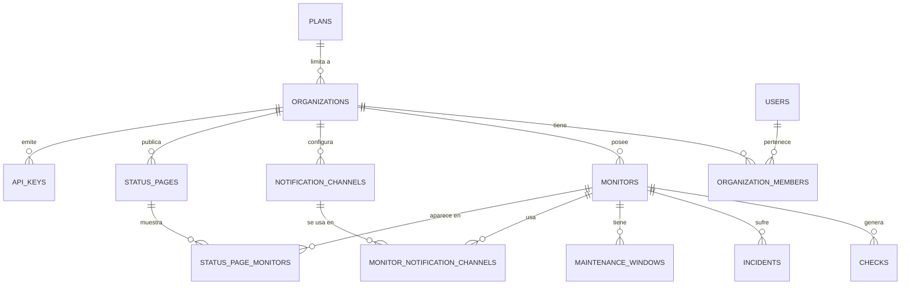

# Diario de construcción de UptimePulse

> Registro paso a paso de todo lo que se implementa, cómo se hace y cómo reproducirlo tú mismo desde una terminal, sin depender de este asistente. Cada entrada corresponde a una tarea de [TASK.md](TASK.md).

---

## 2026-09-20 — Fase 0.1: Estructura del monorepo

### Objetivo
Tener el esqueleto de carpetas del proyecto (`apps/api`, `apps/worker`, `apps/web`, `packages/shared`) con cada parte arrancando un "Hello world", más las herramientas base de calidad de código (TypeScript, ESLint, Prettier) y el repositorio git inicializado.

### Decisión de diseño: npm workspaces en vez de pnpm
El README sugería `pnpm` como gestor de monorepo. Al intentar activarlo con `corepack enable pnpm`, Windows dio un error de permisos (`EPERM`) porque corepack necesita escribir en `C:\Program Files\nodejs`, que requiere permisos de administrador.

**Decisión:** usar **npm workspaces** en su lugar. Viene integrado con Node (desde npm 7+), no requiere instalar nada adicional ni permisos de admin, y para el tamaño de este proyecto cubre exactamente lo mismo que pnpm (resolución de dependencias compartidas entre `apps/*` y `packages/*`, scripts por workspace). Si en el futuro el repo crece mucho y se necesita cacheo de builds más agresivo, se puede migrar a Turborepo por encima de npm workspaces sin rehacer la estructura.

> Si más adelante consigues permisos de admin y prefieres pnpm, el cambio es mecánico: borrar `node_modules` y `package-lock.json` de raíz, sustituir `"workspaces"` de `package.json` por un `pnpm-workspace.yaml`, y ejecutar `pnpm install`.

### Qué se hizo

1. **Estructura de carpetas** (README §6):
   ```
   uptimepulse/
   ├── apps/
   │   ├── api/src
   │   ├── worker/src
   │   └── web/src
   └── packages/
       └── shared/src
   ```

2. **`package.json` raíz** con `"workspaces": ["apps/*", "packages/*"]` y scripts atajo:
   - `npm run dev:api` → arranca solo la API.
   - `npm run dev:worker` → arranca solo el worker.
   - `npm run dev:web` → arranca solo el frontend.
   - `npm run build` / `npm run lint` / `npm run test` → se ejecutan en todos los workspaces que tengan ese script (`--workspaces --if-present`).

3. **`tsconfig.base.json`** en la raíz: configuración TypeScript estricta (`strict: true`) compartida, que cada app extiende con `"extends": "../../tsconfig.base.json"`.

4. **`packages/shared`**: paquete `@uptimepulse/shared` sin paso de compilación (se importa el `.ts` directamente vía `tsx`/Vite) que exporta los primeros tipos de dominio (`Monitor`, `MonitorType`, `MonitorStatus`). Este paquete crecerá según se avance en el modelo de datos (Fase 0.3).

5. **`apps/api`** y **`apps/worker`**: cada uno un paquete npm mínimo que usa [`tsx`](https://github.com/privatenumber/tsx) para ejecutar TypeScript directamente en desarrollo (sin compilar a JS cada vez), con `tsx watch` para recarga automática al guardar. De momento solo imprimen un mensaje por consola a modo de placeholder.

6. **`apps/web`**: app React + Vite + TypeScript montada a mano (en vez del scaffold interactivo `npm create vite@latest`, para que cada archivo generado quede documentado aquí). Arranca en `http://localhost:5173`.

7. **Calidad de código**: `eslint.config.js` (formato "flat config" de ESLint 9) con las reglas recomendadas de JS + TypeScript, y `.prettierrc.json` con el estilo de formateo. Scripts `npm run lint` y `npm run format` en la raíz.

8. **`.gitignore`** para no versionar `node_modules`, `dist`, `.env`, logs, etc.

9. **`git init`** — se inicializó el repositorio local. **Aún no se ha hecho ningún commit** (lo dejo para cuando tú lo confirmes explícitamente, ya que crear commits es una decisión tuya).

### Comandos ejecutados (y qué hace cada uno)

```bash
# Comprobar herramientas disponibles
node --version      # v24.19.0
npm --version        # 11.17.0
git --version        # 2.55.0

# Instalar todas las dependencias de todos los workspaces de golpe
npm install

# Arrancar cada app por separado (cada una en su propia terminal, quedan corriendo)
npm run dev:api      # imprime el mensaje placeholder y se queda escuchando cambios
npm run dev:worker   # ídem
npm run dev:web      # levanta Vite en http://localhost:5173

# Comprobar que el código pasa las reglas de estilo/errores básicos
npm run lint

# Inicializar el repositorio git (sin hacer commit todavía)
git init
```

### Cómo reproducir este paso tú mismo, desde cero

Si quisieras montar exactamente esto sin mí, en una carpeta vacía:

1. Verifica que tienes Node 20+ instalado: `node --version`.
2. Crea las carpetas: `mkdir -p apps/api/src apps/worker/src apps/web/src packages/shared/src` (en PowerShell: `New-Item -ItemType Directory -Force -Path apps/api/src, apps/worker/src, apps/web/src, packages/shared/src`).
3. Copia el contenido de cada archivo tal como aparece en el repo actual (`package.json` raíz, `tsconfig.base.json`, `.gitignore`, `eslint.config.js`, `.prettierrc.json`, y los `package.json`/`tsconfig.json`/`src/*` de cada `apps/*` y `packages/shared`) — todos están ya en tu proyecto, este diario documenta el porqué de cada uno, no hace falta rehacerlos.
4. Ejecuta `npm install` en la raíz.
5. Comprueba que arranca cada pieza con `npm run dev:api`, `npm run dev:worker`, `npm run dev:web` (en terminales separadas) y que `npm run lint` no da errores.
6. `git init` si aún no existe `.git/`.

### Cómo verificar que este paso está bien hecho
- `npm run dev:api` imprime `[api] servidor placeholder arrancado...` sin errores.
- `npm run dev:worker` imprime `[worker] proceso placeholder arrancado...` sin errores.
- `npm run dev:web` levanta Vite y `http://localhost:5173` muestra la página "UptimePulse" en el navegador.
- `npm run lint` termina sin listar errores.
- `git status` ya no dice "not a git repository".

### Pendiente / notas para más adelante
- Hay 2 vulnerabilidades reportadas por `npm audit` (1 moderada, 1 alta) en dependencias transitivas del scaffold de Vite/ESLint. No son explotables en este momento (son herramientas de desarrollo, no código que se despliega), pero conviene revisarlas con `npm audit` antes de la Fase 5 (seguridad).
- `npm` avisó de scripts de instalación pendientes de aprobar para `esbuild` (usado por Vite): `npm warn allow-scripts ... esbuild@0.28.2/0.21.5`. Esto es una política de seguridad de npm que bloquea `postinstall` scripts no aprobados explícitamente. Vite funcionó igualmente en la prueba (usa un binario ya publicado), pero si en el futuro ves errores de "esbuild binary not found", ejecuta `npm approve-scripts esbuild` para aprobarlo conscientemente (revisando antes qué hace ese script).
- ~~Todavía no hay ningún commit en git~~ **Corrección (ver entrada del 2026-09-20 más abajo): esto ya no es así.** Fuera de esta conversación se conectó el proyecto a un repositorio remoto real (`github.com/gsan-dev/UptimePulse`), con commits ya hechos. Detalle completo en la siguiente entrada.

### Próximo paso (Fase 0.2)
Levantar `docker-compose.yml` con PostgreSQL (+ TimescaleDB) y Redis para tener la infraestructura de datos local lista antes de diseñar el esquema de la Fase 0.3.

---

## 2026-09-20 (continuación) — Incidente: ramas git y verificación de la Fase 0.1

### Qué pasó
Fuera de esta conversación (probablemente desde el panel de Source Control de VS Code) se conectó el proyecto a un repositorio remoto real: `https://github.com/gsan-dev/UptimePulse.git`. Ahí se crearon dos ramas con historiales muy distintos:

- **`main`** → un único commit `"Initial commit: README only"` cuyo árbol está **completamente vacío** (ni siquiera tiene el readme, pese al mensaje).
- **`dev`** → un commit `"dev-branch 0.1 task.md readme.md apps/ packages/"` que sí contiene todo el trabajo de la Fase 0.1 (readme, TASK.md, DIARIO.md, apps/, packages/, configuración).

En algún momento se hizo `checkout` a `main`, y como esa rama no tiene archivos, Git vació la carpeta de trabajo — esto es lo que pareció "Git ha borrado mis archivos". Al volver a `dev`, todo reapareció porque ahí sí está guardado.

**Decisión tomada con el usuario:** dejar `main` vacía tal cual está por ahora y trabajar exclusivamente en `dev`. `main` seguirá siendo una rama "trampa" (si algo la vuelve a hacer checkout, la carpeta se vacía otra vez), así que conviene fijarse en el selector de rama de VS Code y confirmar que siempre marca `dev` antes de trabajar.

El usuario subió manualmente el `readme.md` a `main` con:
```bash
git checkout main
git checkout dev -- readme.md
git add readme.md
git commit -m "Añadir readme.md a main"
git push origin main
git checkout dev   # importante: volver a dev para seguir trabajando
```

### Verificación completa de la Fase 0.1 (repetida tras el incidente)

Como `node_modules/` no está versionado (está en `.gitignore`), desapareció durante el vaivén de ramas — **esto es normal y no indica ningún problema**, simplemente hay que reinstalar:

```bash
npm install
```

Con eso reinstalado, se repitió la checklist de verificación original y **todo sigue cumpliéndose**:

| Comprobación | Resultado |
|---|---|
| `npm run lint` sin errores | ✅ Correcto |
| `npm run dev:api` imprime el mensaje placeholder | ✅ Correcto |
| `npm run dev:worker` imprime el mensaje placeholder | ✅ Correcto |
| `npm run dev:web` levanta Vite en `http://localhost:5173` | ✅ Correcto |
| `git status` reconoce el repositorio (ya no dice "not a git repository") | ✅ Correcto — además ahora hay un remoto (`origin`) configurado |

**Conclusión: la Fase 0.1 sigue completa y funcional.** Nada se perdió; el susto fue por el checkout a una rama vacía, no por una eliminación real de archivos.

### Lección para el futuro
Cada vez que reabras el proyecto tras un tiempo sin tocarlo (o tras cualquier operación de git rara), el primer chequeo es:
```bash
git branch --show-current   # ¿estás en dev?
git status                  # ¿working tree clean?
npm install                 # por si falta node_modules
```

---

## 2026-09-20 (continuación 2) — Fase 0.2: Docker Compose para desarrollo

### Objetivo
Tener PostgreSQL (con la extensión TimescaleDB) y Redis corriendo en local vía Docker, con datos persistentes entre reinicios y configuración por variables de entorno, listos para que la Fase 0.3 (esquema de base de datos) tenga dónde aplicar sus migraciones.

### Paso previo: instalar y arrancar Docker Desktop
Docker no estaba instalado en la máquina. Se instaló con `winget` (requiere que el propio instalador se autoeleve a administrador — lo pidió Windows vía UAC, no hizo falta hacer nada especial más que aceptar):

```powershell
winget install --id Docker.DockerDesktop -e --accept-package-agreements --accept-source-agreements --silent
```

Tras la instalación hizo falta:
1. **Reiniciar el equipo** (para que Windows terminase de activar WSL2/Virtualización, que Docker Desktop necesita como backend). Esto lo hizo el usuario manualmente — reiniciar la máquina es una acción que afecta a todo lo abierto, así que no se automatiza.
2. **Abrir Docker Desktop** — la app no arranca sola tras el reinicio. Se lanzó con:
   ```powershell
   Start-Process "C:\Program Files\Docker\Docker\Docker Desktop.exe"
   ```
3. Esperar (30-90s la primera vez) a que el daemon responda:
   ```bash
   docker info
   ```

> **Nota:** el CLI de `docker` no queda en el `PATH` de Git Bash tras la instalación. La ruta completa que funciona es `/c/Program Files/Docker/Docker/resources/bin/docker.exe`. En una consola normal de Windows (PowerShell/CMD) sí queda disponible como `docker` tras reiniciar la terminal, porque Docker Desktop añade esa ruta al `PATH` del sistema, no al de Git Bash específicamente.

### Qué se hizo

1. **`docker-compose.yml`** en la raíz, con dos servicios:
   - `postgres` — imagen `timescale/timescaledb:latest-pg16` (Postgres con la extensión TimescaleDB ya instalada, en vez de la imagen oficial `postgres` a secas + instalar la extensión a mano).
   - `redis` — imagen `redis:7-alpine` (ligera, para la cola de trabajo de la Fase 2.1).
   - Ambos con `healthcheck` (`pg_isready` / `redis-cli ping`) para que `docker compose ps` diga explícitamente si están sanos, no solo "arrancados".
   - Ambos con volumen nombrado (`postgres_data`, `redis_data`) para que los datos sobrevivan a un `docker compose down` (no a un `down -v`, que sí los borra a propósito).
   - Puertos y credenciales parametrizados vía variables de entorno con valores por defecto (`${POSTGRES_USER:-uptimepulse}`), para que funcione incluso sin `.env`.

2. **`.env.example`** (versionado en git) documentando todas las variables: usuario/contraseña/puerto de Postgres, `DATABASE_URL` ya montada, puerto y `REDIS_URL` de Redis.

3. **`.env`** real creado como copia de `.env.example` (ya estaba cubierto por `.gitignore` desde la Fase 0.1, así que nunca se sube).

### Comandos ejecutados (y qué hace cada uno)

```bash
# Copiar la plantilla de variables de entorno a la real (solo la primera vez)
cp .env.example .env

# Descargar las imágenes y levantar los contenedores en segundo plano
docker compose up -d

# Ver el estado de los contenedores (deben decir "healthy", no solo "Up")
docker compose ps

# Comprobar que la extensión TimescaleDB está disponible dentro de Postgres
docker exec uptimepulse-postgres psql -U uptimepulse -d uptimepulse \
  -c "CREATE EXTENSION IF NOT EXISTS timescaledb; SELECT extname, extversion FROM pg_extension WHERE extname='timescaledb';"

# Comprobar que Redis responde
docker exec uptimepulse-redis redis-cli ping

# Ver los volúmenes persistentes creados
docker volume ls
```

**Resultado de la verificación:**
- `uptimepulse-postgres` → `Up (healthy)`, puerto `5432` expuesto.
- `uptimepulse-redis` → `Up (healthy)`, puerto `6379` expuesto.
- Extensión `timescaledb` versión `2.30.1` instalada correctamente.
- Redis responde `PONG`.
- Volúmenes `uptimepulse_postgres_data` y `uptimepulse_redis_data` creados.

### Cómo reproducir este paso tú mismo, desde cero

1. Instala Docker Desktop (si no lo tienes): `winget install --id Docker.DockerDesktop -e`, reinicia el equipo, abre Docker Desktop y espera a que el icono de la ballena diga "running".
2. En la raíz del proyecto: `cp .env.example .env` (en PowerShell: `Copy-Item .env.example .env`). Cambia la contraseña si quieres, aunque en local no es crítico.
3. `docker compose up -d`.
4. `docker compose ps` — comprueba que ambos servicios dicen `healthy`.
5. (Opcional, solo para comprobar) `docker exec uptimepulse-postgres psql -U uptimepulse -d uptimepulse -c "\dx"` — debería listar `timescaledb` entre las extensiones.

### Comandos útiles para el día a día
```bash
docker compose up -d       # arrancar (si ya existen los contenedores, los reutiliza)
docker compose down        # parar y borrar los contenedores (los datos NO se pierden, están en los volúmenes)
docker compose down -v     # parar y borrar TAMBIÉN los volúmenes (esto sí borra los datos, úsalo con cuidado)
docker compose logs -f     # ver logs en vivo de ambos servicios
```

### Pendiente / notas para más adelante
- La imagen usa el tag flotante `latest-pg16` (la última versión de TimescaleDB compatible con Postgres 16). Para producción convendría fijar una versión exacta (ej. `timescale/timescaledb:2.17.2-pg16`) para que un `docker compose pull` futuro no cambie de versión sin avisar. Anotado como mejora, no urgente en desarrollo.
- La contraseña por defecto en `.env.example` es `changeme` — recuerda cambiarla si esto llega a desplegarse en algún sitio accesible, aunque en local no supone riesgo real.

### Próximo paso (Fase 0.3)
Diseñar el modelo de datos (ERD) y elegir herramienta de migraciones (Prisma/Drizzle/node-pg-migrate) para empezar a aplicar el esquema sobre este Postgres.

---

## 2026-09-20 (continuación 3) — Fase 0.3: Modelo de datos inicial

### Objetivo
Diseñar el esquema completo de base de datos (13 tablas), elegir una herramienta de migraciones, y aplicarlo de verdad sobre el Postgres de la Fase 0.2 — no solo dejarlo dibujado en un documento.

### Decisión de diseño: Drizzle ORM + drizzle-kit, no Prisma
El TASK.md dejaba la elección abierta entre Prisma, Drizzle o node-pg-migrate. Motivo de la elección:

- La tabla `checks` necesita ser una **hypertable de TimescaleDB** (`create_hypertable()`) y llevar una **política de retención** (`add_retention_policy()`) — ambas son llamadas a funciones SQL específicas de Timescale que Prisma no sabe representar en su lenguaje de esquema (`schema.prisma`), obligando a workarounds frágiles.
- **Drizzle-kit soporta migraciones "custom"**: además de generar SQL automáticamente a partir del esquema TypeScript (como Prisma), permite intercalar archivos SQL escritos a mano en el mismo flujo de migraciones versionadas. Así, las partes "normales" (tablas, FKs, enums) se generan solas, y las partes Timescale-específicas se escriben a mano sin salirse del sistema de migraciones.
- Sigue dando tipos TypeScript inferidos automáticamente del esquema (igual que Prisma), que es lo que de verdad importa para que `apps/api` y `apps/worker` trabajen con autocompletado y sin duplicar tipos a mano.

### Decisión de diseño: nuevo paquete `packages/db`
El README original solo contemplaba `packages/shared`. Se añade `packages/db` porque:
- El esquema de base de datos y el cliente de Postgres (`pg`) solo los necesitan `apps/api` y `apps/worker` — **no** `apps/web`. Meterlo en `packages/shared` arrastraría el driver de Postgres al bundle del frontend.
- `packages/shared` sigue existiendo para los tipos de dominio ligeros que sí usa el frontend (`Monitor`, `MonitorStatus`, etc., de la Fase 0.1). Son deliberadamente dos cosas distintas: `shared` = contratos ligeros multi-plataforma; `db` = esquema real + acceso a datos, solo backend.

### El ERD (13 tablas)



Tablas y su propósito (todas creadas y verificadas contra la BD real):

| Tabla | Para qué sirve |
|---|---|
| `plans` | Límites de cada plan de suscripción (nº monitores, intervalo mínimo, canales permitidos). |
| `organizations` | Cuenta/equipo dueño de los monitores; referencia a su plan. |
| `users` | Usuarios, con soporte para password o login OAuth. |
| `organization_members` | Tabla puente usuario↔organización con rol (admin/editor/readonly). |
| `monitors` | Configuración de cada monitor (tipo, target, intervalo, timeout, etc.). |
| `checks` | **Hypertable de TimescaleDB.** Un resultado de comprobación por fila; volumen alto, particionado por tiempo. |
| `incidents` | Agrupación de checks fallidos consecutivos en un incidente con inicio/fin. |
| `notification_channels` | Canales configurados por organización (email/SMS/webhook/Slack/Discord). |
| `monitor_notification_channels` | Tabla puente monitor↔canal — la "matriz de alertas" del README §3.5. |
| `maintenance_windows` | Ventanas de mantenimiento (mejora añadida sobre el README original, ver análisis inicial). |
| `status_pages` / `status_page_monitors` | Páginas de estado públicas y qué monitores muestran. |
| `api_keys` | Claves de API por organización, con scopes y hash (nunca la clave en claro). |

### Decisiones concretas sobre columnas (para que quede razonado, no solo hecho)

- **IDs**: `uuid` con `defaultRandom()` (usa `gen_random_uuid()`) para todas las tablas salvo `checks`. Evita exponer IDs secuenciales adivinables en la API pública (ej. status pages).
- **`checks.id`**: aquí sí es `bigint` autoincremental, no `uuid`. Motivo: es la tabla de mayor volumen con diferencia (una fila por check, cada 30s-15min por monitor); un `bigint` ocupa 8 bytes frente a los 16 de un `uuid`, y no necesita ser impredecible porque nunca se expone en una URL pública.
- **Clave primaria de `checks` = `(id, timestamp)`**, no solo `id`. Esto no es una preferencia sino un **requisito técnico de TimescaleDB**: la clave primaria de una hypertable debe incluir la columna de partición temporal.
- **Borrado en cascada** (`ON DELETE CASCADE`) desde `monitors`, `organizations`, etc. hacia sus tablas hijas: al borrar una organización o un monitor, se limpia todo lo asociado (checks, incidentes, ventanas de mantenimiento...) sin dejar huérfanos. Verificado en la prueba de humo (ver más abajo).
- **`headers`, `tags`, `config`, `scopes`, `allowed_channels`** son `jsonb` en vez de tablas normalizadas aparte — son datos de forma variable/opcional por fila donde no hace falta consultarlos con SQL relacional; `jsonb` es el compromiso estándar de Postgres para esto.

### Política de retención de datos (decisión pendiente del análisis inicial, ahora resuelta)
- Los checks en crudo se conservan **90 días** (`add_retention_policy('checks', INTERVAL '90 days')`), ya activa y verificada contra la BD real.
- A partir de esos 90 días, TimescaleDB borra automáticamente los chunks antiguos.
- **Importante para la Fase 2.2:** los *continuous aggregates* (rollups horarios/diarios para calcular uptime % histórico) deben crearse **antes** de que la política de retención empiece a borrar datos con los que aún no se ha calculado ningún rollup. En desarrollo esto no es un problema (no hay datos de producción de más de 90 días), pero es la razón por la que la Fase 2.2 del TASK.md debe implementarse sin demorarla demasiado una vez haya datos reales.

### Comandos ejecutados (y qué hace cada uno)

```bash
# 1. Instalar las dependencias nuevas (drizzle-orm, drizzle-kit, pg, dotenv, tsx)
npm install

# 2. Generar una migración "en blanco" para escribir SQL a mano (extensiones de Postgres)
cd packages/db
npx drizzle-kit generate --custom --name=enable_extensions
# -> crea migrations/0000_enable_extensions.sql vacío, que se rellenó a mano con:
#    CREATE EXTENSION IF NOT EXISTS pgcrypto;
#    CREATE EXTENSION IF NOT EXISTS timescaledb;

# 3. Generar la migración del esquema completo, comparando schema.ts contra "nada" (primera vez)
npx drizzle-kit generate
# -> crea migrations/0001_grey_deadpool.sql con las 13 tablas, enums y foreign keys

# 4. Otra migración en blanco para la conversión a hypertable + retención
npx drizzle-kit generate --custom --name=checks_hypertable
# -> se rellenó a mano con create_hypertable(), add_retention_policy() y un índice de apoyo

# 5. Aplicar las tres migraciones, en orden, contra el Postgres del docker-compose
npm run db:migrate
```

### Problema encontrado y resuelto: `drizzle-kit` no encontraba `drizzle-orm`

Al ejecutar el paso 2 por primera vez, `drizzle-kit` fallaba con:
```
Please install latest version of drizzle-orm
```
...incluso teniendo la versión correcta instalada. La causa (investigada leyendo el propio código de `drizzle-kit` en `node_modules`): `drizzle-orm` tiene muchos peer-dependencies opcionales (uno por cada driver de BD que soporta: `pg`, `postgres`, `mysql2`, `better-sqlite3`...), y el algoritmo de hoisting de `npm` en el monorepo decidió **no elevarlo** a la raíz `node_modules/`, dejándolo solo dentro de `packages/db/node_modules/`. El binario de `drizzle-kit`, que sí vive en la raíz, intenta hacer `import("drizzle-orm/version")` resolviendo desde su propia ubicación (la raíz) y no lo encuentra.

**Solución aplicada:** declarar `drizzle-orm` también como `devDependency` en el `package.json` raíz (además de en `packages/db`, que es donde realmente se usa en tiempo de ejecución). Esto es un workaround pragmático y conocido en la comunidad de Drizzle+npm-workspaces, no una solución "elegante", pero es la forma estándar de resolver este problema concreto sin migrar de gestor de paquetes.

> Si en el futuro esto vuelve a romperse tras un `npm install` limpio, el síntoma es el mismo mensaje de error, y el diagnóstico es: `find . -maxdepth 4 -iname "drizzle-orm" -type d` para ver dónde quedó instalado, y confirmar que también existe en `node_modules/drizzle-orm` (raíz).

### Verificación completa realizada

```bash
# Tablas creadas
docker exec uptimepulse-postgres psql -U uptimepulse -d uptimepulse -c "\dt"
# -> 13 tablas listadas

# checks es una hypertable de verdad
docker exec uptimepulse-postgres psql -U uptimepulse -d uptimepulse \
  -c "SELECT hypertable_name FROM timescaledb_information.hypertables;"
# -> checks

# La política de retención está activa
docker exec uptimepulse-postgres psql -U uptimepulse -d uptimepulse \
  -c "SELECT hypertable_name, config FROM timescaledb_information.jobs WHERE proc_name='policy_retention';"
# -> checks | {"drop_after": "90 days", ...}
```

Además, se hizo una **prueba de extremo a extremo** con un script temporal (`smoke-test.mts`, borrado después de usarlo, no forma parte del repo) que:
1. Insertó un plan, una organización, un monitor y un check reales usando el cliente Drizzle (`db.insert(...).returning()`), confirmando que los tipos TypeScript inferidos del esquema funcionan en la práctica (autocompletado, tipos de retorno correctos, `check.id` como `bigint` de JS).
2. Borró la organización de prueba y comprobó que el borrado en cascada limpió también el monitor y el check asociados, sin necesidad de borrarlos a mano uno por uno.

`npm run lint` y `npx tsc --noEmit -p packages/db` también se ejecutaron limpios sobre todo el código nuevo.

### Cómo reproducir este paso tú mismo, desde cero

1. Asegúrate de que Docker está corriendo y `docker compose up -d` (Fase 0.2) está aplicado.
2. `npm install` en la raíz (instala drizzle-orm, drizzle-kit, pg, dotenv).
3. Si necesitas volver a generar migraciones tras cambiar `packages/db/src/schema.ts`:
   ```bash
   npm run db:generate    # desde la raíz; genera un nuevo archivo en packages/db/migrations/
   ```
4. Para aplicar las migraciones pendientes contra la base de datos:
   ```bash
   npm run db:migrate     # desde la raíz
   ```
5. Si necesitas escribir una migración manual (SQL específico de Timescale, un índice raro, etc.):
   ```bash
   cd packages/db
   npx drizzle-kit generate --custom --name=<nombre-descriptivo>
   # rellena el .sql vacío que se genera en migrations/
   ```
6. **Nunca edites un archivo de `migrations/` que ya se haya aplicado en algún entorno** (ni siquiera el tuyo si ya lo compartiste) — crea uno nuevo. El historial de migraciones es append-only por diseño.

### Pendiente / notas para más adelante
- El paquete `packages/shared` (Fase 0.1) todavía no está alineado con este esquema real — sus tipos (`Monitor`, etc.) son una versión simplificada hecha a mano antes de tener el ERD. Cuando se implemente la API (Fase 1.2), conviene revisar si esos tipos deben derivarse de los tipos de `packages/db` (con `InferSelectModel`) filtrando los campos que sí debe ver el frontend, en vez de mantenerse como una copia manual separada.
- Falta lo último de la Fase 0.4 (convenciones de logging estructurado compartido entre API y worker) — no se ha tocado todavía.

### Próximo paso (Fase 0.4 o Fase 1.1)
Terminar la Fase 0.4 (convención de logging compartido) o saltar directamente a la Fase 1.1 (autenticación), que es lo primero que necesita tocar estas tablas (`users`, `organizations`, `organization_members`) desde código de API real.

### Cómo comprobar tú mismo que esto funciona (en cualquier momento, sin depender de mí)

```bash
# 1. ¿Están vivos los contenedores?
docker compose ps
# -> uptimepulse-postgres y uptimepulse-redis, ambos "Up (healthy)"

# 2. ¿Existen las 13 tablas?
docker exec uptimepulse-postgres psql -U uptimepulse -d uptimepulse -c "\dt"

# 3. ¿"checks" es una hypertable de verdad?
docker exec uptimepulse-postgres psql -U uptimepulse -d uptimepulse \
  -c "SELECT hypertable_name FROM timescaledb_information.hypertables;"
# -> debe devolver: checks

# 4. ¿Está activa la política de retención de 90 días?
docker exec uptimepulse-postgres psql -U uptimepulse -d uptimepulse \
  -c "SELECT hypertable_name, config FROM timescaledb_information.jobs WHERE proc_name='policy_retention';"
# -> debe devolver: checks | {"drop_after": "90 days", ...}
```

Prueba manual más convincente (entrar a `psql` interactivo y comprobar el borrado en cascada con tus propios ojos):
```bash
docker exec -it uptimepulse-postgres psql -U uptimepulse -d uptimepulse
```
```sql
INSERT INTO plans (name, max_monitors, min_interval_seconds, allowed_channels)
VALUES ('free-manual', 3, 300, '["email"]') RETURNING id;   -- copia el id -> <PLAN_ID>

INSERT INTO organizations (name, plan_id) VALUES ('Mi org de prueba', '<PLAN_ID>') RETURNING id; -- -> <ORG_ID>

INSERT INTO monitors (organization_id, name, type, target)
VALUES ('<ORG_ID>', 'Google', 'http', 'https://google.com') RETURNING id;  -- -> <MONITOR_ID>

INSERT INTO checks (monitor_id, status, response_time_ms, http_status)
VALUES ('<MONITOR_ID>', 'up', 87, 200) RETURNING *;

SELECT m.name, c.status, c.response_time_ms, c.timestamp
FROM checks c JOIN monitors m ON m.id = c.monitor_id;

DELETE FROM organizations WHERE id = '<ORG_ID>';
SELECT * FROM monitors WHERE id = '<MONITOR_ID>';        -- debe dar 0 filas
SELECT * FROM checks WHERE monitor_id = '<MONITOR_ID>';  -- debe dar 0 filas
\q
```
Si al borrar la organización desaparecen solos el monitor y el check, el borrado en cascada funciona.

**Alternativa visual:** conectar DBeaver / TablePlus / la extensión PostgreSQL de VS Code a `localhost:5432`, usuario `uptimepulse`, contraseña `changeme` (están en tu `.env`), base de datos `uptimepulse`.

---

## 2026-09-20 (continuación 4) — Fase 0.4: Convenciones de código compartidas

### Objetivo
Que `packages/shared` deje de ser un puñado de tipos escritos a mano (como quedó en la Fase 0.1, antes de existir el ERD) y pase a ser la única fuente de verdad de tipos de dominio para `apps/api`, `apps/worker` y `apps/web`; y tener un formato de logging estructurado común entre los dos procesos backend.

### Decisión de diseño: los tipos de `shared` se derivan del esquema real, no se duplican a mano
En vez de mantener un `Monitor` (y luego `Check`, `Incident`, etc.) escritos a mano en `packages/shared` en paralelo a las tablas de `packages/db` — con el riesgo de que se desincronicen en cuanto alguien cambie una columna sin acordarse de tocar los dos sitios — `packages/shared/src/domain.ts` ahora hace:

```ts
export type Monitor = InferSelectModel<typeof monitors>;
```

`InferSelectModel` es una utilidad de Drizzle que convierte la definición de una tabla en el tipo TypeScript exacto de una fila. Cambiar una columna en `packages/db/src/schema.ts` (Fase 0.3) actualiza automáticamente el tipo en `packages/shared`, y de ahí a todo lo que lo consuma — sin tocar `domain.ts` para nada, salvo que se añada una tabla nueva.

### El riesgo que había que evitar: que el frontend arrastre `pg`
`packages/db` importa `pg` (el driver de Postgres) y, en cuanto se importa su cliente (`client.ts`), intenta leer `DATABASE_URL` y abrir una conexión — código que **no debe existir en el navegador**. Para que `packages/shared` pudiera usar los tipos de `packages/db` sin arrastrar ese runtime al bundle de `apps/web`, todos los imports desde `@uptimepulse/db` en `domain.ts` usan la sintaxis `import type`, nunca `import` normal:

```ts
import type { InferSelectModel } from "drizzle-orm";
import type { monitors, checks, /* ... */ } from "@uptimepulse/db";
```

`import type` se borra por completo del código compilado (tanto `tsc` como el `esbuild` que usa Vite lo eliminan siempre, incluso sin type-checking completo), así que en tiempo de ejecución el navegador nunca ve ni una línea de `@uptimepulse/db`.

**Verificado, no solo asumido:** se arrancó `apps/web`, se pidió por HTTP el archivo `src/App.tsx` ya transformado por Vite (`curl http://localhost:5173/src/App.tsx`), y se comprobó a ojo que el JS servido **no contiene ningún `import` de `@uptimepulse/shared`, `@uptimepulse/db`, `pg` ni `drizzle-orm`** — el `import type { Monitor } from "@uptimepulse/shared"` desapareció sin dejar rastro, tal como se esperaba.

### Qué se hizo

1. **`packages/shared/src/domain.ts`** (nuevo): tipos `Monitor`, `Check`, `Incident`, `NotificationChannel`, `MaintenanceWindow`, `StatusPage`, `Plan`, `Organization` derivados con `InferSelectModel`; `MonitorType`, `CheckStatus`, `ChannelType`, `OrgRole` derivados de los `pgEnum` del esquema (`(typeof monitorTypeEnum.enumValues)[number]`); y `PublicUser` como excepción manual: `Omit<..., "passwordHash" | "oauthId">`, porque esos dos campos **nunca** deben llegar al frontend.
2. **`packages/shared/src/logger.ts`** (nuevo): `createLogger(service: string)` que devuelve `{ debug, info, warn, error }`, cada uno imprimiendo una línea JSON (`timestamp`, `level`, `service`, `message`, + campos extra). Escrito sin ninguna API de Node (nada de `process.pid` ni similares) para que sea seguro de importar desde cualquier sitio, aunque su uso previsto es solo backend.
3. **`packages/shared/src/index.ts`**: ahora solo re-exporta `domain.ts` y `logger.ts` (antes tenía los tipos a mano directamente).
4. **`packages/shared/package.json`**: añadida dependencia `@uptimepulse/db` (para los tipos) y devDependency `drizzle-orm` (para `InferSelectModel`).
5. **`packages/shared/tsconfig.json`** (nuevo, no existía desde la Fase 0.1): para poder tipar el paquete de forma aislada con `tsc --noEmit -p packages/shared`, igual que ya se hacía con `packages/db`.
6. **`apps/api/src/index.ts`**: usa `createLogger("api")` en vez de `console.log`, y el placeholder `exampleMonitor` ahora es un objeto `Monitor` completo y válido (con todos los campos reales de la tabla: `organizationId`, `method`, `headers`, `body`, `expectedStatus`, `tags`, `createdAt`...), no la versión simplificada de la Fase 0.1.
7. **`apps/worker/src/index.ts`**: usa `createLogger("worker")`.
8. **`apps/web/package.json`**: se añadió la dependencia `@uptimepulse/shared` (curiosamente no se había declarado en la Fase 0.1, aunque `apps/api`/`apps/worker` sí la tenían).
9. **`apps/web/src/App.tsx`**: añadido un listado placeholder tipado como `Pick<Monitor, "name" | "type" | "target">[]`, solo para demostrar que el tipo llega con autocompletado hasta el frontend (el dashboard real es la Fase 1.4, esto no lo adelanta).

### Comandos ejecutados (y qué hace cada uno)

```bash
# Instalar las dependencias nuevas (enlaza @uptimepulse/db dentro de @uptimepulse/shared,
# y @uptimepulse/shared dentro de apps/web, vía los symlinks de npm workspaces)
npm install

# Comprobar que todo tipa sin errores, paquete por paquete
npm run lint
npx tsc --noEmit -p packages/shared
npx tsc --noEmit -p apps/api
npx tsc --noEmit -p apps/worker
npx tsc --noEmit -p apps/web

# Comprobar que los logs salen en JSON de verdad (no solo que compila)
npm run dev:api      # -> {"timestamp":"...","level":"info","service":"api","message":"servidor placeholder arrancado","monitor":{...}}
npm run dev:worker   # -> {"timestamp":"...","level":"info","service":"worker","message":"proceso placeholder arrancado..."}

# Comprobar que el import de tipo se borra del bundle del navegador
npm run dev:web &
curl http://localhost:5173/src/App.tsx | head -20
# -> el JS transformado no contiene ningún import de @uptimepulse/shared
```

### Cómo reproducir / comprobar tú mismo

```bash
# 1. Arranca api y worker en dos terminales separadas y mira que los logs sean JSON de una línea
npm run dev:api
npm run dev:worker

# 2. Arranca el frontend y ábrelo en el navegador
npm run dev:web
# -> http://localhost:5173 debe mostrar la lista de 2 monitores de ejemplo (Google, API interna)

# 3. (la comprobación "de verdad") en el navegador, abre las DevTools -> pestaña Network,
#    recarga la página, y mira la petición a /src/App.tsx: no debe haber ninguna petición
#    a @uptimepulse/db, pg, drizzle-orm ni nada que empiece por esos nombres.

# 4. Type-check de todo el repo de una vez
npx tsc --noEmit -p packages/shared && npx tsc --noEmit -p packages/db && npx tsc --noEmit -p apps/api && npx tsc --noEmit -p apps/worker && npx tsc --noEmit -p apps/web
```

### Pendiente / notas para más adelante
- `Check.id` es un `bigint` de JavaScript (viene de la columna `bigint` de Postgres). `JSON.stringify()` **no sabe serializar `bigint`** y lanza una excepción si se intenta tal cual — habrá que convertirlo a `string` o `number` al construir las respuestas de la API en la Fase 1.2. Queda anotado aquí para no encontrárselo por sorpresa.
- No se ha añadido todavía ningún `tsconfig` "raíz" que haga type-check de todo el monorepo de una vez (`tsc --build` con project references); de momento se comprueba paquete por paquete a mano, como en los comandos de arriba. Se puede añadir cuando moleste tener que repetir el comando 5 veces.

### Próximo paso (Fase 1.1)
Autenticación: registro/login con email+contraseña, hash con bcrypt/argon2, y la decisión de diseño pendiente de JWT vs. sesiones (documentar en la sección de ADR del TASK.md).

---

## 2026-09-20 (continuación 5) — Fase 1.1: Autenticación

### Objetivo
Que `apps/api` deje de ser un placeholder y tenga un servidor HTTP real con registro, login, JWT (access + refresh) y un endpoint protegido (`GET /me`) — la primera funcionalidad de negocio real del proyecto.

### Decisiones de diseño (razonadas en detalle en la sección de ADR de TASK.md)
- **Framework: Fastify**, no Express.
- **JWT access (15 min) + refresh (7 días) en cookie httpOnly**, no sesiones de servidor. El access token va en el body de la respuesta (el frontend lo guardará en memoria en la Fase 1.4, nunca en `localStorage`); el refresh token no lo toca JavaScript del navegador.
- **`bcryptjs`** para el hash de contraseñas, no `bcrypt`/`argon2` nativos — para evitar otro punto de fricción con compilación nativa en esta máquina (ya tuvimos problemas de permisos con `pnpm`/`corepack` en la Fase 0.1).
- Al registrarse, se crea automáticamente una **organización personal** (`Organización de <email>`) con el usuario como `admin` — sin esto, un usuario recién registrado no tendría dónde colgar sus monitores en la Fase 1.2.

### Qué se hizo

**Estructura nueva en `apps/api/src/`:**
- `env.ts` — carga `.env` de la raíz (con `dotenv`) y valida que existan las variables necesarias, lanzando un error explícito si falta alguna. **Debe ser siempre el primer import** de cualquier punto de entrada que toque `@uptimepulse/db`, porque el cliente de esa librería lee `process.env.DATABASE_URL` en cuanto se importa.
- `lib/password.ts` — `hashPassword` / `verifyPassword`, envoltorio fino sobre `bcryptjs`.
- `lib/tokens.ts` — `signAccessToken` / `verifyAccessToken` / `signRefreshToken` / `verifyRefreshToken`, sobre `jsonwebtoken`. Dos secretos distintos (`JWT_ACCESS_SECRET`, `JWT_REFRESH_SECRET`) para que filtrar uno no comprometa el otro.
- `plugins/auth.ts` — `requireAuth`, un `preHandler` de Fastify que exige `Authorization: Bearer <token>`, lo verifica, y cuelga `request.user = { id, email }` para que la ruta lo use.
- `routes/auth.ts` — `POST /auth/register`, `POST /auth/login`, `POST /auth/refresh`, `POST /auth/logout`, `GET /me`. Validación de entrada con `zod` (`registerSchema`, `loginSchema`).
- `server.ts` — construye la instancia de Fastify, registra `@fastify/cookie` y `@fastify/cors`, y un error handler que usa el logger de la Fase 0.4 en vez del logger por defecto de Fastify.
- `index.ts` — punto de entrada; arranca el servidor en el puerto de `.env` (`PORT`, por defecto 3000).

**Variables de entorno nuevas** (`.env.example` y `.env`): `PORT`, `NODE_ENV`, `JWT_ACCESS_SECRET`, `JWT_REFRESH_SECRET`. Los secretos del `.env` real se generaron con:
```bash
node -e "console.log(require('crypto').randomBytes(32).toString('hex'))"
```
(uno para access, otro para refresh — nunca el mismo valor para los dos).

**Cómo se protege `PublicUser`:** la función `toPublicUser()` en `routes/auth.ts` desestructura y descarta explícitamente `passwordHash` y `oauthId` antes de devolver el usuario en cualquier respuesta HTTP — usando el tipo `PublicUser` de `packages/shared` (Fase 0.4) para que TypeScript avise si algún día se intenta devolver un campo sensible sin querer.

**Ajuste a ESLint:** se añadió una regla (`argsIgnorePattern`/`varsIgnorePattern: "^_"`) para permitir variables descartadas a propósito con prefijo `_` (necesario para `const { passwordHash: _passwordHash, ... }`), en vez de tener que inventarse un uso artificial solo para pasar el linter.

### Comandos ejecutados (y qué hace cada uno)

```bash
# Generar los secretos JWT (una vez, para el .env real — nunca para .env.example)
node -e "console.log(require('crypto').randomBytes(32).toString('hex'))"

# Instalar fastify, @fastify/cookie, @fastify/cors, bcryptjs, jsonwebtoken, zod, dotenv...
npm install

# Comprobar tipos y estilo
npx tsc --noEmit -p apps/api
npm run lint

# Arrancar la API de verdad
npm run dev:api
```

### Verificación completa realizada (peticiones HTTP reales, no solo "debería funcionar")

```bash
curl http://localhost:3000/health
# -> {"status":"ok"}

curl -o /dev/null -w "HTTP %{http_code}\n" http://localhost:3000/me
# -> HTTP 401 (sin token, correctamente rechazado)

curl -c cookies.txt -X POST http://localhost:3000/auth/register \
  -H "Content-Type: application/json" \
  -d '{"email":"test@uptimepulse.dev","password":"password123"}'
# -> 201, devuelve { user: {...sin passwordHash ni oauthId...}, accessToken }

# Login, guardando la cookie de refresh
curl -c cookies.txt -X POST http://localhost:3000/auth/login \
  -H "Content-Type: application/json" \
  -d '{"email":"test@uptimepulse.dev","password":"password123"}'

curl http://localhost:3000/me -H "Authorization: Bearer <accessToken>"
# -> 200, devuelve el usuario

# Casos de error
curl -o /dev/null -w "%{http_code}\n" -X POST http://localhost:3000/auth/register -d '...(mismo email)...'
# -> 409 (email duplicado)
curl -o /dev/null -w "%{http_code}\n" -X POST http://localhost:3000/auth/login -d '...(password incorrecta)...'
# -> 401

# Refresh usando la cookie httpOnly (sin mandar el access token)
curl -b cookies.txt -X POST http://localhost:3000/auth/refresh
# -> 200, devuelve un accessToken nuevo

# Logout
curl -i -b cookies.txt -X POST http://localhost:3000/auth/logout
# -> 204, y la respuesta incluye Set-Cookie que borra la cookie de refresh
```

**Verificación directa en la base de datos** (que el registro creó la organización y la membresía, no solo el usuario):
```sql
SELECT u.email, o.name AS organizacion, om.role
FROM users u
JOIN organization_members om ON om.user_id = u.id
JOIN organizations o ON o.id = om.organization_id
WHERE u.email = 'test@uptimepulse.dev';
-- -> test@uptimepulse.dev | Organización de test@uptimepulse.dev | admin
```

Los datos de prueba se borraron después de verificar (`DELETE FROM organizations ...` + `DELETE FROM users ...`), para no dejar registros de prueba en la base de datos de desarrollo.

### Cómo reproducir / comprobar tú mismo

```bash
# 1. Asegúrate de que Postgres está corriendo (Fase 0.2) y las migraciones aplicadas (Fase 0.3)
docker compose up -d
npm run db:migrate

# 2. Arranca la API
npm run dev:api
# -> deberías ver: {"timestamp":"...","level":"info","service":"api","message":"servidor escuchando","address":"http://127.0.0.1:3000"}

# 3. Regístrate (cambia el email si ya lo usaste antes)
curl -c cookies.txt -X POST http://localhost:3000/auth/register \
  -H "Content-Type: application/json" \
  -d '{"email":"tu-email@ejemplo.com","password":"unaContraseñaLarga123"}'
# copia el "accessToken" de la respuesta

# 4. Prueba el endpoint protegido
curl http://localhost:3000/me -H "Authorization: Bearer <PEGA_AQUI_EL_TOKEN>"

# 5. Prueba que SIN token te rechaza
curl -o /dev/null -w "%{http_code}\n" http://localhost:3000/me
# -> debe dar 401
```

### Pendiente / notas para más adelante
- No hay revocación de refresh tokens (no hay tabla `refresh_tokens` con estado "activo/revocado") — un refresh token filtrado sigue siendo válido hasta que caduque a los 7 días. Es una limitación aceptada para el MVP, anotada para revisar en la Fase 5 (seguridad) si se necesita "cerrar sesión en todos los dispositivos" o revocación activa.
- No hay rate limiting en `/auth/login` todavía — un atacante podría intentar fuerza bruta sin límite. Pertenece a la Fase 5.1 (seguridad), donde ya está anotado.
- OAuth (GitHub/Google, mencionado en el README §2.7) no se ha tocado — los campos `oauth_provider`/`oauth_id` existen en el esquema desde la Fase 0.3 pero no hay flujo implementado.
- `@fastify/cors` está configurado con `origin: true` (permite cualquier origen) — válido para desarrollo local, pero **hay que restringirlo** a los dominios reales antes de desplegar a producción (anotado también en la Fase 5.1 del TASK.md).

### Cómo comprobar tú mismo que esto funciona (en cualquier momento)

```bash
# 0. Preparación
docker compose up -d
npm run dev:api
# -> espera a ver: {"...","message":"servidor escuchando","address":"http://127.0.0.1:3000"}

# 1. Vivo, y bloquea sin token
curl http://localhost:3000/health                                   # -> {"status":"ok"}
curl -o /dev/null -w "%{http_code}\n" http://localhost:3000/me       # -> 401

# 2. Registro (guarda la cookie de refresh en cookies.txt)
curl -c cookies.txt -X POST http://localhost:3000/auth/register \
  -H "Content-Type: application/json" \
  -d '{"email":"prueba@ejemplo.com","password":"password123"}'
# -> 201, copia el "accessToken" de la respuesta

# 3. Endpoint protegido con el token copiado
curl http://localhost:3000/me -H "Authorization: Bearer <TOKEN>"    # -> 200, tu usuario

# 4. Casos que deben fallar
curl -o /dev/null -w "%{http_code}\n" -X POST http://localhost:3000/auth/register \
  -H "Content-Type: application/json" -d '{"email":"prueba@ejemplo.com","password":"password123"}'  # -> 409 (duplicado)
curl -o /dev/null -w "%{http_code}\n" -X POST http://localhost:3000/auth/login \
  -H "Content-Type: application/json" -d '{"email":"prueba@ejemplo.com","password":"mala"}'          # -> 401

# 5. Refresh y logout con la cookie guardada
curl -b cookies.txt -X POST http://localhost:3000/auth/refresh      # -> 200, accessToken nuevo
curl -i -b cookies.txt -X POST http://localhost:3000/auth/logout    # -> 204 + Set-Cookie que borra la cookie

# 6. (la prueba más reveladora) confirmar en la BD que se creó la organización personal
docker exec uptimepulse-postgres psql -U uptimepulse -d uptimepulse -c "
SELECT u.email, o.name AS organizacion, om.role
FROM users u
JOIN organization_members om ON om.user_id = u.id
JOIN organizations o ON o.id = om.organization_id
WHERE u.email = 'prueba@ejemplo.com';"
```

**Nota si usas PowerShell en vez de Git Bash:** ahí `curl` es un alias de `Invoke-WebRequest` y no acepta `-d`/`-c` de la misma forma. Usa `curl.exe` explícitamente (con la extensión, para forzar el curl real de Windows) y el resto de comandos funciona igual.

### Próximo paso (Fase 1.2)
CRUD de monitores: `POST/GET/PATCH/DELETE /monitors`, con la validación anti-SSRF que quedó marcada como crítica en el análisis inicial del README.

---

## 2026-09-20 (continuación 6) — Fase 1.2: CRUD de monitores + validación anti-SSRF

### Objetivo
Que un usuario autenticado pueda crear, listar, ver, editar, pausar/reanudar y borrar monitores — con la validación anti-SSRF (marcada como crítica en el análisis inicial del README) y los límites del plan de suscripción realmente aplicados, no solo documentados.

### Pieza previa necesaria: sembrar un plan "free" real
Los monitores tienen que validarse contra "los límites del plan" (README §2.7, TASK §1.2), pero hasta ahora ninguna organización tenía un plan asignado (`organizations.plan_id` llevaba desde la Fase 0.3 sin usarse). Se añadió una migración custom:
```sql
-- migrations/0003_seed_default_plan.sql
INSERT INTO plans (name, max_monitors, min_interval_seconds, allowed_channels)
VALUES ('free', 5, 300, '["email"]'::jsonb)
ON CONFLICT (name) DO NOTHING;
```
Y se modificó `POST /auth/register` (Fase 1.1) para asignar este plan a toda organización nueva. El `ON CONFLICT DO NOTHING` hace que la migración sea segura de re-ejecutar (idempotente).

### Decisión de diseño: una organización "primaria" por usuario (simplificación temporal)
`apps/api/src/lib/organizations.ts` expone `getPrimaryOrganizationId(userId)`, que coge la primera membresía del usuario sin pedir que elija cuál. Es correcto hoy porque el registro (Fase 1.1) crea exactamente una organización por usuario; dejará de serlo en la Fase 4 (equipos). Queda documentado en el propio código y en el ADR de TASK.md para no olvidarlo cuando llegue el momento.

### La pieza central: `lib/ssrf-guard.ts`
Qué hace `assertPublicHost(hostname)`:
1. Si `hostname` es ya una IP literal (`net.isIP`), la comprueba directamente.
2. Si es un nombre de dominio, lo resuelve con `dns.lookup(hostname, { all: true })` — pidiendo **todas** las direcciones, no solo la primera — y comprueba cada una.
3. Si cualquiera de las IPs (o la única) cae en un rango privado/loopback/link-local (IPv4: `127.0.0.0/8`, `10.0.0.0/8`, `172.16.0.0/12`, `192.168.0.0/16`, `169.254.0.0/16`, `0.0.0.0/8`; IPv6: `::1`, `fe80::/10`, `fc00::/7`, y direcciones IPv4-mapeadas `::ffff:x.x.x.x`), lanza `SsrfBlockedError` con un mensaje claro.
4. Se puede desactivar con `ALLOW_PRIVATE_MONITOR_TARGETS=true` en `.env`, pensado solo para poder monitorizar servicios internos durante el desarrollo local.

**Por qué comprobar por DNS y no solo por texto:** bloquear el string `"localhost"` o `"169.254.169.254"` a mano habría dejado un hueco enorme — cualquier dominio público que resuelva a una IP privada (a propósito, vía "DNS rebinding") lo habría esquivado. La prueba con `localtest.me` (ver más abajo) demuestra justo esto: es un dominio público de verdad, pero configurado para resolver a `127.0.0.1`, y el guardián lo bloquea igualmente porque comprueba la IP resuelta, no el nombre.

`lib/target.ts` extrae el hostname a comprobar según el tipo de monitor: la URL completa para `http` (`new URL(target).hostname`), la parte antes de los dos puntos para `tcp` (`host:puerto`), y el target tal cual para `ping`.

### Validación de entrada con Zod (por tipo de monitor)
`createMonitorSchema` es un `z.discriminatedUnion("type", [...])`: cada tipo de monitor (`http`/`tcp`/`ping`) tiene su propia forma de validar `target` (URL completa, `host:puerto`, o solo un string no vacío), y los campos específicos de HTTP (`method`, `headers`, `body`, `expectedStatus`) solo existen en el schema de tipo `http`. El intervalo por defecto se fijó en **300 segundos a propósito**, para que coincida con el mínimo del plan "free" — así, si el cliente no manda `intervalSeconds`, nunca choca contra el límite del plan sin querer.

### Endpoints implementados (todos protegidos por `requireAuth`, vía `app.addHook("preHandler", requireAuth)` a nivel de todo el plugin de rutas)
| Método y ruta | Qué hace |
|---|---|
| `POST /monitors` | Valida input, comprueba límites del plan (intervalo mínimo, nº máximo), comprueba anti-SSRF, crea el monitor. |
| `GET /monitors` | Lista los monitores de la organización del usuario. |
| `GET /monitors/:id` | Un monitor, solo si pertenece a la organización del usuario (si no, 404 — no 403, para no confirmar que el id existe). |
| `PATCH /monitors/:id` | Actualiza campos parciales; si cambia `target`, repite la comprobación anti-SSRF; si cambia `intervalSeconds`, repite la comprobación del plan. |
| `DELETE /monitors/:id` | Borra (con la misma comprobación de propiedad). |
| `POST /monitors/:id/pause` / `/resume` | Cambia `isPaused`. |

### Comandos ejecutados

```bash
# Generar y aplicar la migración de seed del plan free
cd packages/db && npx drizzle-kit generate --custom --name=seed_default_plan
# (se rellenó a mano, ver arriba)
npm run db:migrate

# Comprobar tipos y estilo
npx tsc --noEmit -p apps/api
npm run lint

# Arrancar la API
npm run dev:api
```

### Verificación completa (19 comprobaciones con peticiones HTTP reales)

**Anti-SSRF (la parte crítica):**
```bash
# Válido: pasa
curl -X POST http://localhost:3000/monitors -H "$AUTH" -d '{"name":"Example","type":"http","target":"https://example.com"}'
# -> 201

# localhost -> bloqueado (resuelve a ::1)
curl -X POST http://localhost:3000/monitors -H "$AUTH" -d '{"name":"Localhost","type":"http","target":"http://localhost:3000"}'
# -> 422 "localhost resuelve a ::1, una dirección privada/interna..."

# IP de metadatos cloud, literal -> bloqueado
curl -X POST http://localhost:3000/monitors -H "$AUTH" -d '{"name":"Metadata","type":"http","target":"http://169.254.169.254/"}'
# -> 422

# DOMINIO PÚBLICO que resuelve a 127.0.0.1 (localtest.me) -> bloqueado por DNS, no por texto
curl -X POST http://localhost:3000/monitors -H "$AUTH" -d '{"name":"DNS rebinding test","type":"http","target":"http://localtest.me"}'
# -> 422 "localtest.me resuelve a 127.0.0.1..."

# TCP contra IP privada -> bloqueado
curl -X POST http://localhost:3000/monitors -H "$AUTH" -d '{"name":"DB interna","type":"tcp","target":"10.0.0.5:5432"}'
# -> 422

# PATCH cambiando el target a uno privado -> también se revalida
curl -X PATCH http://localhost:3000/monitors/<id> -H "$AUTH" -d '{"target":"http://127.0.0.1"}'
# -> 422
```

**Límites del plan:**
```bash
# Intervalo por debajo del mínimo (300s) -> 422
curl -X POST .../monitors -d '{"...","intervalSeconds":60}'  # -> 422 "Tu plan exige un intervalo mínimo de 300 segundos"

# Crear hasta 5 monitores, el 6º falla
# (se crearon 5 con éxito, el 6º dio:)
# -> 422 "Tu plan permite un máximo de 5 monitores"
```

**Aislamiento entre organizaciones:**
```bash
# Usuario B intenta ver un monitor del usuario A -> 404 (no filtra ni con un 403 que confirme que existe)
curl http://localhost:3000/monitors/<id-de-A> -H "Authorization: Bearer <token-de-B>"
# -> 404 "Monitor no encontrado"
```

**Ciclo de vida completo:** crear → `GET /monitors/:id` → `GET` de un id inexistente (404) → `GET` de un id mal formado (400, sin llegar a tocar la BD) → `PATCH` (nombre e intervalo) → pausar → reanudar → borrar → `GET` tras borrar (404). Los 8 pasos se comprobaron uno a uno y dieron el código HTTP esperado.

Los datos de prueba (2 usuarios, sus organizaciones y monitores) se borraron después de verificar.

### Cómo reproducir / comprobar tú mismo

```bash
# 0. Preparación (si no lo tienes ya corriendo)
docker compose up -d
npm run db:migrate
npm run dev:api

# 1. Regístrate y guarda el accessToken de la respuesta
curl -X POST http://localhost:3000/auth/register -H "Content-Type: application/json" \
  -d '{"email":"tu-email@ejemplo.com","password":"password123"}'

# 2. Crea un monitor válido
curl -X POST http://localhost:3000/monitors \
  -H "Authorization: Bearer <TOKEN>" -H "Content-Type: application/json" \
  -d '{"name":"Mi web","type":"http","target":"https://example.com"}'
# -> 201

# 3. Prueba el anti-SSRF con un objetivo interno
curl -X POST http://localhost:3000/monitors \
  -H "Authorization: Bearer <TOKEN>" -H "Content-Type: application/json" \
  -d '{"name":"Interno","type":"http","target":"http://localhost"}'
# -> debe dar 422, no 201

# 4. Lista tus monitores
curl http://localhost:3000/monitors -H "Authorization: Bearer <TOKEN>"
```

### Pendiente / notas para más adelante
- La comprobación anti-SSRF se hace **al crear/editar** el monitor, pero no se repite en cada check periódico (Fase 1.3). Esto es una ventana teórica: un dominio podría resolver a una IP pública en el momento de crearlo y cambiar a una IP privada después (DNS rebinding "diferido" en el tiempo, no en la misma resolución). Cuando se construya el worker (Fase 1.3), conviene repetir `assertPublicHost` justo antes de cada request real, no fiarse solo de la comprobación en el momento de guardar. Anotado para no olvidarlo.
- No hay paginación en `GET /monitors` — para 5 monitores como máximo (plan free) no hace falta todavía; si los límites de plan suben en el futuro, revisar.
- Las cabeceras (`headers`) y el `body` de un monitor HTTP se guardan tal cual en la BD sin ningún límite de tamaño — no es un problema de seguridad grave (el usuario solo se perjudica a sí mismo), pero podría añadirse un límite de tamaño razonable más adelante.

### Próximo paso (Fase 1.3)
El worker de verdad: un proceso que recorra los monitores activos, ejecute el check HTTP real (repitiendo la comprobación anti-SSRF justo antes de cada petición, según la nota de arriba), y guarde el resultado en la tabla `checks`.

---

## 2026-09-20 (continuación 7) — Fase 1.3: Worker real (checks HTTP y TCP)

### Objetivo
Que `apps/worker` deje de ser un placeholder y ejecute de verdad los checks de los monitores activos, con reintentos y clasificación de errores, guardando cada resultado en la hypertable `checks` — y de paso, cerrar el pendiente que quedó anotado al final de la Fase 1.2 (revalidar anti-SSRF justo antes de cada check real, no solo al crear el monitor).

### Refactor previo: `packages/server-utils`
La comprobación anti-SSRF (`ssrf-guard.ts`) vivía solo dentro de `apps/api`. El worker la necesita igual de estricta — quizás más, porque es el proceso que de verdad hace las peticiones de red — así que duplicarla a mano era el tipo de decisión que años después provoca un fix de seguridad aplicado en un sitio y olvidado en el otro. Se extrajo a un paquete nuevo, `packages/server-utils`, sin ninguna dependencia de runtime (solo usa `node:dns`/`node:net`), usado ahora por `apps/api` y `apps/worker` por igual.

Cambio de firma al extraerlo: `assertPublicHost(hostname, { allowPrivateTargets })` recibe la opción como parámetro en vez de leer una variable de entorno ella misma — así el paquete no depende de ningún mecanismo concreto de configuración (cada app decide cómo lee su propio `ALLOW_PRIVATE_MONITOR_TARGETS`).

### Un bug de TypeScript entretenido (y cómo se resolvió)
Al crear `packages/server-utils`, `tsc` fallaba con `Cannot find name 'node:dns/promises'` / `'node:net'`, como si no reconociera los tipos de Node — pese a que `packages/db` y `apps/api` usan `node:url` sin ningún problema con la misma configuración base. Se investigó a fondo:
- Se comprobó que `@types/node` sí estaba disponible (tanto la copia elevada a la raíz como, en un intento, una copia local en el propio paquete) — no era un problema de "falta el paquete".
- Se comprobó que el binario de `tsc` que se estaba usando (resuelto siempre desde la raíz del monorepo por `npx`) es la **versión 6.0.3** — y con ese mismo binario, `packages/db`/`apps/api` sí compilan bien.
- No se identificó la causa raíz exacta (probablemente algún cambio de comportamiento de auto-inclusión de `@types` en TypeScript 6.0 combinado con cómo `npm workspaces` resuelve este paquete en concreto, que no tiene ninguna otra dependencia de runtime).

**Solución aplicada** (pragmática, no un intento de encontrar la causa perfecta): declarar explícitamente `"types": ["node"]` en `packages/server-utils/tsconfig.json`, en vez de depender de que TypeScript lo detecte solo. Es más explícito y más robusto de todas formas — si esto se repite en algún paquete nuevo sin dependencias de runtime, la solución es la misma línea.

### Qué se hizo

**`packages/server-utils/`** (nuevo): `ssrf-guard.ts` y `target.ts` (movidos de `apps/api`, con el cambio de firma ya comentado).

**`apps/api`**: `routes/monitors.ts` ahora importa de `@uptimepulse/server-utils` y pasa `{ allowPrivateTargets: env.allowPrivateMonitorTargets }` en las dos llamadas a `assertPublicHost`. Se borraron los archivos duplicados de `apps/api/src/lib/`.

**`apps/worker/src/`** (todo nuevo):
- `env.ts` — mismo patrón que `apps/api`: carga `.env` de la raíz, valida `DATABASE_URL`, añade `WORKER_POLL_INTERVAL_MS` (cada cuánto el worker *pregunta* si hay algo pendiente — no confundir con `interval_seconds`, que es cada cuánto se comprueba *cada monitor concreto*) y `ALLOW_PRIVATE_MONITOR_TARGETS`.
- `lib/types.ts` — `CheckOutcome` (status, responseTimeMs, httpStatus, errorMessage): la forma común que devuelve cualquier tipo de check.
- `lib/http-check.ts` — `runHttpCheck()`: hace el `fetch` con `AbortSignal.timeout()`, decide "up" según `expectedStatus` (si se configuró) o `status < 400` (si no), y clasifica errores de red (`ENOTFOUND`, `ECONNREFUSED`, `ECONNRESET`, certificado caducado, timeout) en mensajes legibles.
- `lib/tcp-check.ts` — `runTcpCheck()`: abre un socket TCP crudo (`net.createConnection`), "up" si conecta, clasifica `ECONNREFUSED`/`ENOTFOUND`/`EHOSTUNREACH`/timeout.
- `lib/run-check.ts` — `runCheckWithRetries()`: revalida anti-SSRF, luego intenta hasta 3 veces (1s de espera entre intentos) y devuelve el primer éxito o el último fallo. El tipo `ping` está reconocido pero no implementado (ver pendientes).
- `poller.ts` — `pollDueMonitors()`: por cada monitor activo, mira cuándo fue su último check (`ORDER BY timestamp DESC LIMIT 1`) y decide si le toca ya según su `interval_seconds`; si le toca, ejecuta el check y guarda la fila en `checks`.
- `index.ts` — bucle principal (`setTimeout` recursivo, no `setInterval`, para no solaparse si un ciclo tarda más de `WORKER_POLL_INTERVAL_MS`), con apagado limpio en `SIGINT`/`SIGTERM` (cierra el pool de Postgres antes de salir).

### Decisión de diseño: consulta N+1 por ciclo, no una única query con JOIN LATERAL
`pollDueMonitors()` hace una consulta por monitor para saber su último check, en vez de una única query SQL con `JOIN LATERAL` que resolvería "el último check de cada monitor" de una vez. Con el límite del plan free (5 monitores) esto es irrelevante en rendimiento, y el código es mucho más legible sin SQL crudo complejo. Se sustituirá por completo en la Fase 2.1 (BullMQ), donde cada monitor tiene su propio job programado y ni siquiera hace falta "preguntar" quién le toca — así que optimizar esta consulta ahora sería trabajo tirado.

### Diseño de reintentos
Hasta 3 intentos con 1 segundo de espera fija entre ellos (no backoff exponencial — para un worker en segundo plano que no bloquea ninguna petición de usuario, la complejidad de un backoff progresivo no se justifica todavía). Solo se guarda **una fila** en `checks` por ciclo (el resultado final tras los reintentos), nunca una fila por intento — si se guardara una por intento, un monitor caído generaría 3x más filas en la hypertable sin aportar información real.

### Comandos ejecutados

```bash
npm install
npx tsc --noEmit -p packages/server-utils
npx tsc --noEmit -p apps/worker
npx tsc --noEmit -p apps/api   # revalidar que el refactor no rompió nada
npm run lint

npm run dev:api      # necesario para registrar el usuario de prueba
npm run dev:worker
```

### Verificación completa realizada

Se registró un usuario de prueba (vía API) para obtener una organización real, y se insertaron 5 monitores **directamente por SQL** (para controlar `interval_seconds` con precisión de segundos en vez de los 300s mínimos que exige el plan free vía la API — solo para poder probar la cadencia del worker en una sesión corta, no para saltarse la validación en producción):

| Monitor | Qué demuestra | Resultado obtenido |
|---|---|---|
| `https://example.com` (http, 300s) | Caso feliz | `up`, 138ms, sin reintentos |
| `https://httpstat.us/500` (http, 15s) | Status inesperado + reintentos + cadencia | 3 intentos fallidos (`"Se esperaba un status < 400, se obtuvo 404"`) → `down`; **se repitió otras 2 veces** a los ~15s y ~38s, confirmando que respeta su intervalo |
| Dominio inventado que no resuelve (http, 300s) | Revalidación anti-SSRF antes del check real | `down`, sin llegar a intentar el HTTP, con el mensaje del propio guardián: `"No se pudo resolver el host..."` |
| `example.com:443` (tcp, 300s) | Check TCP exitoso | `up`, 19ms |
| `example.com:9999` (tcp, 300s, timeout 3s) | Timeout de red + reintentos | 3 intentos de 3s cada uno (`"Timeout tras 3000ms conectando..."`) → `down` |

**La prueba de cadencia más reveladora:** en la misma ventana de ~45 segundos, el monitor de 15s generó 3 filas en `checks` mientras que los 4 monitores de 300s generaron solo 1 fila cada uno (la primera, inmediata, porque nunca se habían comprobado) — confirmando que `isDue()` respeta el `interval_seconds` de cada monitor de forma independiente.

Verificación final directa en la tabla:
```sql
SELECT m.name, c.status, c.response_time_ms, c.http_status, c.error_message, c.timestamp
FROM checks c JOIN monitors m ON m.id = c.monitor_id
WHERE m.organization_id = '<id>'
ORDER BY c.timestamp;
-- -> 7 filas, exactamente las esperadas
```

Los datos de prueba se borraron después (cascada desde `organizations`).

### Cómo reproducir / comprobar tú mismo

```bash
# 0. Preparación
docker compose up -d
npm run db:migrate
npm run dev:api      # en una terminal

# 1. Regístrate y crea un monitor real por la API (en otra terminal)
curl -X POST http://localhost:3000/auth/register -H "Content-Type: application/json" \
  -d '{"email":"tu-email@ejemplo.com","password":"password123"}'
# copia el accessToken

curl -X POST http://localhost:3000/monitors -H "Authorization: Bearer <TOKEN>" -H "Content-Type: application/json" \
  -d '{"name":"Mi web","type":"http","target":"https://example.com"}'

# 2. Arranca el worker en una tercera terminal
npm run dev:worker
# -> en menos de 10s (WORKER_POLL_INTERVAL_MS) deberías ver en el log:
#    {"...","message":"check registrado","...,"status":"up",...}

# 3. Comprueba en la BD que la fila existe de verdad
docker exec uptimepulse-postgres psql -U uptimepulse -d uptimepulse \
  -c "SELECT * FROM checks ORDER BY timestamp DESC LIMIT 5;"
```

### Pendiente / notas para más adelante
- **`ping` no está implementado.** El tipo existe en el esquema y en la validación de la API desde la Fase 1.2, pero el worker lo registra como `down` con el mensaje explícito "Los checks de tipo 'ping' todavía no están implementados" en vez de fingir que funciona. Implementarlo de verdad (ICMP real) requiere sockets raw (privilegios de administrador en la mayoría de sistemas) o invocar el comando `ping` del sistema operativo — con la complicación añadida de que la sintaxis difiere entre Windows (`-n`/`-w`) y Linux (`-c`/`-W`). Se ha dejado fuera a propósito de esta fase para no introducir código frágil y no probado en un entorno real Linux (esta máquina de desarrollo es Windows).
- **La consulta N+1 del poller** es aceptable ahora (máx. 5 monitores) pero no escala — sustituir por BullMQ en la Fase 2.1, como ya estaba previsto.
- **El bucle de sondeo es un único proceso secuencial**: si hay muchos monitores pendientes a la vez, se comprueban uno detrás de otro, no en paralelo. Para 5 monitores es instantáneo; con más, convendría `Promise.all` con un límite de concurrencia — otra razón más para que la Fase 2.1 (workers concurrentes de verdad) llegue pronto.
- Anotado también: la comprobación anti-SSRF del worker, al resolver DNS para el hostname, hace que la clasificación de error `ENOTFOUND` dentro de `http-check.ts` casi nunca se llegue a activar en la práctica para monitores HTTP (el guardián ya corta antes) — no es un bug, simplemente ese código de `http-check.ts` queda como red de seguridad para el caso raro en que la resolución DNS cambie entre la comprobación del guardián y la petición real de `fetch`.

### Próximo paso (Fase 1.4)
Dashboard básico en `apps/web`: login/registro real (conectado a la API), listado de monitores con su estado, y un formulario para crear/editar monitores — sustituyendo por fin los datos de ejemplo (`placeholderMonitors`) de la Fase 0.4.

---

## 2026-09-20 (continuación 8) — Fase 1.4: Dashboard real en el frontend

### Objetivo
Que `apps/web` deje de mostrar datos de ejemplo (Fase 0.4) y sea una aplicación real: login/registro contra la API, listado de monitores con su estado en vivo, formulario de creación, y vista de detalle con el historial de checks.

### Aviso importante sobre cómo se verificó esto
Se comprobó que **no hay ninguna herramienta de control de navegador real** disponible en esta sesión (se buscó explícitamente antes de empezar). Por tanto, esta fase se verificó con todo el rigor posible sin clicar de verdad en un navegador:
- Tipos (`tsc --noEmit`) y lint limpios.
- **Build de producción** (`vite build`), que compila JSX/TS de verdad y falla si algo no encaja (más fiable que solo el dev server).
- Se inspeccionó el bundle final para confirmar que sigue sin colar `pg`/`drizzle-orm`/`@uptimepulse/db` (0 coincidencias), pese a que ahora el frontend usa los tipos compartidos mucho más que antes.
- Se probó **exactamente el contrato HTTP que el código del frontend consume** (mismos headers, mismo `credentials: include`, mismo origen simulado) contra la API real y el worker real corriendo, incluyendo las cabeceras CORS de un preflight real.
- Al terminar, se dejaron la API, el worker y el frontend corriendo para que el usuario pudiera hacer la comprobación visual final él mismo — eso no se puede sustituir.

### Decisiones de diseño

**Dos endpoints nuevos en la API, necesarios porque el frontend los necesitaba de verdad (no por adelantado):**
1. `GET /monitors/:id/checks` — no existía ningún endpoint para leer el historial de checks de un monitor. Se añadió con paginación simple (`?limit=`, por defecto 50, máx. 200).
2. `GET /monitors` y `GET /monitors/:id` ahora incluyen un campo `lastCheck` (`{ status, responseTimeMs, timestamp } | null`) calculado al vuelo con una consulta al último check — porque el "estado actual" de un monitor (README §3.2) no es una columna de la tabla `monitors`, se deriva del último resultado. Este cálculo vive en la API, no en el frontend, para no duplicar esa lógica si mañana hay una app móvil u otro cliente.

**Se cerró un pendiente que llevaba dos fases esperando: la serialización de `bigint` y `Date`.** Ya estaba anotado desde la Fase 0.4 ("`Check.id` es un `bigint`... `JSON.stringify()` no sabe serializarlo") y desde la Fase 1.1 (fechas como `Date` vs. string por HTTP). Ahora que el frontend consume estos datos de verdad, había que resolverlo:
- La API convierte `check.id` (bigint) a string antes de responder (`row.id.toString()`).
- `packages/shared/src/domain.ts` ganó un tipo de utilidad nuevo, `Serialized<T>`, que convierte `Date → string` y `bigint → string` a nivel de tipos — así el frontend tipa sus datos como `Serialized<Monitor>`/`Serialized<Check>` (la forma REAL en que llegan) en vez de fingir que sigue siendo un `Date`/`bigint` como en el servidor. Esto sigue derivándose del esquema real (Fase 0.3/0.4), no son tipos nuevos inventados a mano.

**Gestión de sesión en el frontend:** el access token vive solo en una variable en memoria dentro de `api/client.ts` (no `localStorage`), tal como se decidió en la Fase 1.1. Esto significa que se pierde al recargar la página — por diseño, para reducir el riesgo de robo por XSS. Para que la sesión sobreviva a un F5, `AuthContext` intenta un `silentRefresh()` al montar la app (usa la cookie httpOnly de refresh, invisible a JavaScript). `apiFetch()` además reintenta automáticamente una vez si una petición cualquiera devuelve 401 (el access token caducó a los 15 minutos), antes de rendirse y dejar que la UI pida login de nuevo.

**TailwindCSS v4**, no v3: se usa `@tailwindcss/vite` (plugin oficial) con un único `@import "tailwindcss";` en `index.css` — ya no hace falta `tailwind.config.js` ni `postcss.config.js` para el uso básico, a diferencia de v3.

**React Router**, no un enrutado manual: dado que ya hay 5 pantallas (login, registro, dashboard, detalle, nuevo monitor) con URLs propias, un router de verdad es la opción естándar, no una sobre-ingeniería.

### Qué se hizo

**Backend** (`apps/api/src/routes/monitors.ts`):
- `getLastCheck()` / `withLastCheck()` — adjuntan el último check a la respuesta de un monitor.
- `GET /monitors/:id/checks` — historial paginado, con el `id` serializado a string.

**`packages/shared/src/domain.ts`**: tipo `Serialized<T>`.

**Frontend** (`apps/web/src/`, todo nuevo salvo `App.tsx`/`main.tsx`, reescritos):
- `api/client.ts` — `apiFetch()` con reintento de refresh en 401, `ApiError` con mensaje legible (incluye desempaquetar los errores de validación de Zod, que llegan como objeto `{formErrors, fieldErrors}`, no como string).
- `api/auth.ts`, `api/monitors.ts`, `api/types.ts` — funciones tipadas por endpoint, usando `Serialized<Monitor>`/`Serialized<Check>`/`Serialized<PublicUser>` de `@uptimepulse/shared`.
- `context/AuthContext.tsx` — estado de sesión + `silentRefresh()` al montar.
- `components/ProtectedRoute.tsx` — redirige a `/login` si no hay sesión.
- `components/StatusBadge.tsx` — badge de color reutilizable (README §3.7) + `monitorDisplayStatus()`, que decide "paused"/"pending"/"up"/"down" a partir de `isPaused` + `lastCheck`.
- `pages/LoginPage.tsx`, `pages/RegisterPage.tsx`, `pages/DashboardPage.tsx` (listado con polling cada 10s), `pages/NewMonitorPage.tsx` (formulario con campos condicionales según el tipo de monitor), `pages/MonitorDetailPage.tsx` (info + pausar/reanudar/editar/borrar + tabla de últimos 20 checks, también con polling).
- `App.tsx` — rutas (`/login`, `/register`, `/monitors`, `/monitors/new`, `/monitors/:id`, todas las de monitores protegidas).

### Comandos ejecutados

```bash
npm install
npx tsc --noEmit -p apps/web
npm run lint
cd apps/web && npx vite build          # build de producción real, no solo dev server
grep -c "drizzle\|@uptimepulse/db" dist/assets/*.js   # -> 0, confirma que no se coló nada del backend

npm run dev:api
npm run dev:web
npm run dev:worker
```

### Verificación completa (contrato HTTP real, simulando exactamente al frontend)

```bash
# Registro y login con el header Origin que mandaría el navegador real
curl -c cookies.txt -X POST http://localhost:3000/auth/register \
  -H "Content-Type: application/json" -H "Origin: http://localhost:5173" \
  -d '{"email":"...","password":"..."}'

# Crear un monitor, luego comprobar que aparece con lastCheck:null (sin checks aún)
curl http://localhost:3000/monitors -H "Authorization: Bearer <TOKEN>"
# -> [{ ..., "lastCheck": null }]

# (arrancar el worker, esperar un ciclo)

# Comprobar que lastCheck ya tiene datos reales
curl http://localhost:3000/monitors -H "Authorization: Bearer <TOKEN>"
# -> [{ ..., "lastCheck": { "status": "up", "responseTimeMs": 140, "timestamp": "..." } }]

# Comprobar que el id (bigint) llega como STRING, no como número
curl http://localhost:3000/monitors/<id>/checks -H "Authorization: Bearer <TOKEN>"
# -> [{ "id": "10", ... }]   <- "10" entre comillas, es un string

# Comprobar las cabeceras CORS de un preflight real (necesarias para credentials:"include")
curl -i -X OPTIONS http://localhost:3000/monitors \
  -H "Origin: http://localhost:5173" -H "Access-Control-Request-Method: GET"
# -> access-control-allow-origin: http://localhost:5173
# -> access-control-allow-credentials: true
```

Todas las respuestas coincidieron exactamente con lo que el código de `apps/web` espera recibir.

### Cómo comprobarlo tú mismo (la parte que de verdad importa: verlo en el navegador)

```bash
docker compose up -d
npm run db:migrate
npm run dev:api      # terminal 1
npm run dev:worker   # terminal 2
npm run dev:web      # terminal 3
```
Abre `http://localhost:5173`:
1. Regístrate con cualquier email/contraseña (mínimo 8 caracteres).
2. Deberías caer en `/monitors`, vacío. Click en "+ Nuevo monitor".
3. Crea uno de tipo HTTP contra `https://example.com` (o cualquier web real).
4. Vuelve al listado: en menos de 10 segundos (el polling de la página) debería aparecer con estado "Sin datos" y luego, cuando el worker lo compruebe (hasta 10s más), cambiar a "Operativo" con su tiempo de respuesta.
5. Entra al detalle del monitor: deberías ver la tabla de checks poblándose cada vez que el worker vuelve a comprobarlo (según su intervalo).
6. Prueba "Pausar", "Editar" (cambia el nombre) y "Borrar".
7. Recarga la página (F5) estando logueado: no debería pedirte login otra vez (gracias al refresh silencioso).

### Pendiente / notas para más adelante
- El polling de 10 segundos consume ancho de banda/DB innecesariamente si hay la pestaña abierta mucho tiempo sin cambios — la Fase 2.3 lo sustituye por WebSockets (solo se notifica cuando de verdad cambia algo).
- El formulario de edición en la vista de detalle solo permite cambiar nombre e intervalo, no `target`/`method`/`headers` — una edición completa reutilizando el formulario de creación es una mejora razonable pero no bloqueante para el MVP.
- No hay página de "olvidé mi contraseña" ni verificación de email — fuera del alcance de la Fase 1 (README §2.7 solo pide registro/login básico).
- El diseño visual es funcional pero mínimo (Tailwind con la paleta oscura del README, sin sparklines/gráficos — eso es la Fase 2.4 y Fase 5 de pulido visual).

### Próximo paso (Fase 1.5)
Alertas por email: al detectar una transición up→down o down→up, enviar un correo al dueño del monitor (Resend/Nodemailer).

---

## 2026-09-20 (continuación 9) — Fase 1.5: Alertas por email

### Objetivo
Que el worker avise por email cuando un monitor cambia de estado (se cae o se recupera) — cerrando la Fase 1 (MVP) al completo.

### Decisión de diseño: Nodemailer + Mailpit, no Resend
El README y el TASK.md dejaban abierta la elección entre Resend y Nodemailer. Resend exige una cuenta real y una API key — no tenía sentido pedirte que te dieras de alta en un servicio externo solo para que esta fase funcionase. En su lugar:
- **Nodemailer** como librería (habla SMTP estándar, sirve tanto para un servidor de pruebas local como para cualquier proveedor real después).
- **Mailpit** (`axllent/mailpit`, nuevo servicio en `docker-compose.yml`) como servidor SMTP de mentira: captura los correos sin salir a internet, y expone una API JSON en `http://localhost:8025/api/v1/messages` — que es exactamente lo que ha permitido **comprobar de verdad** que los emails llegaron, en vez de solo confiar en que el código no lanzó ninguna excepción.

Migrar a un proveedor real en producción es cambiar las variables `SMTP_*` del `.env`; `packages/mailer` recibe la configuración como parámetro (`createMailer(config)`), no la lee de `process.env` ella misma — mismo patrón que `assertPublicHost` en `packages/server-utils` (Fase 1.3).

### Qué se hizo

1. **`docker-compose.yml`**: nuevo servicio `mailpit`, puertos `1025` (SMTP) y `8025` (UI web + API).
2. **`packages/mailer/`** (nuevo paquete):
   - `src/index.ts` — `createMailer(config)` → `{ sendMail }`, envoltorio fino sobre Nodemailer.
   - `src/templates.ts` — `monitorDownEmail()` / `monitorRecoveredEmail()`, cada una devuelve `{ subject, text, html }`. El HTML escapa `name`/`target` del monitor (son input de usuario desde la Fase 1.2 — sin escapar, un nombre de monitor con `<script>` se colaría en el email).
3. **`apps/worker/src/lib/notifications.ts`** (nuevo): `notifyTransition(monitor, outcome)` — busca los emails de todos los miembros de la organización del monitor (no solo "el dueño": con la Fase 4 de equipos, varios usuarios podrían compartir una organización) y envía la plantilla que corresponda según `outcome.status`.
4. **`apps/worker/src/poller.ts`**: `getLastCheckTimestamp()` pasó a `getLastCheck()` (ahora también trae el `status`, no solo el `timestamp`). Tras guardar cada check nuevo, si había un check anterior **y** su estado difiere del nuevo, llama a `notifyTransition()` — envuelto en `try/catch` para que un fallo de envío de email (SMTP caído, lo que sea) nunca tumbe el bucle de checks.
5. **`apps/worker/src/env.ts`**: variables `SMTP_HOST`, `SMTP_PORT`, `SMTP_SECURE`, `SMTP_USER`/`SMTP_PASS` (opcionales, Mailpit no pide autenticación), `MAIL_FROM`.

### Decisión de diseño: solo se notifica en transición real, nunca en el primer check
Si un monitor nunca se ha comprobado, su primer resultado (sea `up` o `down`) **no** genera email — no hay un estado "anterior" con el que comparar, así que técnicamente no hay "transición". Esto es deliberado y simple: evita inventarse una regla especial para "recién creado", y se ve confirmado en la Fase 2.2 (motor de incidentes real, con lógica de N-checks-consecutivos) que sustituirá esto por algo más completo de todas formas.

### Comandos ejecutados

```bash
npm install                          # nodemailer, @types/nodemailer
npx tsc --noEmit -p packages/mailer
npx tsc --noEmit -p apps/worker
npm run lint

docker compose up -d mailpit
npm run dev:worker
```

### Verificación completa (end-to-end real, no solo "no lanzó excepción")

Se registró un usuario de prueba y se insertó un monitor con intervalo de 15s (igual que en la Fase 1.3, para no esperar minutos), apuntando a `https://example.com`:

```bash
# 1. Primer check (up) -> SIN email, correcto (no hay "anterior" con el que comparar)
curl http://localhost:8025/api/v1/messages   # -> total: 0

# 2. Se fuerza la caída (UPDATE del target a una ruta 404)
# El worker detecta la transición up->down tras sus 3 reintentos:
# {"...","message":"notificación de cambio de estado enviada","status":"down","recipients":1}

curl http://localhost:8025/api/v1/messages
# -> total: 1, asunto "🔴 Alert test monitor está caído"

# Contenido completo verificado (vía GET /api/v1/message/<id>):
# "Tu monitor "Alert test monitor" (https://.../pagina-que-no-existe...) ha dejado
#  de responder.\n\nMotivo: Se esperaba un status < 400, se obtuvo 404\n\n— UptimePulse"

# 3. Se restaura el target válido
# El worker detecta la transición down->up:
# {"...","message":"notificación de cambio de estado enviada","status":"up","recipients":1}

curl http://localhost:8025/api/v1/messages
# -> total: 2 (uno de caída, uno de recuperación — SIN duplicados)
```

**Detalle interesante que confirma que la deduplicación funciona bien:** por el timing de mi cambio manual por SQL, hubo un segundo check "down" de más (el worker leyó el target antiguo una vez más antes de que mi `UPDATE` surtiera efecto) — y **no generó un segundo email de caída**, porque el estado anterior ya era "down" y no hubo transición real. Solo se disparan notificaciones cuando el estado cambia de verdad, tal como se diseñó.

### Cómo reproducir / comprobar tú mismo

```bash
# 0. Preparación
docker compose up -d          # incluye mailpit ahora
npm run db:migrate
npm run dev:api
npm run dev:worker
npm run dev:web

# 1. Desde el navegador (http://localhost:5173): regístrate y crea un monitor
#    contra una URL que puedas "romper" fácilmente (ej. tu propia web de prueba,
#    o cambia el target más tarde a una ruta que dé 404).

# 2. Abre http://localhost:8025 en el navegador — es la bandeja de entrada de
#    Mailpit. Cuando el worker detecte que el monitor se cae, el correo
#    aparecerá ahí en tiempo real (Mailpit tiene su propia UI en vivo).

# 3. Arregla el monitor (edítalo desde la propia web, o pon el target bueno
#    otra vez) y espera al siguiente check: debería llegar el email de
#    recuperación.
```

### Pendiente / notas para más adelante
- Solo hay canal de email — SMS (Twilio), webhooks y Slack/Discord (README §2.4) quedan para la Fase 3.2.
- No hay "resumen semanal" (README §2.4) — es una función aparte, no ligada a transiciones, pendiente de una fase futura.
- No hay preferencias por canal/monitor (la "matriz de alertas" del README §3.5, tabla `monitor_notification_channels` ya creada en la Fase 0.3 pero sin usar todavía) — ahora mismo TODOS los miembros de la organización reciben TODAS las alertas de TODOS sus monitores, sin poder desactivarlo. Es la simplificación correcta para un MVP de una sola persona por organización; dejará de serlo en cuanto haya equipos de verdad (Fase 4).

## 🎉 Fase 1 completa (MVP)

Con esto, UptimePulse hace de principio a fin lo que promete el README: te registras, añades un monitor, un proceso independiente lo comprueba de verdad, y te avisa por email cuando cambia de estado — todo verificado con pruebas reales en cada paso, no solo "debería funcionar". La Fase 2 sustituye las partes deliberadamente simples del MVP (bucle de sondeo N+1, polling de 10s en el frontend) por la arquitectura de sistemas distribuidos real: cola de trabajo con BullMQ, motor de incidentes, y tiempo real por WebSocket.

---

## 2026-09-21 — Fase 2.1: Cola de trabajo real con BullMQ

### Objetivo
Sustituir el bucle de sondeo del worker (Fase 1.3: "cada 10s, pregunta a la BD quién le toca") por una cola de trabajo real sobre Redis, donde cada monitor tiene su propio job programado según su intervalo, y el trabajo se reparte automáticamente entre tantas instancias de worker como se levanten — sin duplicar ni perder checks.

### Decisión de diseño: paquete nuevo `packages/queue`, y la API moderna de BullMQ
`packages/queue` centraliza el nombre de la cola, la forma del job, y cómo programar/quitar el check de un monitor — usado por `apps/api` (productor) y `apps/worker` (consumidor), mismo patrón que `packages/server-utils`/`packages/mailer`.

Dentro de BullMQ se usa **`upsertJobScheduler`/`removeJobScheduler`** — la API de "Job Schedulers" (más moderna que el mecanismo clásico de "repeatable jobs" con claves manuales). Se comprobaron los tipos reales de la librería instalada (`node_modules/bullmq/dist/esm/classes/queue.d.ts`) antes de escribir código, en vez de asumir la API por la documentación general.

**Detalle que había que resolver:** `upsertJobScheduler({ every: ms })` no ejecuta el primer job de inmediato — solo tras el primer intervalo completo (`immediately` de BullMQ solo aplica a patrones cron). Para no perder el "se comprueba nada más crearlo" de la Fase 1.3, se separaron dos funciones:
- `upsertMonitorScheduler()` — solo programa/reprograma, idempotente, sin efectos secundarios. Se usa en la reconciliación al arrancar la API.
- `scheduleMonitorCheck()` — programa **y además** encola un check inmediato (`queue.add()`). Se usa solo en las acciones que el usuario dispara a propósito (crear, reanudar un monitor).

Esta separación importaba de verdad: si la reconciliación usara la versión con check inmediato, cada reinicio de la API en desarrollo (con `tsx watch`, que reinicia en cada guardado) dispararía una ráfaga de checks de todos los monitores activos.

### Qué se hizo

**`packages/queue/`** (nuevo): `createRedisConnection`, `createMonitorCheckQueue`, `createMonitorCheckWorker`, `upsertMonitorScheduler`, `enqueueImmediateCheck`, `scheduleMonitorCheck`, `unscheduleMonitorCheck`.

**`apps/api/src/`**:
- `queue.ts` — conexión Redis + instancia de `Queue` del proceso API (productor).
- `reconcile-schedulers.ts` — al arrancar, recorre todos los monitores activos y les asegura un scheduler (necesario para los monitores creados antes de esta migración, y como red de seguridad si Redis se reinicia).
- `routes/monitors.ts` — cableado completo: `POST /monitors` programa, `PATCH` reprograma solo si cambió `intervalSeconds` (y el monitor no está pausado — para no reactivar uno pausado de rebote al editar otro campo), `DELETE` y `pause` desprograman, `resume` reprograma.
- `server.ts` — Bull Board montado en `/admin/queues`, solo si `NODE_ENV !== "production"` (es una herramienta de desarrollo, no algo para dejar expuesto sin autenticación en un despliegue real).
- `index.ts` — llama a `reconcileMonitorSchedulers()` antes de arrancar a escuchar peticiones.

**`apps/worker/src/`**:
- `lib/process-check.ts` (nuevo) — la lógica que antes vivía en el bucle de `poller.ts` (ejecutar el check, guardarlo, detectar transición, notificar), ahora como el *processor* de un job de BullMQ. Si el monitor ya no existe o está pausado (carrera normal API↔cola), simplemente no hace nada — no es un error.
- `index.ts` (reescrito) — crea un `Worker` de BullMQ con concurrencia configurable (`WORKER_CONCURRENCY`, por defecto 5) en vez del `setTimeout` recursivo de la Fase 1.3.
- `poller.ts` — **borrado**, sustituido por completo.

**Variables de entorno**: `WORKER_CONCURRENCY` sustituye a `WORKER_POLL_INTERVAL_MS` (ya no tiene sentido: BullMQ decide cuándo toca cada check, el worker ya no "pregunta" en un bucle).

### Comandos ejecutados

```bash
npm view bullmq version   # comprobar versión real antes de diseñar sobre supuestos
npm install               # bullmq, ioredis, @bull-board/api, @bull-board/fastify
npx tsc --noEmit -p packages/queue
npx tsc --noEmit -p apps/api
npx tsc --noEmit -p apps/worker
npm run lint

docker compose up -d      # postgres, redis, mailpit
npm run dev:api           # dispara la reconciliación de schedulers al arrancar
npm run dev:worker &      # instancia A
npm run dev:worker &      # instancia B, a la vez
```

### Verificación completa (la más rigurosa de todo el proyecto hasta ahora)

**1. Reconciliación al arrancar:** con 2 monitores ya existentes en la BD (creados por el usuario probando la web en una fase anterior), el log de arranque de la API mostró `"schedulers de monitores reconciliados","count":2` — confirmado también consultando Bull Board (`jobSchedulerCount: 2`).

**2. Reparto entre dos workers, sin duplicados:** se insertaron 5 monitores de prueba con intervalo de 15s, se arrancaron dos instancias del worker a la vez (con el PID de cada una impreso en los logs para poder distinguirlas), y tras un breve pico inicial de checks atrasados (los monitores llevaban ~30s programados antes de que arrancara ningún worker — comportamiento correcto de BullMQ, no un bug: recupera lo pendiente en cuanto hay un worker disponible), la cadencia se asentó exactamente en 15s:
```
Q1: 22:26:25.382 → 22:26:27.608 → 22:26:42.651 → 22:26:57.623 → 22:27:12.611
                    (recuperando atrasados)      (~15s)         (~15s)          (~15s)
```
Verificación definitiva en SQL — **cero duplicados**, comprobado con la condición más estricta posible (que el número de filas sea igual al número de timestamps distintos):
```sql
SELECT m.name, COUNT(DISTINCT c.timestamp) AS distintos, COUNT(*) AS totales
FROM checks c JOIN monitors m ON m.id = c.monitor_id
WHERE m.organization_id = '<id>' GROUP BY m.name;
-- -> Q1..Q5: distintos = totales en las 5 filas, sin excepción
```

**3. Pausar/reanudar/borrar reprograman de verdad**, no solo actualizan la BD:
```bash
POST /monitors/<id>/pause   # jobSchedulerCount: 7 -> 6
POST /monitors/<id>/resume  # jobSchedulerCount: 6 -> 7
DELETE /monitors/<id>       # jobSchedulerCount: 7 -> 6
```
Los tres confirmados leyendo `jobSchedulerCount` de la API de Bull Board antes y después de cada llamada.

### Incidente durante la propia verificación (y la lección que deja)
Para poder insertar monitores de prueba con intervalo de 15s (el mínimo del plan free vía la API es 300s), se insertaron directamente por SQL, como en fases anteriores. Al terminar, se limpiaron borrando la organización de prueba también por SQL — **pero eso dejó los *job schedulers* de esos 4 monitores huérfanos en Redis**, porque nunca pasaron por el `DELETE /monitors/:id` de la API, que es el único sitio donde se llama a `unscheduleMonitorCheck()`. Se detectó comprobando que `jobSchedulerCount` seguía en 6 tras borrar por SQL (debería haber bajado a 2), y se limpiaron a mano con un script puntual usando `unscheduleMonitorCheck()` directamente.

**Lección importante para todo lo que viene a partir de ahora:** antes de la Fase 2.1, tocar monitores por SQL directamente no tenía coste — el worker releía la BD en cada ciclo, así que un monitor borrado por SQL sin más simplemente dejaba de aparecer. **Desde la Fase 2.1, la cola en Redis es un segundo sistema con estado que hay que mantener sincronizado.** A partir de ahora, cualquier prueba manual de monitores debería hacerse a través de la API (que sí mantiene la cola sincronizada), no con `INSERT`/`DELETE` directos — o, si hace falta por algún motivo (como el intervalo corto de esta prueba), recordar limpiar también el scheduler correspondiente.

### Cómo comprobarlo tú mismo

```bash
# 1. Arranca todo
docker compose up -d
npm run dev:api

# 2. Mira el panel de administración de la cola
# http://localhost:3000/admin/queues  (verás tus monitores reales programados)

# 3. Arranca DOS terminales con el worker a la vez
npm run dev:worker   # terminal A
npm run dev:worker   # terminal B

# 4. Observa los logs de ambas: cada "check registrado" lleva un "pid" distinto
#    según qué instancia lo procesó. Ningún monitor debería aparecer registrado
#    dos veces para el mismo ciclo en ambas terminales a la vez.

# 5. Pausa un monitor desde la web y comprueba en /admin/queues que su
#    "Job Schedulers" desaparece de la lista; reanúdalo y comprueba que vuelve.
```

### Pendiente / notas para más adelante
- Bull Board queda accesible en `/admin/queues` sin autenticación — aceptable solo porque está bloqueado a `NODE_ENV !== "production"`. Si este proyecto llegara a desplegarse alguna vez con acceso público en modo desarrollo (no debería), habría que protegerlo con autenticación básica como mínimo.
- La concurrencia (`WORKER_CONCURRENCY=5`) es por instancia, no global — no hay (todavía) un límite agregado de "cuántos checks como máximo a la vez en todo el sistema", relevante si algún día hay muchísimos monitores y muchas instancias de worker.
- El script de limpieza de schedulers huérfanos (`cleanup-orphan-schedulers.mts`) fue puntual y se borró tras usarlo — no forma parte del repo. Si esto se repite a menudo, valdría la pena un comando de mantenimiento de verdad ("reconciliar y purgar huérfanos"), pero no se ha construido porque no hace falta para el desarrollo normal (solo para las pruebas manuales agresivas de esta sesión).

### Próximo paso (Fase 2.2)
Motor de incidentes real: agrupar N checks fallidos consecutivos (no solo 1, como ahora) en un "incidente" con inicio/fin, respetando ventanas de mantenimiento, y calculando métricas de uptime — sustituyendo la detección de transición simple de la Fase 1.5 por algo más robusto.

---

## 2026-09-21 — Fase 2.2: Motor de incidentes real

### Objetivo
Sustituir la detección de transición cruda de la Fase 1.5 ("cambió el status de un check respecto al anterior → notifica") por un motor de incidentes de verdad: agrupar N checks fallidos **consecutivos** en un `incident` con inicio y fin, respetar `maintenance_windows` (una caída durante una ventana programada no cuenta), y calcular métricas de uptime %, tiempo de respuesta medio y MTTR sobre rangos de tiempo (24h/7d/30d/90d).

### Decisiones
1. **El umbral de checks fallidos consecutivos es configurable** (`INCIDENT_FAILURE_THRESHOLD`, por defecto 2), no hardcodeado. Con 1 se abriría un incidente por cualquier bache puntual — 2 es el mínimo que empieza a distinguir señal de ruido, y coincide con lo que hacen productos reales del mismo tipo (UptimeRobot, Better Uptime, etc.).
2. **Las notificaciones por email pasan a dispararse por incidente, no por check** — ver el ADR completo en TASK.md ("Notificaciones por email: ligadas al incidente, no al check crudo"). Es un cambio de comportamiento respecto a lo verificado en la Fase 1.5, deliberado: además de reducir ruido, es la única forma de que las ventanas de mantenimiento silencien también la *alerta*, no solo el *incidente*.
3. **El `started_at` del incidente es el timestamp del primer check fallido de la racha, no el que cruza el umbral.** Al abrir el incidente se consultan los últimos `threshold` checks y se usa el más antiguo de ellos — así la duración (`resolved_at - started_at`) refleja la caída real, no solo la parte de ella que ocurrió después de "darse cuenta".
4. **Las métricas se calculan sobre un *continuous aggregate* de TimescaleDB (`checks_hourly`), no sobre `checks` en crudo.** Ver el ADR completo en TASK.md. Motivo resumido: escalabilidad (un rango de 90 días son ~2160 filas agregadas, no potencialmente millones de checks) y permanencia (no está sujeto a la política de retención de 90 días de `checks`).
5. **Se añadió un CRUD mínimo de ventanas de mantenimiento** (`GET/POST /monitors/:id/maintenance-windows`, `DELETE .../:windowId`) aunque no estaba en el checklist original de la fase — sin él era imposible verificar de verdad que el motor las respeta. Sin `PATCH`: para este alcance basta con borrar y recrear.
6. **Índice parcial en `incidents`** (`WHERE resolved_at IS NULL`) para la consulta "¿hay ya un incidente abierto para este monitor?", que se repite en cada check fallido de cada monitor.

### Qué se hizo
- **`packages/db/migrations/0004_incidents_open_index.sql`**: índice parcial `incidents_open_by_monitor_idx` sobre `(monitor_id) WHERE resolved_at IS NULL`.
- **`packages/db/migrations/0005_checks_hourly_continuous_aggregate.sql`**: vista materializada continua `checks_hourly` (bucket de 1 hora: `total_checks`, `up_checks`, `down_checks`, `avg_response_time_ms` por monitor) + política de refresco automático cada 30 min + índice `(monitor_id, bucket DESC)`.
- **`packages/db/migrations/0006_checks_hourly_realtime_aggregation.sql`** (migración de corrección, ver "Verificación" más abajo): activa `timescaledb.materialized_only = false` sobre `checks_hourly`.
- **`apps/worker/src/lib/incidents.ts`** (nuevo): `updateIncidentState(monitorId, status, errorMessage, checkTimestamp, failureThreshold)` — la lógica completa del motor: comprueba incidente abierto, comprueba ventana de mantenimiento, cuenta la racha de fallos consecutivos, abre/cierra el incidente. Devuelve `{ opened, closed }` para que quien llama decida si notificar.
- **`apps/worker/src/lib/process-check.ts`** (modificado): tras guardar el check (ahora con `.returning()` para tener su `timestamp` exacto), llama a `updateIncidentState()` y solo notifica si `opened || closed` — ya no compara el check actual con el anterior directamente.
- **`apps/worker/src/env.ts`**: nueva variable `incidentFailureThreshold` (de `INCIDENT_FAILURE_THRESHOLD`, por defecto 2).
- **`.env` / `.env.example`**: añadida `INCIDENT_FAILURE_THRESHOLD=2`.
- **`apps/api/src/lib/metrics.ts`** (nuevo): `getMonitorMetrics(monitorId, range)` — dos consultas SQL crudas (vía `db.execute(sql\`...\`)`) contra `checks_hourly` (uptime %, tiempo de respuesta medio ponderado) e `incidents` (nº de incidentes, incidentes abiertos, MTTR sobre los resueltos en el rango).
- **`apps/api/src/routes/monitors.ts`** (modificado): nuevas rutas `GET /monitors/:id/metrics?range=24h|7d|30d|90d`, `GET /monitors/:id/incidents`, `GET/POST /monitors/:id/maintenance-windows`, `DELETE /monitors/:id/maintenance-windows/:windowId`.

### Comandos ejecutados
```bash
# Migraciones "custom" (mismo patrón que 0002/0003 de la Fase 0.3)
cd packages/db
npx drizzle-kit generate --custom --name incidents_open_index
npx drizzle-kit generate --custom --name checks_hourly_continuous_aggregate
# ... (se editó el contenido de los .sql generados vacíos) ...
npm run db:migrate

# Tras detectar el problema de materialized_only (ver "Verificación"):
npx drizzle-kit generate --custom --name checks_hourly_realtime_aggregation
# ... (se editó el ALTER MATERIALIZED VIEW) ...
npm run db:migrate

# Reinicio limpio de api/worker para cargar el código nuevo (se encontró y
# mató un proceso duplicado de la API de una sesión anterior que no llegó a
# hacer bind del puerto — ver nota de "pendiente" de la Fase 2.1 sobre
# EADDRINUSE, quedaba un tsx watch zombi sin servir nada)
npm run dev:api &
npm run dev:worker &

npx tsc --noEmit --project apps/worker   # limpio
npx tsc --noEmit --project apps/api      # limpio
npx eslint apps/api/src apps/worker/src packages/db/src   # limpio
```

### Verificación completa
Toda la prueba se hizo **a través de la API** (nunca `INSERT`/`DELETE` SQL directo sobre `monitors`), aplicando la lección de la Fase 2.1 sobre schedulers huérfanos. Se registró un usuario de prueba nuevo (`test-fase22@example.com`) en vez de tocar la cuenta real, y se bajó temporalmente `min_interval_seconds` del plan "free" a 30 (el mínimo que permite el propio *schema* Zod) solo para poder ver varios ciclos de check en minutos en vez de en horas — revertido a 300 al terminar.

**1. Umbral de incidente y `started_at` correcto:**
- Monitor `incident-test-1` creado contra un endpoint que siempre devuelve error. Tras el 2º check "down" consecutivo (threshold=2) se creó el incidente con `started_at` = timestamp del **primer** check fallido, no del segundo — confirmado comparando el `started_at` del incidente contra el `timestamp` del check más antiguo de los dos.
- Email de caída recibido en Mailpit **exactamente una vez**, en el momento en que se abrió el incidente (no en el primer check "down" suelto, que por sí solo no cruza el umbral).

**2. Ventanas de mantenimiento silencian el incidente (y la alerta):**
- Segundo monitor `incident-test-2-maintenance` creado con una ventana de mantenimiento activa desde el momento de su creación. Acumuló **3 checks "down" consecutivos** sin que se creara ningún incidente (`GET /monitors/:id/incidents` → `[]`) y sin ningún email de alerta.

**3. Cierre de incidente y MTTR exacto:**
- Se corrigió el target de `incident-test-1` a un endpoint que responde 200. Al siguiente check ("up"), el incidente se cerró con `resolved_at`.
- `resolved_at - started_at` = **268 segundos** exactos, e independientemente, `GET /monitors/:id/metrics?range=24h` devolvió `"mttrSeconds": 268` — **coinciden exactamente**, confirmando que el cálculo de MTTR sobre `incidents` es correcto.
- Email de recuperación recibido en Mailpit una única vez, pese a que hubo 10 checks "down" entre la apertura y el cierre del incidente (0 emails de más).
- `GET /monitors/:id/metrics?range=24h` final: `{"totalChecks":11,"upChecks":1,"downChecks":10,"uptimePercentage":9.09,"mttrSeconds":268,"incidentCount":1,"openIncidentCount":0}` — el uptime % refleja correctamente el incidente real.

**4. Bug real encontrado y corregido en vivo — `materialized_only` de TimescaleDB:**
Al probar las métricas por primera vez, `GET /monitors/:id/metrics` devolvía `totalChecks: 0` con checks reales en la tabla. Investigado con SQL directo:
```sql
SELECT materialized_only FROM timescaledb_information.continuous_aggregates WHERE view_name='checks_hourly';
-- devolvía: t  (true) — la suposición de la migración 0005 (real-time aggregation
-- activada por defecto) era incorrecta en esta versión de TimescaleDB.
```
Corregido con una migración de seguimiento (`0006`, `ALTER MATERIALIZED VIEW checks_hourly SET (timescaledb.materialized_only = false)`) en vez de reescribir la 0005 ya aplicada (`__drizzle_migrations` guarda un hash de contenido; editar una migración ya corrida haría que Drizzle intentara reaplicarla y fallara contra objetos que ya existen). Tras aplicar la 0006, `materialized_only` pasó a `f` y las métricas empezaron a devolver los totales correctos de inmediato (sin esperar al primer refresco automático).

**5. Cero interferencia con monitores reales / cero schedulers huérfanos tras la limpieza:**
- Antes de esta fase, mientras el worker ya corría con el código nuevo, el monitor real `TEST-blackjack` del usuario cruzó de verdad el umbral de 2 fallos y el motor le abrió un incidente real (`502`, sin cerrar todavía) — confirmado que es un caso real, no de prueba, y se dejó intacto (ver aviso al usuario).
- Limpieza tras las pruebas: `DELETE /monitors/:id` vía API para ambos monitores de prueba (código 204, desprograma su *job scheduler*), luego borrado del usuario/organización de prueba por SQL (no tienen *scheduler* asociado, solo los monitores lo tienen) y restauración de `min_interval_seconds` a 300.
- Verificación final: `monitors` = 2 filas (las reales del usuario), `incidents` = 1 fila (la real de `TEST-blackjack`, no tocada), `maintenance_windows` = 0 filas, `/admin/queues` → cola `monitor-checks` con `delayed: 2` (exactamente los 2 monitores reales, cero huérfanos).

### Cómo reproducir/comprobar tú mismo
```bash
# 1. Con la API y el worker corriendo, crea un monitor contra un endpoint
#    que siempre falle (ejemplo real: https://httpbin.org/status/500):
curl -X POST http://localhost:3000/monitors -H "Content-Type: application/json" \
  -H "Authorization: Bearer $TOKEN" \
  -d '{"type":"http","name":"prueba-incidente","target":"https://httpbin.org/status/500","intervalSeconds":30}'
# (si tu plan exige un intervalo mínimo mayor a 30s, ajústalo temporalmente
#  con: UPDATE plans SET min_interval_seconds = 30 WHERE name = 'free';
#  y no olvides devolverlo a 300 al terminar)

# 2. Espera a que pasen 2 ciclos de check (unos 30-60s) y comprueba que se
#    abrió un incidente:
curl http://localhost:3000/monitors/$MONITOR_ID/incidents -H "Authorization: Bearer $TOKEN"
# Debe aparecer un incidente con resolved_at: null

# 3. Comprueba que llegó el email de caída (una sola vez):
curl http://localhost:8025/api/v1/messages

# 4. Crea una ventana de mantenimiento para OTRO monitor que falle y
#    comprueba que, pese a fallar, no abre incidente:
curl -X POST http://localhost:3000/monitors/$OTRO_MONITOR_ID/maintenance-windows \
  -H "Content-Type: application/json" -H "Authorization: Bearer $TOKEN" \
  -d "{\"startsAt\":\"$(date -u +%Y-%m-%dT%H:%M:%S.000Z)\",\"endsAt\":\"$(date -u -d '+30 min' +%Y-%m-%dT%H:%M:%S.000Z)\",\"note\":\"prueba\"}"

# 5. Corrige el target del primer monitor a uno que responda 200
#    (ej. https://httpbin.org/status/200), espera un ciclo más, y comprueba
#    que el incidente se cerró con resolved_at y que llegó el email de
#    recuperación:
curl -X PATCH http://localhost:3000/monitors/$MONITOR_ID -H "Content-Type: application/json" \
  -H "Authorization: Bearer $TOKEN" -d '{"target":"https://httpbin.org/status/200"}'

# 6. Comprueba las métricas agregadas:
curl "http://localhost:3000/monitors/$MONITOR_ID/metrics?range=24h" -H "Authorization: Bearer $TOKEN"
# uptimePercentage, avgResponseTimeMs, incidentCount, mttrSeconds

# 7. Limpieza: borra los monitores de prueba vía API (no por SQL directo)
curl -X DELETE http://localhost:3000/monitors/$MONITOR_ID -H "Authorization: Bearer $TOKEN"
```

### Pendiente / notas
- **httpstat.us dejó de responder de forma fiable durante esta sesión** (devolvía 404 para cualquier ruta, incluida su propia página de inicio) — se cambió a `httpbin.org/status/{código}` como target de prueba, que sí respondió consistentemente. No afecta al código del proyecto, solo a cómo se prueba manualmente.
- El aviso al usuario sobre `TEST-blackjack` (su monitor real) está caído desde `2026-09-20T23:14:18Z` con un incidente abierto de verdad — no es parte de esta verificación, es información real que el motor de incidentes nuevo detectó.
- La Fase 2.2 no incluye UI en el frontend para ver incidentes/métricas/ventanas de mantenimiento — eso llega con la Fase 2.4 (dashboard mejorado). Por ahora todo se verifica por API/SQL directo, igual que se avisó en la Fase 1.4 sobre las limitaciones de verificación visual en esta sesión.
- El cálculo de `avgResponseTimeMs` en `getMonitorMetrics` es una media ponderada por nº de checks de cada bucket horario (`sum(avg*count)/sum(count)`), no una media simple de las medias — para no sesgar el resultado si un bucket tuvo muchos más checks que otro.
- Simplificación conocida: si una ventana de mantenimiento empieza *a mitad* de una racha de fallos ya en curso, los checks fallidos anteriores a la ventana siguen contando para el umbral una vez que la ventana termina (no se "reinicia" la racha al entrar en mantenimiento). Caso límite, aceptable para el alcance de este proyecto.

### Próximo paso (Fase 2.3)
Tiempo real con WebSockets: servidor Socket.io en la API (autenticado con el mismo JWT), evento `monitor:status_changed` emitido a los clientes de la organización correspondiente, y sustitución del polling de 10s del frontend por la suscripción — con toast/notificación visual cuando cambia el estado de un monitor mientras el dashboard está abierto.

---

## 2026-09-21 — Fase 2.3: Tiempo real con WebSockets

### Objetivo
Sustituir el polling de 10s del frontend (Fase 1.4) por una suscripción WebSocket de verdad: cuando un check cambia el estado visible de un monitor, la API empuja un evento `monitor:status_changed` a los navegadores de esa organización, y el dashboard/detalle se actualizan sin recargar ni sondear.

### Decisiones
Ver el ADR completo en TASK.md ("Tiempo real: Socket.io + Redis, no un segundo servidor WS"). Resumen de las dos decisiones clave:
1. **Socket.io en la API + `@socket.io/redis-adapter`, y `@socket.io/redis-emitter` en el worker** (mismo canal Redis, sin abrir sockets él mismo) — porque quien detecta el cambio (worker) no es quien tiene las conexiones WebSocket (API), y ya se paga el coste de tener Redis por BullMQ.
2. **El evento se dispara por transición cruda `up<->down` de un check, no por el umbral de incidentes de la Fase 2.2.** El dashboard debe reflejar lo que está pasando ahora mismo; el motor de incidentes decide, aparte, si eso es una alerta de verdad. Por eso `process-check.ts` vuelve a comparar contra el check anterior (como hacía antes de la Fase 2.2), pero ahora con dos propósitos distintos y explícitos: uno alimenta al motor de incidentes/notificaciones, el otro alimenta el WebSocket.
3. **Autenticación del socket con el JWT de acceso existente**, mandado en `socket.handshake.auth.token` (no un header — el handshake WebSocket del navegador no permite headers custom). Cada conexión se une a una sala `org:<organizationId>`, calculada igual que en el resto de la API (`getPrimaryOrganizationId`).
4. **El frontend no parchea el estado a mano con el payload del evento** — al recibir `monitor:status_changed`, simplemente vuelve a pedir los datos completos (`refresh()`, ya existente) y muestra un toast con la info del evento. Es menos "óptimo" que actualizar solo el campo que cambió, pero evita que el estado del frontend diverja de la forma real que devuelve la API (`ApiMonitor`, `Serialized<T>`, etc.) por un payload de WebSocket deliberadamente resumido.

### Qué se hizo
- **`apps/api/src/realtime.ts`** (nuevo): `attachRealtime(httpServer)` — crea el `Server` de Socket.io colgado del `http.Server` interno de Fastify (`app.server`, disponible desde que se instancia, no hace falta esperar a `listen()`), le pone el adaptador de Redis (dos conexiones ioredis, `pubClient`/`subClient`, la segunda por `.duplicate()`), autentica con el JWT y une cada socket a `org:<organizationId>`.
- **`apps/api/src/server.ts`**: llama a `attachRealtime(app.server)` al final de `buildServer()`.
- **`apps/worker/src/lib/realtime-emitter.ts`** (nuevo): `emitMonitorStatusChanged(organizationId, payload)`, envuelve un `Emitter` de `@socket.io/redis-emitter` sobre una conexión Redis dedicada (no la del `Worker` de BullMQ, para no interferir con sus comandos bloqueantes).
- **`apps/worker/src/lib/process-check.ts`**: vuelve a leer el status del check anterior (`getPreviousCheckStatus`, antes de insertar el nuevo) — pero ahora solo para decidir si emitir el evento en vivo, con un comentario explícito de por qué esto es independiente del motor de incidentes.
- **Frontend** (`apps/web`):
  - `src/api/client.ts`: `getAccessToken()` (antes solo existía el setter) — el socket necesita leer el token vigente en cada intento de conexión.
  - `src/api/realtime.ts` (nuevo): singleton perezoso del cliente `socket.io-client`, con `auth` como función (no objeto) para mandar siempre el token más reciente, no uno capturado al crear el socket.
  - `src/context/RealtimeContext.tsx` (nuevo): conecta el socket solo mientras hay sesión (`useAuth().user`), reparte `monitor:status_changed` a quien se suscriba.
  - `src/context/ToastContext.tsx` (nuevo): toasts simples (sin librería externa), auto-descartables a los 6s.
  - `App.tsx`: envuelve las rutas en `<ToastProvider><RealtimeProvider>`.
  - `DashboardPage.tsx` / `MonitorDetailPage.tsx`: fuera el `setInterval` de 10s; ahora se suscriben con `useRealtime().subscribe()` y en cada evento relevante llaman a `refresh()` + `showToast()`.

### Comandos ejecutados
```bash
# Dependencias nuevas
npm pkg set dependencies.socket.io="^4.8.0" dependencies["@socket.io/redis-adapter"]="^8.3.0" -w apps/api
npm pkg set dependencies["@socket.io/redis-emitter"]="^5.1.0" -w apps/worker
npm pkg set dependencies.recharts="^2.13.0" dependencies["socket.io-client"]="^4.8.0" -w apps/web  # (se instaló ya pensando en la 2.4)
npm install

npx tsc --noEmit --project apps/api     # limpio (tras corregir el tipo de Socket.data con generics, ver más abajo)
npx tsc --noEmit --project apps/worker  # limpio
npx tsc --noEmit --project apps/web     # limpio
npx eslint apps/api/src apps/worker/src apps/web/src   # limpio
```

### Verificación completa
Sin herramienta de navegador real disponible en esta sesión, pero esta vez sí existe una forma de comprobar el WebSocket de extremo a extremo sin necesidad de uno: un cliente `socket.io-client` real, corriendo en Node, autenticado con un JWT real — no un mock ni una simulación de HTTP.

1. **Conexión y autenticación real:** script `verify-ws.mjs` (temporal, borrado al terminar) que se conecta a `http://localhost:3000` con `auth: { token }` usando el `accessToken` de un usuario de prueba recién registrado. Log: `{"event":"connected","socketId":"..."}` — confirma que `io.use()` verificó el JWT y resolvió su organización antes de aceptar la conexión.
2. **Evento en tiempo real, caída:** se creó un monitor de prueba (`ws-test-1`) y se forzó una transición up→down (`PATCH target` a un endpoint que devuelve 500, junto con un cambio de intervalo para disparar un check inmediato). El listener recibió `monitor:status_changed` con `status: "down", previousStatus: "up"` en cuestión de segundos — sin ningún sondeo de por medio, solo la reacción al evento real.
3. **Evento en tiempo real, recuperación:** se corrigió el target a un 200 y se repitió el patrón — el listener recibió `status: "up", previousStatus: "down"`.
4. **Aislamiento por organización:** se registró un segundo usuario de prueba (organización distinta) con su propio listener conectado *a la vez* que el primero. Al forzar otra transición en `ws-test-1` (que pertenece a la primera organización), el segundo listener no recibió absolutamente nada — confirma que `socket.join(`org:...`)` + `.to(`org:...`)` aíslan correctamente entre organizaciones, no solo que el evento "funciona" en general.
5. **Limpieza:** monitor de prueba borrado vía API (204, desprograma su *scheduler*), usuarios/organizaciones de prueba borrados por SQL, script `verify-ws.mjs` eliminado. Estado final verificado: 1 usuario real (`gdev@outlook.es`), 1 organización real, 2 monitores reales (`temp-test`, `TEST-blackjack`), cola `monitor-checks` con `delayed: 2` (cero huérfanos).
6. **Tipado:** el primer intento de `Socket.data` con `declare module "socket.io"` fallaba (`TS2717: Subsequent property declarations must have the same type`, porque `socket.io` ya declara `SocketData` como tipo genérico, no como una interfaz para fusionar) — corregido pasando el tipo de los datos del socket como parámetro genérico de `Server<...>` en vez de intentar una augmentación de módulo.

### Cómo reproducir/comprobar tú mismo
```bash
# 1. Instala un cliente de socket.io de prueba en cualquier carpeta con
#    node_modules que lo tenga (por ejemplo, dentro de apps/web):
cd apps/web
cat > verify-ws.mjs <<'EOF'
import { io } from "socket.io-client";
const socket = io("http://localhost:3000", { auth: { token: process.argv[2] } });
socket.on("connect", () => console.log("conectado", socket.id));
socket.on("connect_error", (e) => console.log("error de conexión:", e.message));
socket.on("monitor:status_changed", (payload) => console.log("EVENTO:", payload));
EOF

# 2. Consigue un access token real (login) y conéctate:
node verify-ws.mjs "TU_ACCESS_TOKEN"

# 3. En otra terminal, fuerza una transición en un monitor tuyo (cambia su
#    target a uno que falle, o al revés) y observa que el evento llega a la
#    terminal del paso 2 en segundos, sin que nadie lo pida.

# 4. Borra verify-ws.mjs al terminar — no forma parte del repo.
```
También, con `apps/web` corriendo (`npm run dev:web`) y sesión iniciada en el navegador, abrir las DevTools → pestaña Network → WS, y comprobar que hay una conexión activa a `ws://localhost:3000/socket.io/...` con frames `monitor:status_changed` llegando cuando cambie un monitor.

### Pendiente / notas
- Reconfirmado el mismo detalle ya anotado en la Fase 2.1/2.2: `scheduleMonitorCheck()` dispara un check casi inmediatamente DOS veces al crear/reprogramar un monitor (el *job scheduler* de BullMQ más el `enqueueImmediateCheck` explícito) — se vio de nuevo como dos eventos `monitor:status_changed` casi idénticos (200ms de diferencia) en el listener de prueba. No rompe nada (el frontend simplemente refresca dos veces seguidas), pero sigue siendo candidato a un ajuste fino si se retoma la Fase 2.1.
- No hay reconexión "inteligente" más allá de la que trae `socket.io-client` por defecto (reintentos con backoff) — suficiente para el alcance de este proyecto.
- El toast no se agrupa ni deduplica: si llegan varios eventos casi seguidos (ver punto anterior), aparecen varios toasts casi iguales. Cosmético, no funcional.

### Próximo paso (Fase 2.4)
Dashboard mejorado: sparklines de las últimas 24h por monitor (Recharts), cabecera con resumen agregado (operativos vs. caídos, uptime medio global, incidentes activos), y en el detalle de un monitor, selector de rango temporal (24h/7d/30d/90d) con gráfico de tiempo de respuesta y zonas sombreadas en rojo para las caídas — reutilizando `checks_hourly` y `incidents` de la Fase 2.2.

---

## 2026-09-21 — Fase 2.4: Dashboard mejorado

### Objetivo
Aprovechar toda la infraestructura de las Fases 2.1-2.3 (cola, incidentes, tiempo real) en la interfaz: sparklines de 24h por monitor en el listado, una cabecera con el estado agregado de la organización, y en el detalle de cada monitor un selector de rango temporal con un gráfico de tiempo de respuesta que sombrea en rojo los periodos de caída real.

### Decisiones
Ver el ADR completo en TASK.md ("Dashboard mejorado: un único endpoint de resumen, no N llamadas por monitor"). Resumen:
1. **`GET /monitors/summary`**: un solo endpoint nuevo para toda la cabecera + las sparklines del dashboard, en vez de que el frontend calcule cosas él mismo con N llamadas. El desglose operativos/caídos/pausados SÍ se calcula en el frontend (ya tiene `lastCheck` de cada monitor); solo el uptime medio agregado de verdad (cruza monitores) necesita SQL nuevo.
2. **Un único mecanismo de series temporales** (`getMonitorTimeseries`, por horas, sobre `checks_hourly`) para dos usos distintos: el gráfico de la vista de detalle (rango elegido por el usuario) y las sparklines del dashboard (siempre `range=24h`). Evita mantener dos consultas de agregación parecidas.
3. **Las zonas sombreadas del gráfico usan un eje X numérico (timestamp en ms), no categórico.** Con un eje de categorías, una `ReferenceArea` de Recharts solo puede alinearse a valores exactos ya presentes en los datos (los buckets horarios) — un incidente real casi nunca empieza o termina justo en el borde de una hora. Con eje numérico, `x1`/`x2` pueden ser cualquier timestamp real (`incident.startedAt`/`resolvedAt`), recortado (`clamp`) al dominio visible por si el incidente empieza antes o sigue abierto después del rango.
4. **`GET /monitors/:id/incidents` acepta un `range` opcional**: incluye un incidente si empezó dentro del rango, **o si sigue abierto** aunque empezara antes — de lo contrario una caída larga desaparecería del gráfico en cuanto su inicio quedara fuera de la ventana visible.

### Qué se hizo
- **`apps/api/src/lib/metrics.ts`**: `rangeToInterval()` (extraído para reutilizar), `getMonitorTimeseries(monitorId, range)` (serie por horas) y `getOrganizationSummary(organizationId)` (uptime medio + incidentes activos, agregados a nivel de organización).
- **`apps/api/src/routes/monitors.ts`**: nuevas rutas `GET /monitors/:id/timeseries?range=`, `GET /monitors/summary`; `GET /monitors/:id/incidents` ahora acepta `?range=` opcional (`or(isNull(resolvedAt), startedAt >= now() - interval)`).
- **Frontend** (`apps/web`):
  - `src/api/types.ts`: `ApiMonitorMetrics`, `ApiTimeseriesPoint`, `ApiDashboardSummary`, `ApiIncident`, `ApiMaintenanceWindow`, `UptimeRange`.
  - `src/api/monitors.ts`: `getMonitorMetrics`, `getMonitorTimeseries`, `listMonitorIncidents`, `getDashboardSummary`.
  - `src/components/Sparkline.tsx` (nuevo): mini-gráfico de área con Recharts, sin ejes ni tooltip, rojo si hubo algún check "down" en el rango.
  - `src/components/SummaryHeader.tsx` (nuevo): 4 tarjetas (operativos, caídos, uptime medio 24h, incidentes activos) para la cabecera del dashboard.
  - `src/components/RangeSelector.tsx` (nuevo): selector 24h/7d/30d/90d, botones simples.
  - `src/components/ResponseTimeChart.tsx` (nuevo): `LineChart` de Recharts con eje X numérico + `ReferenceArea` roja por incidente.
  - `DashboardPage.tsx`: pide `getDashboardSummary()` junto a `listMonitors()`, muestra `SummaryHeader` y una `Sparkline` por fila.
  - `MonitorDetailPage.tsx`: estado de `range`, `refreshRangeData()` (metrics + timeseries + incidents del rango elegido, independiente de `refresh()`), fila de estadísticas (uptime/tiempo de respuesta/incidentes/MTTR) y el gráfico.

### Comandos ejecutados
```bash
npx tsc --noEmit --project apps/api     # limpio
npx tsc --noEmit --project apps/web     # error de tipos en Tooltip formatter de Recharts, corregido
npx eslint apps/api/src apps/web/src    # limpio
cd apps/web && npm run build            # build de producción correcto (bundle ~624KB con Recharts, sin código de pg/drizzle-orm)
```

### Verificación completa
Igual que en la Fase 2.2, toda la prueba se hizo a través de la API con un usuario de prueba nuevo, nunca tocando los monitores reales del usuario.

1. **Estado inicial vacío:** `GET /monitors/summary` sin monitores → `{"avgUptimePercentage":null,"activeIncidents":0,"sparklines":{}}` — sin errores con cero datos.
2. **Datos reales tras un check:** monitor de prueba contra un endpoint que responde 200 → `GET /monitors/:id/timeseries?range=24h` reflejó el bucket con los checks reales.
3. **Bug real encontrado y corregido:** el primer resultado del paso 2 devolvía `"totalChecks":"2"` y `"avgResponseTimeMs":"882.5000000000000000"` — **strings**, no números, pese a que el tipo TypeScript decía `number`. Causa: `count(*)` de Postgres es `bigint` y `avg(...)` es `numeric`; el driver `pg` los serializa como string para no perder precisión si no se castean explícitamente en el SQL. `getMonitorMetrics` (Fase 2.2) ya lo hacía bien; `getMonitorTimeseries` (nueva) no. Corregido con `::int` y `round(avg_response_time_ms)::int` en la consulta — verificado que tras el fix `GET /monitors/:id/timeseries` devuelve `2` y `883` como números de verdad (JSON sin comillas).
4. **Ciclo completo up→down→up:** el mismo monitor de prueba llevado a fallar (2 checks seguidos, cruzando el umbral del motor de incidentes de la Fase 2.2) y recuperado después. En cada paso:
   - `GET /monitors/:id/incidents` (sin y con `range=24h`/`range=90d`) devolvió el incidente abierto en los tres casos — confirma que un incidente sin resolver aparece independientemente del rango.
   - `GET /monitors/summary` mientras estuvo caído: `{"avgUptimePercentage":33.33,"activeIncidents":1,...}` — coincide con 2 checks "up" de 6 totales.
   - `GET /monitors/:id/metrics?range=24h` tras la recuperación: `{"uptimePercentage":50,"incidentCount":1,"openIncidentCount":0,"mttrSeconds":31}` — consistente con 4 up / 8 total y el incidente ya cerrado.
5. **Limpieza:** monitor borrado vía API (204), usuario/organización de prueba borrados por SQL. Estado final: 1 usuario real, 1 organización real, 2 monitores reales, cola `monitor-checks` con `delayed: 2` (sin huérfanos).
6. **Frontend:** sin navegador real disponible en esta sesión (igual que en la Fase 1.4/2.3), verificado con `tsc --noEmit`, `vite build` de producción, e inspección del bundle para confirmar que sigue sin arrastrar `pg`/`drizzle-orm` pese a añadir Recharts (~624KB con gzip ~180KB, aviso de Vite sobre el tamaño del chunk — aceptable para el alcance de este proyecto, no se hizo code-splitting).

### Cómo reproducir/comprobar tú mismo
```bash
# 1. Con la API corriendo, pide el resumen del dashboard (sustituye el token):
curl "http://localhost:3000/monitors/summary" -H "Authorization: Bearer $TOKEN"

# 2. Pide la serie temporal de un monitor concreto en distintos rangos:
curl "http://localhost:3000/monitors/$MONITOR_ID/timeseries?range=24h" -H "Authorization: Bearer $TOKEN"
curl "http://localhost:3000/monitors/$MONITOR_ID/timeseries?range=7d" -H "Authorization: Bearer $TOKEN"

# 3. Pide los incidentes filtrados por rango (debe incluir cualquiera que
#    siga abierto, aunque empezara antes del rango):
curl "http://localhost:3000/monitors/$MONITOR_ID/incidents?range=24h" -H "Authorization: Bearer $TOKEN"

# 4. En el navegador (npm run dev:web), abre el dashboard: deberías ver la
#    cabecera con el resumen agregado y una sparkline junto a cada monitor.
#    Entra al detalle de un monitor con histórico real y cambia el selector
#    24h/7d/30d/90d — el gráfico y las estadísticas deben actualizarse.
```

### Pendiente / notas
- El bundle de producción de `apps/web` supera los 500KB (aviso de Vite) tras añadir Recharts — no se ha hecho code-splitting ni carga diferida del gráfico porque no es necesario para el alcance de un proyecto de portfolio, pero sería el primer sitio a mirar si esto se convirtiera en un producto real con métricas de rendimiento de carga.
- Las sparklines y el gráfico de detalle usan resolución horaria (`checks_hourly`) incluso para el rango de 24h — 24 puntos es suficiente para una sparkline compacta y mantiene un único mecanismo de agregación para todos los rangos, a costa de no mostrar cada check individual en el gráfico de 24h (si se quisiera esa granularidad, habría que añadir una consulta aparte sobre `checks` en crudo solo para ese caso).
- El toast y el refresco por WebSocket (Fase 2.3) siguen disparando un refetch completo de `metrics`/`timeseries`/`incidents` del rango activo en la vista de detalle, no solo del monitor/checks — coherente con el resto de la página, pero son 3 peticiones extra por cada evento en vez de 1.

### Próximo paso (Fase 3)
SSL (verificación de expiración de certificados con alertas a 30/15/7 días), webhooks/SMS/Slack/Discord como canales de notificación adicionales al email, y páginas de estado públicas.

---

## 2026-09-21 — Fase 3: SSL, webhooks/Discord/Slack, status pages públicas

### Objetivo
Cerrar toda la Fase 3 del roadmap: alertas de certificados SSL a punto de caducar, canales de notificación configurables por el usuario (Discord/Slack/webhook genérico con firma HMAC, cada uno con un botón de "probar conexión" antes de confiar en él), y páginas de estado públicas compartibles sin necesidad de cuenta. SMS (Twilio) queda pospuesto por decisión explícita: sin una cuenta real, no se podía verificar con el mismo rigor que el resto (ver pregunta al usuario y ADR en TASK.md).

### Decisiones
Los ADR completos están en TASK.md; resumen de las cinco decisiones de esta fase:
1. **SMS pospuesto**, documentado como hueco real, no simulado.
2. **`packages/notify-channels`** (paquete nuevo): la lógica de envío a Discord/Slack/webhook, compartida entre la API (botón "probar conexión") y el worker (envío real ante una caída) — "probar" prueba literalmente el mismo código que se usa en producción.
3. **`ChannelMessage` genérico**: se renderiza una sola vez por evento (título/descripción/tono/campos) y cada sender lo traduce a su formato — añadir un canal nuevo en el futuro no exige tocar la lógica de negocio.
4. **Status pages bajo `/status/:slug`**, no un subdominio — evita gestión de DNS que no aporta nada a la demostración de la funcionalidad.
5. **La status page pública nunca expone `target`** — solo `name`/`displayName` y el estado derivado.

Otras decisiones más pequeñas, ya anotadas en el código:
- El `started_at` de una alerta SSL usa el mismo patrón de dedupe que los incidentes (Fase 2.2): un campo `sslLastAlertedThresholdDays` en `monitors`, reseteado a `null` en cuanto cambia la fecha de expiración detectada (el certificado se renovó).
- El evento `monitor:status_changed` de WebSocket (Fase 2.3) y las notificaciones por canal (Fase 3.2) siguen siendo conceptos separados a propósito: uno reacciona a cada check, el otro al umbral de incidentes/SSL.
- `getCertificateExpiry` usa una conexión TLS **aparte** de la del check HTTP normal (`fetch` no expone el certificado del peer) y con `rejectUnauthorized: false`, para poder leer la fecha de expiración incluso de un certificado ya inválido/caducado — si usara la validación estricta por defecto, nunca podría leer la fecha de un certificado que ya falló la validación, justo el caso que más importa alertar.

### Qué se hizo

**Esquema (migración `0007_ssl_and_notification_channel_name.sql`):**
- `monitors.sslExpiresAt` (timestamp, nullable) y `monitors.sslLastAlertedThresholdDays` (integer, nullable).
- `notification_channels.name` (nuevo, no estaba en el diseño original de la Fase 0.3) y `notification_channels.createdAt`.

**`packages/notify-channels`** (paquete nuevo):
- `discord.ts`: `sendDiscordMessage()` — embed con color según `tone`, usa `?wait=true` para que Discord devuelva el mensaje creado (con su `id`) en vez de un 204 vacío sin confirmación.
- `slack.ts`: `sendSlackMessage()` — texto plano con emoji según `tone`.
- `webhook.ts`: `sendGenericWebhook()` + `signWebhookPayload()` — firma HMAC-SHA256 sobre el cuerpo EXACTO que se envía (no un objeto reconstruido aparte).
- `dispatch.ts`: `sendChannelNotification(type, config, message)` — único punto de entrada usado por API y worker.

**`packages/mailer`**: nueva plantilla `sslExpiringEmail()`.

**`apps/worker`**:
- `src/lib/ssl-check.ts`: `getCertificateExpiry(hostname, port)` — conexión `tls.connect` dedicada, best-effort (nunca lanza).
- `src/lib/ssl-alerts.ts`: `checkSslExpiry()` — umbral 30/15/7 (resuelve al más urgente ya cruzado), dedupe vía `sslLastAlertedThresholdDays`, resetea el dedupe si el certificado cambió.
- `src/lib/notifications.ts` (reescrito): `notifyTransition()` y la nueva `notifySslExpiring()` ahora, además del email de siempre, reparten un `ChannelMessage` a todos los canales que el monitor tenga activados (`dispatchToChannels`), tolerando el fallo de un canal sin bloquear a los demás.
- `src/lib/process-check.ts`: añadida la llamada a `checkSslExpiry()` tras el check normal, solo para monitores `http` con target `https://`.

**`apps/api`**:
- `src/routes/notification-channels.ts` (nuevo): CRUD de canales (`discord`/`slack`/`webhook` únicamente — `sms`/`email` no se pueden crear aquí) + `POST /notification-channels/:id/test`, todos protegidos por el mismo guard anti-SSRF (`assertPublicHost`) que ya protegía los targets de monitores.
- `src/routes/monitors.ts`: `GET/POST/DELETE /monitors/:id/notification-channels[/:channelId]` — la "matriz" monitor↔canal, resuelta como toggles individuales, no un formulario con guardado explícito.
- `src/lib/metrics.ts`: `getMonitorDailyHistory()` — un punto por día (no por hora) sobre `checks_hourly`, para las barras de 90 días de la status page.
- `src/routes/status-pages.ts` (nuevo): CRUD autenticado de status pages, con `filterOwnedMonitorIds()` para blindar contra "colar" el id de un monitor ajeno en una página pública.
- `src/routes/public-status.ts` (nuevo): `GET /public/status/:slug`, sin autenticación, limitado a 30 peticiones/minuto (`@fastify/rate-limit`, registrado con `global: false` — el resto de la API no tiene límite explícito, ya lo protege exigir JWT).

**Frontend** (`apps/web`):
- `src/pages/NotificationChannelsPage.tsx` (nuevo, ruta `/channels`): crear/listar/borrar canales, botón "Probar conexión" con el resultado real devuelto por la API.
- `src/components/MonitorChannelsSection.tsx` (nuevo): checkboxes por canal en el detalle de un monitor, persistencia instantánea.
- `src/pages/StatusPagesPage.tsx` (nuevo, ruta `/status-pages`): crear/listar/borrar status pages, elegir qué monitores incluir.
- `src/pages/PublicStatusPage.tsx` (nuevo, ruta pública `/status/:slug`, **fuera** de `<ProtectedRoute>`): layout distinto por completo, banner de estado general, barras de histórico de 90 días.
- `src/api/publicStatus.ts` (nuevo): cliente HTTP deliberadamente independiente de `api/client.ts` — la página pública no debe depender de nada relacionado con la sesión.
- Stat nuevo de "Certificado SSL" en el detalle de un monitor `https://` (días restantes, derivado de `monitor.sslExpiresAt`).

### Comandos ejecutados
```bash
# Nuevo paquete
mkdir packages/notify-channels/src

# Dependencias nuevas
npm pkg set dependencies["@socket.io/redis-adapter"] -w apps/api   # (ya existía; recordatorio del patrón)
# ...editados a mano los package.json de apps/api, apps/worker, apps/web...
npm install   # @fastify/rate-limit, y el nuevo workspace @uptimepulse/notify-channels

# Migración de esquema (auto-generada, no "custom" — sí hay cambio de columnas)
cd packages/db && npx drizzle-kit generate --name ssl_and_notification_channel_name
npm run db:migrate

npx tsc --noEmit --project apps/api / apps/worker / apps/web / packages/notify-channels / packages/mailer   # limpio
npx eslint apps/api/src apps/worker/src apps/web/src packages/notify-channels/src packages/mailer/src        # limpio
cd apps/web && npm run build   # build de producción correcto
```

### Verificación completa
Aplicando el mismo estándar de toda la sesión ("verificar con interacciones reales, no simulaciones"), pero esta vez con dos servicios externos reales de por medio.

**1. Anti-SSRF en la creación de canales:** un canal Discord con `webhookUrl: "http://localhost:9999/fake"` fue rechazado con 422 (`"localhost" resuelve a "::1", una dirección privada/interna`) antes de intentar guardarlo.

**2. Discord real:** con el webhook real proporcionado por el usuario, `POST /notification-channels/:id/test` devolvió `{"ok":true,"detail":"message id: 1551384347708362867"}` — un id de mensaje real, confirmado por la propia API de Discord, no un 200 genérico. Más adelante, con el canal activado en un monitor de prueba, una caída y recuperación reales dispararon dos mensajes más sin ningún error registrado en los logs del worker (`dispatchToChannels` solo loguea fallos, así que "sin logs de error" es la señal de éxito para un canal cuya respuesta no se puede leer de vuelta por HTTP).

**3. Webhook genérico con HMAC, contra un receptor local propio:** un servidor HTTP mínimo (`webhook-receiver.mjs`, temporal, borrado al terminar) recalculó el HMAC-SHA256 del cuerpo recibido con el mismo secreto y lo comparó byte a byte contra la cabecera `X-UptimePulse-Signature` — válida en los 4 eventos que llegaron a lo largo de la sesión (prueba, caída, recuperación, alerta SSL). Requirió activar temporalmente `ALLOW_PRIVATE_MONITOR_TARGETS=true` (el receptor corría en `localhost`) — revertido a `false` al terminar, con API/worker reiniciados para recargarlo.

**4. Ciclo completo de incidente con ambos canales activados:** monitor de prueba llevado a fallar (2 checks seguidos, cruzando el umbral del motor de incidentes de la Fase 2.2) y recuperado. En el momento exacto en que el incidente se abrió/cerró: email real en Mailpit, evento válido en el receptor HMAC, sin errores de Discord — los tres canales dispararon a la vez, ninguno bloqueó a los demás.

**5. SSL contra un certificado real y deliberadamente caducado:** `expired.badssl.com` es un dominio público mantenido exactamente para pruebas como esta. Un script temporal (`verify-ssl.mts`, borrado al terminar) llamó a `getCertificateExpiry` directamente: devolvió `2015-04-12` (la fecha real del certificado). Contra `httpbin.org` devolvió `2027-01-02` (certificado sano, sin alerta). Ejecutando `checkSslExpiry()` dos veces seguidas contra el mismo certificado caducado: la primera disparó la alerta (email + webhook con firma válida + Discord, umbral resuelto correctamente a "7" pese a que faltaban -4180 días, no solo 7) y guardó el estado en `monitors`; la segunda **no generó ninguna alerta nueva** (confirmado por la ausencia del log "certificado SSL próximo a caducar" y de un segundo email/webhook) — el dedupe funciona.

**6. Status pages, con peticiones HTTP reales sin autenticación:**
- `GET /public/status/:slug` de una página con un monitor de prueba devolvió el título, `overallStatus: "operational"`, `uptimePercentage90d: 100` y 90 puntos de histórico diario — y la respuesta, inspeccionada explícitamente, **no contiene la palabra `target`** en ningún sitio.
- Una página creada con `isPublic: false` devuelve 404 en la ruta pública (confirmado, no solo por lectura del código).
- Un slug inexistente devuelve 404.
- Una ráfaga de 35 peticiones seguidas a la misma página disparó el límite de verdad: las últimas 8 devolvieron 429, con cabeceras `X-RateLimit-Limit/Remaining` visibles en toda la serie.
- **Bug real encontrado y corregido:** `getMonitorDailyHistory` fallaba con `row.day.toISOString is not a function` — `date_trunc('day', bucket)` sobre una columna calculada no siempre vuelve como `Date` ya parseado por el driver `pg` (a diferencia de `bucket` tal cual, una columna real de la vista). Corregido envolviendo con `new Date(row.day)` antes de formatear, que normaliza tanto si llega como `Date` como si llega como string.

**7. Limpieza:** todos los monitores/canales/status pages de prueba borrados vía API (nunca SQL directo sobre monitores, lección de la Fase 2.1); usuarios/organizaciones de prueba borrados por SQL al final de cada bloque. Estado final verificado: 1 usuario real, 1 organización real, 2 monitores reales, 0 canales/status pages huérfanos, cola `monitor-checks` sin *schedulers* huérfanos.

### Cómo reproducir/comprobar tú mismo
```bash
# 1. Crea un canal de Discord con tu propio webhook y pruébalo:
curl -X POST http://localhost:3000/notification-channels -H "Content-Type: application/json" \
  -H "Authorization: Bearer $TOKEN" \
  -d '{"type":"discord","name":"Mi Discord","config":{"webhookUrl":"TU_WEBHOOK_DE_DISCORD"}}'
curl -X POST http://localhost:3000/notification-channels/$CHANNEL_ID/test -H "Authorization: Bearer $TOKEN"
# Revisa tu canal de Discord — debería haber llegado un mensaje de prueba real.

# 2. Actívalo en un monitor y fuerza una caída real:
curl -X POST http://localhost:3000/monitors/$MONITOR_ID/notification-channels/$CHANNEL_ID -H "Authorization: Bearer $TOKEN"
curl -X PATCH http://localhost:3000/monitors/$MONITOR_ID -H "Content-Type: application/json" \
  -H "Authorization: Bearer $TOKEN" -d '{"target":"https://httpbin.org/status/500","intervalSeconds":301}'
# Espera 2 checks (umbral de incidente) y revisa Discord + Mailpit.

# 3. Comprueba el guard anti-SSRF:
curl -X POST http://localhost:3000/notification-channels -H "Content-Type: application/json" \
  -H "Authorization: Bearer $TOKEN" \
  -d '{"type":"webhook","name":"malo","config":{"url":"http://localhost:1234","secret":"12345678"}}'
# Debe devolver 422.

# 4. Crea una status page y ábrela sin sesión iniciada (ventana de incógnito):
curl -X POST http://localhost:3000/status-pages -H "Content-Type: application/json" \
  -H "Authorization: Bearer $TOKEN" -d '{"slug":"mi-estado","title":"Mi Estado","monitorIds":["'$MONITOR_ID'"]}'
# Abre http://localhost:5173/status/mi-estado en una ventana de incógnito.
```

### Pendiente / notas
- **SMS (Twilio) queda sin implementar** — el enum de la base de datos lo soporta, la UI no lo ofrece como opción creable. Retomar cuando haya una cuenta real de Twilio para verificarlo con el mismo rigor.
- La redacción de la alerta SSL para un certificado YA caducado ("caduca en -4180 días") es correcta pero gramaticalmente rara — un caso límite real solo alcanzable con `expired.badssl.com`, no algo que un monitor normal debería ver en producción (un certificado realmente caducado ya haría fallar el check HTTP en sí, con `rejectUnauthorized` por defecto). Cosmético, pendiente de pulir si se retoma esta fase.
- La gestión de status pages en el frontend no permite editar la lista de monitores después de crear la página (solo crear/borrar) — recorte de alcance deliberado dado el tamaño ya considerable de esta fase; el backend (`PATCH /status-pages/:id`) sí lo soporta, falta solo la UI.
- `displayName` por monitor dentro de una status page (columna ya existente en `status_page_monitors` desde la Fase 0.3, para mostrar un nombre distinto al interno) tampoco tiene UI todavía — mismo motivo.
- Verificación de frontend, igual que en fases anteriores, limitada a `tsc --noEmit` + `vite build` + inspección del bundle — sin navegador real disponible en esta sesión.

### Próximo paso (Fase 4)
Equipos y roles (invitar miembros, admin/editor/solo-lectura aplicado en cada endpoint), diseño de checks multi-región (la pieza más "sistemas distribuidos" del proyecto, requiere un ADR de quorum/consenso antes de implementar), y planes de suscripción con límites reales aplicados.

---

## 2026-09-21 — Bug real reportado por el usuario: "no puedo eliminar los canales de webhooks"

### Objetivo
El usuario reportó, usando la app de verdad en el navegador: crea un canal de notificación (Discord/webhook) y luego el botón "Borrar" no hace nada. Investigar la causa raíz y corregirla — no solo en el borrado de canales, sino en cualquier sitio donde el mismo patrón pudiera estar fallando.

### Diagnóstico
Primer paso: reproducir el borrado de un canal directamente contra la API con `curl`, sin pasar por el frontend — **funcionó perfectamente** (`204 No Content`), incluso con el canal activado en un monitor (para descartar un problema de `ON DELETE CASCADE`). Esto descartó de entrada un bug en la lógica de negocio del backend.

Segundo paso, la pregunta clave: *¿qué hace el navegador de forma diferente a un `curl` normal?* Un `fetch()` real desde el frontend manda las cabeceras que `rawFetch()` (`apps/web/src/api/client.ts`) le pone siempre, cabeceras que un `curl -X DELETE ... -H "Authorization: ..."` simple no manda a menos que se le pidan explícitamente. Reproduciendo la petición DELETE con `-H "Content-Type: application/json"` (que es justo lo que `rawFetch` pone en **toda** petición, tenga cuerpo o no):

```
HTTP/1.1 400 Bad Request
{"statusCode":400,"code":"FST_ERR_CTP_EMPTY_JSON_BODY","error":"Bad Request","message":"Body cannot be empty when content-type is set to 'application/json'"}
```

Ahí estaba: Fastify rechaza cualquier petición que declare `Content-Type: application/json` con el cuerpo vacío. `rawFetch` ponía ese header siempre, incluso en peticiones sin `body` (todo `DELETE`, los `POST` de pausar/reanudar, etc.). El error viajaba hasta el frontend, pero como `handleDelete` (y varios manejadores parecidos) no tenían `try/catch`, la excepción se perdía como una promesa rechazada sin capturar — sin mensaje de error, sin nada visible. El botón "Borrar" parecía "no hacer nada" porque, literalmente, nadie estaba escuchando el porqué.

**Alcance real del bug**, comprobado explícitamente uno por uno (no solo por inspección de código): afectaba a **toda** petición sin cuerpo de la aplicación —
- `DELETE /monitors/:id`, `POST /monitors/:id/pause|resume`
- `DELETE /notification-channels/:id`, `POST`/`DELETE /monitors/:id/notification-channels/:channelId`
- `DELETE /status-pages/:id`, `DELETE /monitors/:id/maintenance-windows/:windowId`
- **`POST /auth/refresh`** — el mecanismo que renueva la sesión cuando caduca el access token (cada 15 minutos). Este es el hallazgo más serio: significa que, en teoría, cualquier sesión activa más de 15 minutos sin recargar la página podía empezar a fallar en cascada (cada petición devolvería 401, el intento de refresh fallaría con este mismo 400, y el usuario se quedaría "desconectado" sin ningún aviso claro).

**Por qué ninguna verificación anterior de esta sesión lo detectó:** todas las pruebas de las Fases 1 a 3 usaron `curl` para verificar los endpoints, y `curl` **no** manda `Content-Type` a menos que se le pida explícitamente (con `-H` o `-d`). Verificar "el endpoint responde bien a una petición limpia" no es lo mismo que verificar "el frontend construye la petición correctamente" — dos preguntas distintas que esta sesión había estado tratando como una sola. Es una lección de proceso, no solo un bug puntual.

### Qué se hizo
- **`apps/web/src/api/client.ts`**: `rawFetch()` ahora solo pone `Content-Type: application/json` cuando `options.body !== undefined`. Una condición de una línea, pero es la causa raíz de todo lo anterior.
- **Manejo de errores añadido donde antes se perdían en silencio** (mismo patrón en los cuatro sitios, todos con el mismo defecto: llamar a una función que puede lanzar sin `try/catch` alrededor):
  - `MonitorDetailPage.tsx`: `handleTogglePause()` y `handleDelete()`.
  - `NotificationChannelsPage.tsx`: `handleDelete()`.
  - `StatusPagesPage.tsx`: `handleDelete()`.
  - `MonitorChannelsSection.tsx`: `handleToggle()` (ya tenía `try/finally`, le faltaba el `catch`).

### Verificación completa
1. **Backend aislado, sin el bug del frontend de por medio:** `DELETE /notification-channels/:id` vía `curl` sin `Content-Type` → `204`, incluso con el canal activado en un monitor real (para descartar cualquier problema de cascada de borrado).
2. **Reproducción exacta del bug:** la misma petición, esta vez con `-H "Content-Type: application/json"` (replicando lo que `rawFetch` mandaba antes del fix) → `400 FST_ERR_CTP_EMPTY_JSON_BODY`, confirmado también contra `DELETE /monitors/:id` y `POST /auth/refresh` (no era exclusivo de los canales).
3. **Corrección aplicada, verificada con una petición `fetch()` real** (Node, mismo motor que un navegador) replicando exactamente la forma corregida de `rawFetch` (sin `Content-Type` cuando no hay `body`):
   - `DELETE /notification-channels/:id` → `204 No Content`.
   - `POST /auth/refresh` sin cookie → `401 {"error":"No hay refresh token"}` — el error de *negocio* correcto (falta la cookie), ya no el `400` de *transporte* de antes. Confirma que el mecanismo de renovar sesión, roto para cualquier sesión de más de 15 minutos, ya funciona.
4. `tsc --noEmit` y `eslint` sobre `apps/web` limpios tras los cambios; `vite build` de producción correcto.
5. **Limpieza:** todos los usuarios/canales/monitores de prueba usados para reproducir el bug, borrados (los 2 canales reales del usuario — `#general` y `Discord`, creados por él mismo probando la funcionalidad — se dejaron completamente intactos, nunca se tocaron).

No se re-probó individualmente cada una de las rutas afectadas (pause/resume, maintenance-windows, status-pages) porque el bug y su corrección viven en un único punto compartido (`rawFetch`, usado por *todas* las llamadas de `apiFetch`) — probar el mecanismo general con dos casos representativos (un `DELETE` y un `POST`) es suficiente para confirmar la corrección de la causa raíz, no haría falta repetir la misma prueba endpoint por endpoint.

### Cómo reproducir/comprobar tú mismo
```bash
# Antes del fix, esto reproducía el 400 (con el código actual ya no debería):
curl -i -X DELETE "http://localhost:3000/notification-channels/UN_ID_DE_CANAL" \
  -H "Authorization: Bearer $TOKEN" \
  -H "Content-Type: application/json"
# Debería dar 204 (o 404 si el canal no existe/no es tuyo), nunca 400 FST_ERR_CTP_EMPTY_JSON_BODY.

# En el navegador: crea un canal en /channels, bórralo con el botón "Borrar".
# Debería desaparecer de la lista al instante, sin recargar la página.
```

### Pendiente / notas
- Ningún otro `handleX` de la aplicación quedó revisado exhaustivamente en busca del mismo patrón (llamar a algo que puede lanzar, sin `try/catch`) — se corrigieron los que tocaban directamente el bug reportado y los que comparten el mismo patrón obvio, no se hizo una auditoría completa de todos los componentes.
- Lección de proceso anotada para el resto del proyecto: al verificar una funcionalidad que el frontend consume, replicar la forma exacta en que el cliente real construye la petición (cabeceras incluidas), no solo comprobar que el servidor responde bien a una petición "limpia" hecha a mano.

### Próximo paso
Retomar la Fase 4 (equipos/roles, checks multi-región, planes de suscripción) cuando el usuario confirme que esto queda resuelto.

---

## 2026-09-21 — El botón "Borrar" seguía sin hacer nada: segunda causa, encontrada con un navegador real

### Objetivo
El usuario reportó *"me sigue ocurriendo el mismo problema"* después de la
corrección anterior (la del `Content-Type`). Encontrar la causa **real** del
síntoma "creo un canal y luego no puedo eliminarlo", esta vez sin dar nada por
supuesto.

### Decisiones
- **Dejar de verificar solo contra la API.** La corrección anterior se validó
  con `fetch()`/`curl` contra el backend y era correcta, pero el síntoma
  persistía: señal inequívoca de que el fallo vivía en el navegador, donde
  ninguna de las verificaciones hechas hasta ahora llegaba.
- **Instalar Playwright y conducir un Chromium de verdad** contra la app de
  desarrollo. Se instaló en el directorio temporal de la sesión, no en el
  repositorio, para no añadir una dependencia de ~100 MB al proyecto sin
  haberlo hablado.
- **Sustituir `window.confirm()` por un diálogo propio** en vez de intentar
  detectar cuándo falla: un diálogo renderizado por la propia app funciona en
  todos los entornos por construcción, y además es accesible por teclado.
- **Añadir una regla de ESLint** que prohíba `confirm`/`alert`/`prompt` en
  `apps/web`, para que el patrón no pueda reaparecer sin que salte el linter.

### Qué se hizo
1. **Descartado el backend.** Script que reproduce lo que hace el navegador
   (preflight CORS `OPTIONS` incluido, que es lo que manda Chrome antes de un
   `DELETE` con cabecera `Authorization`): preflight `204`, `DELETE` `204`, y
   el canal desaparecía de verdad de la base de datos. El backend estaba bien.
2. **Localizada la causa en el cliente.** Los tres borrados empezaban por
   `if (!confirm("¿Borrar…?")) return;`. `confirm()` es un diálogo del
   navegador y hay entornos donde no se muestra y devuelve `false` en
   silencio: el navegador integrado de VS Code (Simple Browser) y otras
   webviews, Chrome con "impedir que esta página cree más diálogos" marcado,
   iframes con `sandbox` sin `allow-modals`, pestañas en segundo plano. En
   esos casos la función salía en su primera línea: sin llamada a la API, sin
   error, sin rastro en consola.
3. **Mecanismo demostrado aisladamente**, ejecutando el código viejo tal cual
   dentro de un navegador con los diálogos bloqueados: `window.confirm()`
   devuelve `false` → "salió sin hacer nada" → "¿llegó a llamar a la API?:
   false".
4. **Corrección:** nuevo `apps/web/src/context/ConfirmContext.tsx`
   (`ConfirmProvider` + `useConfirm()`, que devuelve una promesa `boolean`),
   montado en `App.tsx`, y usado en `NotificationChannelsPage`,
   `StatusPagesPage` y `MonitorDetailPage`. Los botones de borrar muestran
   "Borrando…" mientras la petición está en vuelo.
5. **Red de seguridad:** regla `no-restricted-globals` para
   `confirm`/`alert`/`prompt` en `apps/web`, comprobada con un archivo de
   prueba que efectivamente la hace fallar (y luego eliminado).
6. **Bug extra encontrado por el camino.** La prueba con navegador real
   capturó un error de consola que no era visible de ninguna otra forma:
   `Pattern attribute value [a-z0-9-]+ is not a valid regular expression`.
   Chrome compila el `pattern` de un `<input>` con la flag `v`, donde un `-`
   suelto al final de una clase de caracteres es un error de sintaxis — el
   navegador descartaba el patrón entero y **el slug de las status pages no se
   estaba validando en el formulario**. Corregido a `[a-z0-9\-]+`.

### Comandos ejecutados
```bash
# Playwright + Chromium, instalados en el directorio temporal de la sesión
npm install playwright@latest && npx playwright install chromium

node repro-delete.mjs     # backend: preflight OPTIONS + DELETE reales -> 204/204
node prove-confirm.mjs    # demuestra que confirm() devuelve false sin mostrarse
node ui-full-test.mjs     # batería completa en Chromium real

npx tsc --noEmit -p apps/web
npx eslint apps/web/src
npx vite build
```

### Verificación completa
Batería en **Chromium real**, con los diálogos nativos bloqueados (el
comportamiento del entorno donde le falla al usuario) — **12 de 12 OK**:

| Acción | Resultado |
|---|---|
| Registro + login desde la UI | OK |
| Crear canal | OK |
| Crear monitor | OK |
| Abrir detalle del monitor | OK |
| Activar canal en el monitor (`POST` sin cuerpo) | OK, **comprobado tras recargar** (persistió en la API, no solo en React) |
| Desactivar canal (`DELETE` sin cuerpo) | OK, comprobado tras recargar |
| Pausar monitor (`POST` sin cuerpo) | OK |
| Reanudar monitor (`POST` sin cuerpo) | OK |
| Crear status page | OK |
| Borrar status page (`DELETE` + confirmación) | OK |
| Borrar monitor (`DELETE` + confirmación) | OK |
| **Borrar canal** (`DELETE` + confirmación) | **OK** |

Además: ningún intento de abrir un `confirm()` nativo, cero errores de
consola y ninguna respuesta HTTP >= 400 salvo el `401` esperado de
`/auth/refresh` al cargar la app sin sesión iniciada. `tsc --noEmit`, `eslint`
y `vite build` limpios. API `{"status":"ok"}`, web dev server `200`, los tres
contenedores de Docker sanos.

### Limpieza
Los 5 usuarios y 5 organizaciones de prueba creados durante el diagnóstico,
eliminados. El monitor y el canal de prueba que quedaron de una ejecución
fallida se borraron **vía API** (no con `DELETE` en SQL) para que BullMQ
eliminara también su job scheduler y no quedaran jobs huérfanos en Redis.
Estado final de la base de datos: 1 usuario (`gdev@outlook.es`), 1
organización, 2 monitores (`temp-test`, `BlackJack`) y 1 canal — todos del
usuario, ninguno tocado.

### Cómo reproducir/comprobar tú mismo
```bash
# En el navegador, en /channels: pulsa "Borrar" en un canal.
# Ahora debe aparecer un diálogo DENTRO de la página (no uno del navegador)
# y, al confirmar, el canal desaparece de la lista al instante.

# El linter ya impide volver a usar los diálogos nativos:
npx eslint apps/web/src   # confirm()/alert()/prompt() dan error
```

### Pendiente / notas
- Playwright quedó instalado solo en el directorio temporal de la sesión, no
  en el repositorio. Si se quiere dejar una suite de pruebas end-to-end
  permanente (recomendable, visto lo visto), hay que añadirlo como
  `devDependency` y decidir dónde viven los tests — no se hizo por iniciativa
  propia para no meter una dependencia grande sin hablarlo.
- La corrección anterior (la del `Content-Type`) sigue siendo necesaria y
  correcta: arreglaba `/auth/refresh` y el resto de peticiones sin cuerpo.
  Eran dos bugs distintos con el mismo síntoma visible.
- Sigue sin revisarse de forma exhaustiva el resto de componentes en busca de
  otros patrones que fallen en silencio.

### Próximo paso
Retomar la Fase 4 (equipos/roles, checks multi-región, planes de suscripción).

---

## 2026-09-21 — Status pages por usuario (`/status/<username>/<slug>`) y registro con más datos

### Objetivo
Que cada usuario tenga su propio espacio de rutas: dos cuentas pueden crear una
status page con el mismo slug y cada una vive en `/status/<su-username>/<slug>`.
Y un formulario de registro que pida más información (nombre, username,
confirmación de contraseña, organización).

### Decisiones
Ver la entrada ADR de hoy en TASK.md. Las más importantes: username legible en
vez de id cifrado; reglas del username en `packages/shared` compartidas por API
y formulario; slug único **por organización**; ruta antigua eliminada (sería
ambigua); usuario inexistente y slug inexistente dan el mismo 404; los usuarios
existentes reciben username desde su email y pueden cambiarlo en `/profile`.

### Qué se hizo
1. `packages/db`: `users.username` (único) y `users.full_name`; `status_pages`
   pierde `UNIQUE(slug)` y gana `UNIQUE(organization_id, slug)`. Migración
   `0008` generada con drizzle-kit y **editada a mano** para añadir la columna
   nullable, rellenarla para los usuarios existentes (bloque `DO $$` en
   PL/pgSQL: parte local del email saneada, sufijo numérico si choca) y solo
   entonces ponerla `NOT NULL`.
2. `packages/shared/src/username.ts`: regex, longitudes, reservados,
   `getUsernameError()` / `normalizeUsername()`.
3. `apps/api`: registro con `username`/`fullName`; login por `identifier`
   (email o username); `GET /auth/username-available` (rate limit 60/min);
   `PATCH /me`; status pages con unicidad por organización;
   `GET /public/status/:username/:slug` (sustituye a `/:slug`).
4. `apps/web`: `RegisterPage` nueva (disponibilidad en vivo, vista previa de
   URL, confirmación de contraseña, organización opcional); `LoginPage` acepta
   email o username; `ProfilePage` nueva en `/profile`; `StatusPagesPage`
   muestra la URL completa con el username; `PublicStatusPage` lee
   `:username/:slug`; el dashboard enlaza al perfil con `@username`.

### Comandos ejecutados
```bash
cd packages/db && npx drizzle-kit generate --name users_username_and_status_page_slug_per_org
# (edición manual de migrations/0008_*.sql para el backfill)
npm run db:migrate
npx tsc --noEmit -p apps/api && npx tsc --noEmit -p apps/web && npx tsc --noEmit -p apps/worker
npx eslint apps/web/src apps/api/src packages/shared/src
npx vite build
node ui-username-test.mjs     # Chromium real, 14 comprobaciones
```

### Verificación completa
- **SQL tras migrar:** `gdev@outlook.es → gdev`, `gsanchezdom@proton.me →
  gsanchezdom`; índice `status_pages_organization_id_slug_unique` presente y
  `status_pages_slug_unique` eliminado.
- **API con curl:** `username-available` → `gdev` ocupado, `Nuevo_Usuario`
  formato inválido, `admin` reservado, `libre-123` disponible;
  `/public/status/status` (ruta vieja) → 404; `/public/status/gdev/status` →
  la página real "Whitebox test"; `/public/status/gsanchezdom/status` y
  `/public/status/nadie/status` → el mismo 404.
- **Chromium real (Playwright), 14/14:** validaciones del formulario (formato,
  ocupado, contraseñas), registro de dos usuarios en sesiones separadas, ambos
  crean el slug `status` (que además ya tiene gdev), las tres páginas se
  sirven cada una con su título, un usuario no puede repetir su propio slug,
  login por username, cambio de username en el perfil actualiza el enlace y
  la URL vieja pasa a 404, y no se puede robar el username de otro. Sin
  diálogos nativos, sin errores de consola inesperados.
- `tsc` en api/web/worker, `eslint` y `vite build`: limpios.

### Limpieza
4 usuarios y 4 organizaciones de prueba (`e2e-alpha-*`, `e2e-beta-*`, de dos
ejecuciones) borrados por SQL (sin monitores, así que sin jobs en BullMQ que
limpiar). Quedan solo las tres cuentas reales del usuario: `gdev`,
`gsanchezdom` y `gsan-dev` (esta última la creó él mismo con el formulario
nuevo durante la verificación) con sus dos status pages.

### Cómo reproducir/comprobar tú mismo
```bash
# 1. Tu página de siempre, ahora bajo tu username:
#    http://localhost:5173/status/gdev/status
# 2. Regístrate con otra cuenta y crea una status page con slug "status":
#    te la aceptará y vivirá en /status/<tu-otro-username>/status
# 3. Entra en /profile y cambia el username: el enlace en /status-pages cambia
#    al instante y el antiguo deja de funcionar.
# 4. En /login puedes entrar con "gdev" en vez del email.
```

### Pendiente / notas
- **Fase 4.1 (equipos):** la resolución pública asume una organización por
  usuario. Con varias, el espacio de nombres debería pasar a la organización
  (`organizations.slug`) — anotado en `public-status.ts` y en el ADR.
- No hay redirección de URLs antiguas al cambiar el username (decisión
  consciente; el perfil lo avisa).
- La cuenta `gsanchezdom` tiene un username derivado del email; si quieres
  `gsan`, cámbialo desde `/profile` con esa cuenta.

### Próximo paso
Fase 4 (equipos/roles, multi-región, planes) cuando lo confirmes.
