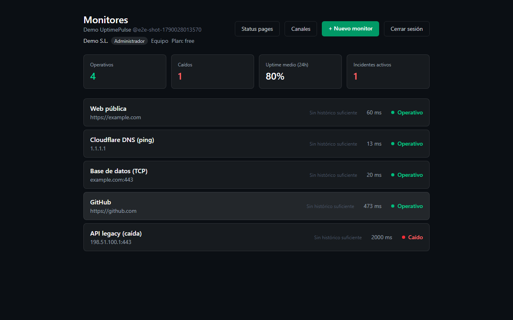
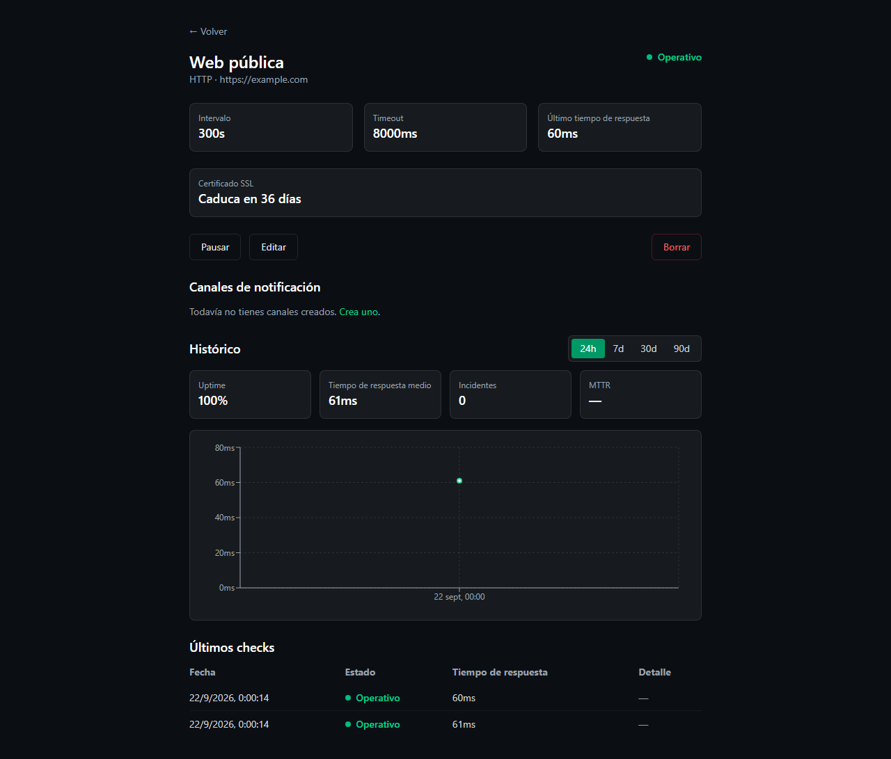
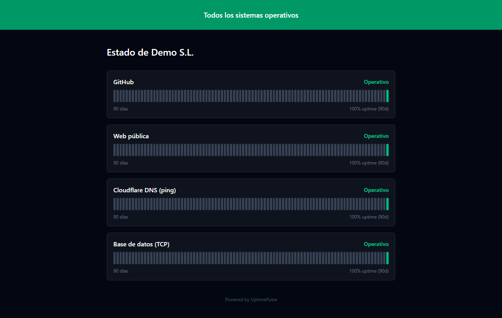
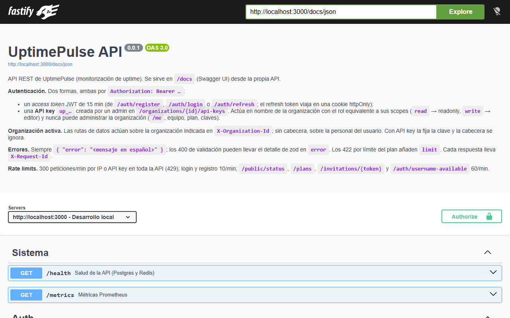

# UptimePulse — Plataforma de Monitorización de Uptime y Salud de Servicios

> Una alternativa ligera y asequible a Pingdom/Datadog/UptimeRobot, pensada para desarrolladores independientes, freelancers y startups pequeñas que necesitan saber si sus servicios están caídos sin pagar precios de nivel enterprise.

---

## Estado: las 5 fases del plan están completas

[](https://github.com/gsan-dev/UptimePulse/actions/workflows/ci.yml)

Checks HTTP/TCP/ping desde varias regiones con quórum, incidentes, alertas
(email, Discord, Slack, webhook firmado), SSL, status pages públicas por
usuario, equipos con roles, [API REST documentada con API keys](#usar-la-api-desde-fuera),
métricas Prometheus, tests (unitarios, integración, E2E) y CI con imágenes Docker.
Lo que no está hecho a propósito (SMS, OAuth…) está en
[TODO.md](TODO.md); cada decisión, en los ADR de [TASK.md](TASK.md); cada
paso reproducible, en [DIARIO.md](DIARIO.md).

### Capturas (reales, tomadas con Playwright sobre la app en local)

| Dashboard en tiempo real | Detalle de un monitor |
| --- | --- |
|  |  |

| Status page pública (`/status/<usuario>/<slug>` o `/status/team/<organización>/<slug>`) | API (`/docs`) |
| --- | --- |
|  |  |

### Self-hosting en un servidor (Docker Compose)

Un solo origen: `web` (nginx) sirve la interfaz y reenvía `/api` y el
WebSocket a la API. Con dominio, Caddy pone HTTPS automático.

```bash
git clone https://github.com/gsan-dev/UptimePulse.git && cd UptimePulse
cp .env.example .env     # POSTGRES_PASSWORD, JWT_* (openssl rand -hex 32), DOMAIN, APP_URL, SMTP_*
docker compose -f docker-compose.prod.yml --profile tls up -d    # HTTPS en DOMAIN
# o sin dominio:  docker compose -f docker-compose.prod.yml up -d  → http://IP:8080 (con COOKIE_SECURE=false)
```

Imágenes en GHCR (`ghcr.io/gsan-dev/uptimepulse/{api,worker,web}`),
migraciones automáticas al arrancar, copias con `scripts/backup.sh` /
`scripts/restore.sh`. Guía completa: [docs/DEPLOY.md](docs/DEPLOY.md).

### Probarlo entero con un comando

Requisitos: Docker con Compose v2. Nada más — ni Node, ni `.env`.

```bash
git clone https://github.com/gsan-dev/UptimePulse.git && cd UptimePulse
docker compose up
```

Levanta TimescaleDB, Redis, Mailpit, las migraciones, la API, el worker y la
web. Abre http://localhost:8080, regístrate y crea un monitor: en unos
segundos verás "Operativo" sin recargar.

| | |
| --- | --- |
| Web | http://localhost:8080 |
| API | http://localhost:3000 — [cómo llamarla](#usar-la-api-desde-fuera) · `/docs` (Swagger) · `/health` · `/metrics` |
| Worker | http://localhost:3001 (`/health`, `/metrics`) |
| Emails (Mailpit) | http://localhost:8025 |

Todos esos puertos salen del `.env` (`WEB_PORT`, `API_PORT`,
`WORKER_HTTP_PORT`, `POSTGRES_PORT`, `REDIS_PORT`, `MAILPIT_*`). Cada
variable manda a la vez en el puerto publicado, en el puerto donde escucha el
servicio y en la URL con la que le hablan los demás: cambias el número y no
hay que tocar nada más.

### Arrancar en local para programar

Con los procesos en tu máquina (recarga en caliente) y solo la
infraestructura en Docker. Requisitos: Node 22+ y Docker.

```bash
cp .env.example .env                    # los valores de ejemplo valen para desarrollo
docker compose up -d postgres redis mailpit
npm install && npm run db:migrate
npm run dev:api & npm run dev:worker & npm run dev:web   # o tres terminales
```

Aquí la web es el servidor de Vite: http://localhost:5173. (Los puertos de la
API y el worker chocan con los del stack completo, así que no levantes los
dos a la vez.)

```bash
npm run lint && npm run typecheck   # calidad
npm test                            # unitarios + integración (usa la base uptimepulse_test)
npm run test:e2e                    # Playwright contra los procesos arrancados
```

Más detalle por aplicación: [apps/api](apps/api/README.md),
[apps/worker](apps/worker/README.md), [apps/web](apps/web/README.md).
Self-hosting: [docs/DEPLOY.md](docs/DEPLOY.md). Seguridad:
[docs/SECURITY.md](docs/SECURITY.md).

---

## Usar la API desde fuera

Todo lo que hace la interfaz se puede hacer por API. La referencia completa
—todas las rutas con sus esquemas— se sirve como Swagger UI en
**http://localhost:3000/docs** y vive en [docs/openapi.yaml](docs/openapi.yaml).

Dos formas de autenticarse, las dos con la misma cabecera `Authorization: Bearer …`:

| | Para qué | De dónde sale |
| --- | --- | --- |
| **Access token (JWT)** | La propia interfaz web. Dura 5 min y se renueva sola mientras la uses. | `POST /auth/login` |
| **API key** (`up_…`) | Scripts, CI, integraciones. No caduca; se revoca a mano. | La página `/api-keys`, o `POST /organizations/{id}/api-keys` |

Para cualquier cosa automatizada, usa una API key.

### 1. Crear la clave

En la interfaz: **API keys** (`/api-keys`), siendo administrador de la
organización. O por API, con tu sesión iniciada:

```bash
curl -X POST http://localhost:3000/organizations/<ORG_ID>/api-keys \
  -H "Authorization: Bearer <TU_ACCESS_TOKEN>" \
  -H "Content-Type: application/json" \
  -d '{"name":"GitHub Actions","scopes":["read","write"]}'
```

```json
{
  "id": "c2171886-…",
  "name": "GitHub Actions",
  "keyPrefix": "up_f922ed97",
  "scopes": ["read", "write"],
  "key": "up_f922ed974cb9af5c25f09d13cc068f608e478bcbd1736799d6f3547692e3d3fb"
}
```

El campo `key` **se muestra una sola vez**: después solo queda su prefijo
(`up_f922ed97`), porque en la base de datos se guarda únicamente su sha256.
Si la pierdes, revócala y crea otra.

Crear claves exige sesión de una persona: una API key no puede fabricar más
claves, a propósito.

### 2. Usarla

```bash
KEY=up_f922ed97…

# Leer (scope "read")
curl -H "Authorization: Bearer $KEY" http://localhost:3000/monitors

# Escribir (scope "write")
curl -X POST http://localhost:3000/monitors \
  -H "Authorization: Bearer $KEY" \
  -H "Content-Type: application/json" \
  -d '{"name":"api-prod","type":"http","target":"https://api.midominio.com/health","intervalSeconds":60}'
```

**La URL base** depende de por dónde entres: `http://localhost:3000` llamando
a la API directamente, `http://localhost:8080/api` si pasas por la web del
`docker compose` (nginx la reenvía), y `https://tu-dominio/api` en un
servidor.

Desde una GitHub Action, que es el caso típico — dar de alta el monitor al desplegar:

```yaml
- name: Registrar el despliegue en UptimePulse
  env:
    UPTIMEPULSE_KEY: ${{ secrets.UPTIMEPULSE_KEY }}
  run: |
    curl -fsS -X POST https://status.midominio.com/api/monitors \
      -H "Authorization: Bearer $UPTIMEPULSE_KEY" \
      -H "Content-Type: application/json" \
      -d '{"name":"api-prod","type":"http","target":"https://api.midominio.com/health"}'
```

### 3. Qué puede y qué no

| Scope | Equivale al rol | Puede |
| --- | --- | --- |
| `read` | solo lectura | ver monitores, checks, incidentes y métricas |
| `write` | editor | además crear, editar, pausar y borrar |

Una API key **nunca administra la organización**: miembros, invitaciones,
perfil y la gestión de las propias claves responden `403` aunque tenga
`write`. Y la organización la fija la clave, así que la cabecera
`X-Organization-Id` se ignora: una clave no puede actuar sobre otra
organización.

### 4. Revocar

```bash
curl -X DELETE http://localhost:3000/organizations/<ORG_ID>/api-keys/<KEY_ID> \
  -H "Authorization: Bearer <TU_ACCESS_TOKEN>"
```

Responde `204` y el siguiente uso de esa clave da `401` al instante. El
listado de claves muestra `lastUsedAt`, útil para localizar las olvidadas.

El límite de peticiones (300/min por defecto) se cuenta **por clave**, no por
IP: una integración detrás de un NAT no agota la cuota de las demás.

---

## 1. Descripción del proyecto

**UptimePulse** es una aplicación web tipo SaaS que permite a un usuario registrar URLs, APIs o servicios y monitorizarlos de forma continua. El sistema realiza comprobaciones periódicas (HTTP, TCP, SSL), detecta caídas y recuperaciones, calcula métricas de disponibilidad y rendimiento, y notifica al usuario por email, SMS o webhook cuando algo falla.

El proyecto está compuesto por dos partes claramente diferenciadas:

- **Servidor (backend):** API REST + WebSockets, cola de trabajos, workers que ejecutan los checks, base de datos de series temporales y motor de alertas.
- **Cliente (frontend):** dashboard web donde el usuario ve el estado de sus monitores en tiempo real, histórico de disponibilidad, gráficos de latencia y configuración de alertas.

### Problema que resuelve

Los desarrolladores independientes y las startups pequeñas necesitan saber si su web, API o servicio backend está caído, pero las herramientas actuales del mercado:

- Cobran precios pensados para empresas grandes (Datadog, Pingdom).
- Tienen planes gratuitos muy limitados (pocos monitores, intervalos de chequeo largos).
- Incluyen funcionalidades innecesarias para alguien que solo quiere saber "¿está mi web arriba o no?".

UptimePulse ofrece lo esencial —monitorización fiable, alertas rápidas y visibilidad clara— sin la complejidad ni el coste de las plataformas grandes.

### Por qué este proyecto tiene valor como pieza de portfolio

No es un CRUD más. Obliga a diseñar y justificar decisiones de:
- Sistemas distribuidos a pequeña escala (colas de trabajo, workers desacoplados).
- Almacenamiento y agregación de datos de series temporales.
- Comunicación en tiempo real cliente-servidor (WebSockets).
- Lógica de negocio no trivial (detección de incidentes, evitar falsos positivos, cálculo de SLA/uptime %).
- Integraciones externas (email, SMS, webhooks).

---

## 2. Funcionalidades

### 2.1 Gestión de monitores
- Crear, editar, pausar y eliminar monitores.
- Tipos de check soportados: HTTP/HTTPS, TCP (puerto), ping ICMP.
- Configuración por monitor: URL/host, método HTTP, headers personalizados, body (para POST), código de estado esperado, intervalo de chequeo (30s / 1min / 5min / 15min según plan), timeout.
- Etiquetas/proyectos para agrupar monitores (ej. "Producción", "Staging", "API cliente X").

### 2.2 Motor de comprobación (checks)
- Workers independientes que ejecutan los checks según su intervalo configurado.
- Reintentos automáticos antes de marcar un monitor como caído (evita falsos positivos por errores de red puntuales).
- Registro de cada check: timestamp, estado (up/down), tiempo de respuesta, código de estado HTTP, mensaje de error si aplica.
- Verificación de certificados SSL: aviso cuando un certificado está próximo a expirar (30/15/7 días antes).

### 2.3 Gestión de incidentes
- Agrupación automática de checks fallidos consecutivos en un "incidente" (con hora de inicio, hora de resolución y duración).
- Historial de incidentes por monitor, con línea temporal visual.
- Cálculo automático de:
  - % de uptime (día / semana / mes / histórico total).
  - Tiempo medio de respuesta.
  - Tiempo medio de resolución de incidentes (MTTR).

### 2.4 Alertas y notificaciones
- Canales soportados: email, SMS (vía Twilio), webhook genérico, integración directa con Slack/Discord.
- Notificación automática al caer un monitor y al recuperarse.
- Configuración de qué canales se usan para cada monitor (no todos los monitores necesitan SMS, por ejemplo).
- Resumen semanal por email con el estado general de todos los monitores.

### 2.5 Dashboard en tiempo real
- Vista general con el estado de todos los monitores (arriba/abajo/degradado) actualizada por WebSocket sin recargar la página.
- Gráficos de latencia y disponibilidad por monitor, con rangos de tiempo seleccionables (24h / 7d / 30d / 90d).
- Vista de detalle de cada monitor con su historial de checks e incidentes.

### 2.6 Páginas de estado públicas (status pages)
- El usuario puede publicar una página pública (URL tipo `estado.tuempresa.com` o `uptimepulse.app/status/tu-proyecto`) mostrando el estado de los servicios que decida hacer visibles, sin exponer datos sensibles de su cuenta.
- Útil para que una startup muestre transparencia a sus propios clientes.

### 2.7 Cuentas y equipos
- Registro/login con email y contraseña (y opcionalmente OAuth con GitHub/Google).
- Sin planes ni límites de uso: cualquier organización puede crear los monitores que quiera, con intervalo mínimo de 30 s y cualquier canal (decisión del 2026-09-22; el sistema de planes de la Fase 4.3 se retiró).
- Equipos/organizaciones con roles (admin, editor, solo lectura) — funcionalidad de la fase 2.

---

## 3. Diseño y experiencia de usuario

La estética general debe transmitir **fiabilidad, claridad y calma** — es una herramienta que la gente mira cuando algo puede estar fallando, así que el diseño no debe añadir ruido ni ansiedad innecesaria. Referencias de estilo: Linear, Vercel, Better Stack (antes Better Uptime).

### Paleta y tono visual
- Fondo oscuro por defecto (modo claro como alternativa), con acentos de color reservados exclusivamente para estados:
  - Verde: operativo.
  - Ámbar: degradado/lento.
  - Rojo: caído.
  - Gris: pausado/sin datos.
- Tipografía sans-serif limpia (Inter o similar), con buena jerarquía entre números grandes (métricas) y texto de apoyo.
- Uso generoso de espacio en blanco (o "negro", en modo oscuro) — evitar dashboards sobrecargados.

### 3.1 Página de aterrizaje (landing, pública)
- Hero claro: titular de una frase explicando el problema ("Entérate antes que tus usuarios de que algo se ha caído"), subtítulo, CTA de registro.
- Sección de captura de pantalla del dashboard real (no ilustraciones genéricas).
- Sección de características (3-4 columnas: monitorización HTTP, alertas multicanal, status pages, tiempo real).
- Tabla de precios simple (Free / Pro / Team).
- Footer minimalista.

### 3.2 Dashboard principal (vista general, autenticado)
- Barra lateral fija con navegación: Monitores, Incidentes, Status Pages, Alertas, Ajustes.
- Cabecera con resumen agregado: nº de monitores operativos vs caídos, uptime medio global, incidentes activos (destacado en rojo si hay alguno).
- Listado de monitores en formato de tarjetas o tabla compacta, cada uno mostrando:
  - Nombre y URL.
  - Indicador de estado (punto de color + texto).
  - Mini-gráfico de las últimas 24h (sparkline).
  - Tiempo de respuesta actual.
  - Uptime % del período seleccionado.
- Todo debe actualizarse en vivo (WebSocket) — un monitor que cae debe reflejarse sin recargar.

### 3.3 Vista de detalle de un monitor
- Cabecera con nombre, URL, estado actual grande y claro.
- Selector de rango temporal (24h / 7d / 30d / 90d).
- Gráfico principal de tiempo de respuesta a lo largo del tiempo (línea), con zonas sombreadas en rojo donde hubo caídas.
- Tabla/lista de incidentes recientes (inicio, duración, resolución).
- Panel lateral con configuración del monitor (editable in-line).

### 3.4 Página de incidentes
- Línea temporal cronológica de todos los incidentes de todos los monitores.
- Filtro por monitor, por rango de fechas, por estado (resuelto/activo).

### 3.5 Configuración de alertas
- Lista de canales configurados (email, SMS, webhook) con posibilidad de añadir nuevos.
- Matriz simple: qué monitores notifican por qué canal.

### 3.6 Status page pública
- Diseño completamente distinto (sin sidebar ni UI de gestión): una página limpia, de una sola columna, mostrando el nombre del proyecto, un indicador general ("Todos los sistemas operativos" en verde, o detalle de qué falla), y una lista de servicios con su estado e histórico de los últimos 90 días en forma de barras (como GitHub Status o Stripe Status).

### 3.7 Componentes reutilizables a diseñar
- Badge de estado (up/down/degraded/paused).
- Sparkline de latencia.
- Gráfico de barras de uptime histórico (estilo "calendario de disponibilidad").
- Toast/notificación en tiempo real cuando cambia el estado de un monitor mientras el usuario está viendo el dashboard.

---

## 4. Arquitectura técnica (resumen)

```
Cliente (React) ──REST/WebSocket──► API Server ──► PostgreSQL (+ TimescaleDB)
                                         │
                                         ▼
                                  Cola (Redis/BullMQ)
                                         │
                              ┌──────────┴──────────┐
                              ▼                     ▼
                          Worker 1              Worker N
                       (ejecuta checks)     (ejecuta checks)
                                         │
                                         ▼
                               Servicio de alertas
                          (email / SMS / webhook)
```

**Stack real (el que hay en el repositorio):**
- Backend: Node.js 22 + Fastify 5 + zod; Drizzle ORM sobre PostgreSQL 16 + TimescaleDB 2.30 (hypertable `checks`, agregado continuo `checks_hourly`)
- Cola: Redis 7 + BullMQ (job schedulers, una cola por región)
- Frontend: React 18 + Vite + TailwindCSS + Recharts
- Tiempo real: Socket.io con adaptador Redis (el worker publica, la API reenvía)
- Alertas: Nodemailer (Mailpit en desarrollo, cualquier SMTP en producción), Discord, Slack, webhook genérico firmado con HMAC-SHA256. SMS pendiente (sin cuenta de Twilio).
- Observabilidad: logs JSON con request id, `prom-client` en `/metrics`, `/health` con dependencias
- Tests: Vitest (unitarios e integración contra la base real), Playwright (E2E)
- Infraestructura: Docker Compose en desarrollo y self-hosting (`docker-compose.prod.yml`: nginx como único origen + Caddy TLS opcional), GitHub Actions (lint, type-check, tests, E2E, imágenes en GHCR), guía para Fly.io

---

## 5. Roadmap por fases

| Fase | Contenido |
|---|---|
| **Fase 0 — Base** ✅ | Monorepo, Docker Compose, esquema y migraciones, logging JSON |
| **Fase 1 — MVP** ✅ | Auth (JWT + refresh httpOnly), CRUD de monitores con anti-SSRF, worker HTTP/TCP, dashboard, alertas por email |
| **Fase 2** ✅ | BullMQ, incidentes con umbral y ventanas de mantenimiento, WebSockets, métricas sobre TimescaleDB |
| **Fase 3** ✅ | SSL, Discord/Slack/webhook firmado, status pages públicas por usuario (`/status/<usuario>/<slug>`) |
| **Fase 4** ✅ | Equipos y roles con invitaciones, checks multi-región con quórum. (Los planes con límites se implementaron y se retiraron después: no hay límites de uso.) |
| **Fase 5** ✅ | Seguridad (helmet, CORS, rate limits, API keys, cuota por host, redirecciones), observabilidad, tests, CI/CD, documentación. Ping ICMP añadido. |
| **Fase 6** ✅ | Etiquetas con filtro, formulario HTTP completo (método/cabeceras/body) y edición completa del monitor, UI de ventanas de mantenimiento, línea temporal de incidentes, uptime «histórico total», status pages editables con nombre público por monitor y URL propia por organización (`/status/team/<organización>/<slug>`), cierre de sesión por inactividad |

El detalle de cada fase, con lo verificado y cómo, está en [TASK.md](TASK.md).

---

## 6. Estructura de carpetas propuesta

```
uptimepulse/
├── apps/
│   ├── api/            # Fastify: REST + Socket.io, productor de la cola (README propio)
│   ├── worker/         # Consumidor de la cola: checks, quórum, incidentes, alertas (README propio)
│   └── web/            # React + Vite (README propio)
├── packages/
│   ├── db/             # Esquema Drizzle, migraciones SQL, cliente
│   ├── queue/          # BullMQ: colas por región, job schedulers, quórum
│   ├── server-utils/   # Anti-SSRF, validación de targets
│   ├── mailer/         # Nodemailer + plantillas
│   ├── notify-channels/# Discord, Slack, webhook firmado
│   └── shared/         # Logger JSON, reglas de username, tipos
├── e2e/                # Playwright (flujos críticos, contra los procesos de desarrollo)
├── e2e-docker/         # Playwright contra el stack de `docker compose up`
├── test/               # Configuración de los tests de integración (base uptimepulse_test)
├── docs/               # openapi.yaml, SECURITY.md, DEPLOY.md, capturas
├── .github/workflows/  # CI
├── docker-compose.yml       # stack completo en local: `docker compose up`
├── docker-compose.prod.yml  # self-hosting: imágenes publicadas + TLS
├── deploy/Caddyfile         # TLS automático (perfil tls)
├── scripts/                 # backup.sh / restore.sh
├── TASK.md · DIARIO.md · TODO.md
└── README.md
```

---

## 7. Qué queda

El plan original está cumplido. Lo que se dejó fuera conscientemente y la
deuda técnica conocida están en [TODO.md](TODO.md) (SMS con Twilio, OAuth,
resumen semanal, alertas por rol, «degradado» por latencia, revocación
explícita de refresh tokens, entre otros).
